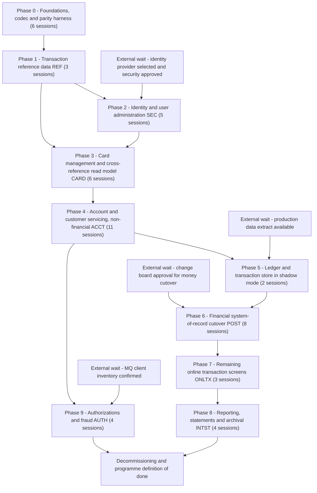

# CardDemo COBOL-to-Java Cutover Plan

Phased migration sequence for the AWS CardDemo estate in this repository, with per-phase scope, bridges,
rollback, and objective exit gates.

**Inputs.** This plan builds on the four analysis artifacts on this branch (`APPLICATION_INVENTORY.md`,
`DATA_DICTIONARY.md`, `DEPENDENCY_MAP.md`, `HOTSPOT_REPORT.md`) and on two documents produced by parallel
sessions that are *not* in the repository: `MODERNIZATION_BLUEPRINT.md` (per-functional-area strategy) and
`DOMAIN_DECOMPOSITION.md` (bounded contexts, dataset ownership, rated seams S1–S13). Their contexts and
seam ratings are adopted as the starting position. The four places where this plan diverges from them are
listed in §10, each with source evidence.

**Effort units.** All effort is in Devin-session units (one session ≈ 1–2 human-weeks). External waits
(provisioning, approvals, extracts, licences) are listed separately in §11 and are never folded into
session counts.

**Uncertainty.** Statements derived from repository evidence carry a `path:line` citation or an artifact
section. Everything else — production volumes, batch-window length, target cloud, team skills, regulatory
retention, risk appetite — is unobservable from this repository and is labelled **[ASSUMPTION]** where it
affects the plan.

---

## 1. Cutover principles

Each principle traces to a concrete constraint in this codebase.

**P1 — Exactly one writer per dataset at any instant; no unreconciled dual-write to a VSAM KSDS.**
Today the estate enforces this *temporally*, not structurally: every batch chain is bracketed by
`CLOSEFIL` and `OPENFIL`, which issue `CEMT SET FIL ... CLO/OPE` against exactly five CICS files —
`TRANSACT`, `CCXREF`, `ACCTDAT`, `CXACAIX`, `USRSEC` (`app/jcl/CLOSEFIL.jcl:26`–`:30`,
`app/jcl/OPENFIL.jcl:26`–`:30`). Online and batch never write the same file concurrently because the
scheduler physically closes it. There is no record-level locking to fall back on, so any phase that lets
a Java writer and a COBOL writer touch the same dataset in the same window has removed the only
concurrency control the estate has (`DOMAIN_DECOMPOSITION.md` §2.4, seam S13).

**P2 — Transaction-ID allocation must have a single arbiter before any `TRANSACT` writer moves.**
Two online programs allocate transaction IDs by browsing the KSDS to `HIGH-VALUES`, reading backwards and
adding one: `COTRN02C.cbl:444`–`:451` and `COBIL00C.cbl:212`–`:219`. Batch uses two other schemes:
`CBTRN02C` copies the inbound ID (`app/cbl/CBTRN02C.cbl:425`) and `CBACT04C` builds it from the run-date
parameter plus a counter (`app/cbl/CBACT04C.cbl:476`–`:479`). A "last key plus one" allocator is only
correct if one system owns the tail of the key space; two writers silently collide.

**P3 — The mainframe remains system of record for money until the single cutover in Phase 6.**
Money-moving state is updated *in place* by batch: `CBTRN02C` rewrites `ACCTDATA` and `TCATBALF` and
appends to `TRANSACT` (`app/cbl/CBTRN02C.cbl:528`, `:554`, `:564`), and `CBACT04C` rewrites the account
record while zeroing the cycle counters (`app/cbl/CBACT04C.cbl:352`–`:356`). In-place updates with no
before-image mean there is no cheap way to un-post a run, so ownership of balances moves once, on one
night, not incrementally.

**P4 — Every phase is independently revertible, and "revertible" means the data-repair step is written
down before the phase starts.** A phase whose data repair is "restore from backup and lose the day" is a
one-way phase and must say so. The estate gives one genuine reversal asset: `TRANBKP` REPROs
`TRANSACT.VSAM.KSDS` into `TRANSACT.BKUP(+1)` daily (`app/jcl/TRANBKP.jcl:23`, `:27`, `:33`) before
deleting and redefining the cluster (`app/jcl/TRANBKP.jcl:37`, `:51`), and `COMBTRAN` rebuilds the KSDS by
sorting `TRANSACT.BKUP(0)` with `SYSTRAN(0)` and REPROing the result back
(`app/jcl/COMBTRAN.jcl:24`, `:26`, `:37`, `:48`). There is no equivalent for `ACCTDATA`, `TCATBALF`,
`CUSTDATA` or `CARDDATA` — no repository job backs them up — so phases touching those must create a
pre-phase image explicitly.

**P5 — Legacy consumers are kept alive by regenerating the exact byte layout they read, not by changing
them.** The reference-data path already works this way: `TRANEXTR` unloads Db2 to `TRANTYPE.PS` and
`TRANCATG.PS` (`app/app-transaction-type-db2/jcl/TRANEXTR.jcl:73`, `:103`) and `TRANTYPE.jcl:61` /
`TRANCATG.jcl:61` REPRO those files into the VSAM replicas that `CBTRN03C` reads
(`app/jcl/TRANREPT.jcl:69`–`:72`). A migrated service that emits the same 60-byte records
(`DATA_DICTIONARY.md` §"Transaction type / category reference data", 169–187) needs no downstream change.

**P6 — Representation is converted at a single audited boundary, never ad hoc per program.** The estate is
fixed-format EBCDIC with mixed numeric representations for the *same* business key: `ACCT-ID` is zoned
`9(11)` in the account master (`DATA_DICTIONARY.md`:35–52) but packed `S9(11) COMP-3` in the IMS
authorization summary (`DATA_DICTIONARY.md`:566–582), and authorization MQ amounts are edited text with
explicit sign and decimal point (`DATA_DICTIONARY.md`:584–616). Sample data ships in both encodings
(`app/data/EBCDIC/`, `app/data/ASCII/`) and the README requires binary transfer to preserve it
(`README.md:124`, `:127`–`:128`).

**P7 — Monetary arithmetic stays fixed-scale decimal; binary floating point is prohibited.** All money is
2-decimal fixed scale — `S9(10)V99` on the account (`DATA_DICTIONARY.md`:35–52), `S9(09)V99` on the
transaction (`DATA_DICTIONARY.md`:189–207) — and interest is computed as
`(TRAN-CAT-BAL * DIS-INT-RATE) / 1200` into a `S9(09)V99` field with no `ROUNDED` phrase
(`app/cbl/CBACT04C.cbl:168`, `:464`–`:465`), i.e. truncating division. Parity requires reproducing the
truncation, which floating point cannot do reliably.

**P8 — Implicit scheduler and GDG coupling is replaced by explicit run identity before the pipeline
moves.** Jobs pass state through relative generations (`DALYREJS(+1)` at `app/jcl/POSTTRAN.jcl:38`,
`SYSTRAN(+1)` at `app/jcl/INTCALC.jcl:41`, `TRANSACT.BKUP(+1)` at `app/jcl/TRANBKP.jcl:33`, consumed as
`(0)` at `app/jcl/COMBTRAN.jcl:24`, `:26`), and ordering is enforced partly by a fixed 36-second sleep
(`app/jcl/WAITSTEP.jcl:22`, `:26`) rather than a completion signal. Nine GDG bases exist
(`app/jcl/DEFGDGB.jcl:25`, `:31`, `:37`, `:43`, `:49`, `:55`; `app/jcl/DEFGDGD.jcl:28`, `:51`, `:74`) plus
`DALYREJS` (`app/jcl/DALYREJS.jcl:25`). See `MODERNIZATION_BLUEPRINT.md` §4.4.

**P9 — A bridge is only approved with a written removal condition.** Bridges without one are named as
permanent liabilities in the phase that creates them (§3, "Temporary bridges" subsections; two are so
named: the `USRSEC` replica in Phase 2 and the MQ authorization contract in Phase 9).

**P10 — Nothing is deleted without evidence.** Decommissioning criteria are in §8; the deletion list
covers 8 CICS `FILE` definitions, 18 `PROGRAM`, 18 `TRANSACTION` and 17 `MAPSET` definitions in
`app/csd/CARDDEMO.CSD` (`:1`–`:88` for files, `:100` onward for mapsets, `:173` onward for programs,
`:306` onward for transactions; 505 lines total), the two sub-application CSDs, 38 core plus 8
sub-application JCL members and 2 PROCs (`APPLICATION_INVENTORY.md:9`, `:23`–`:25`).

---

## 2. Phase overview

| Phase | Name | Programs migrated | Data stores affected | Bridges required | Sessions | Reversible (how) | Gate to next phase |
| --- | --- | --- | --- | --- | --- | --- | --- |
| 0 | Foundations, codec and parity harness | `CBEXPORT`, `CBIMPORT` (as tooling); `CSUTLDTC`, `COBSWAIT` wrapped | None in production; read-only copies of `app/data/EBCDIC/` fixtures | None (no production traffic) | 6 | Yes — nothing in production changes; delete the harness | Golden-master replay of `POSTTRAN` and `INTCALC` reproduces every output byte except masked timestamp fields |
| 1 | Transaction reference data (REF) | `COTRTLIC`, `COTRTUPC`, `COBTUPDT` | Db2 `CARDDEMO.TRANSACTION_TYPE`, `CARDDEMO.TRANSACTION_TYPE_CATEGORY`; VSAM replicas `TRANTYPE`, `TRANCATG` | Replica emitter producing `TRANTYPE.PS` and `TRANCATG.PS` byte-for-byte | 3 | Yes — reload Db2 from the last `TRANEXTR` unload, re-enable `MNTTRDB2` and `TRANEXTR` | Two consecutive weekly cycles where emitted replicas are byte-identical to the legacy unload and `TRANREPT` output is unchanged |
| 2 | Identity and user administration (SEC) | `COSGN00C`, `COUSR00C`, `COUSR01C`, `COUSR02C`, `COUSR03C` | `USRSEC.VSAM.KSDS` | Identity-provider facade; `USRSEC` write-back replica; COMMAREA user-type shim | 5 | Yes — restore `USRSEC` via `DUSRSECJ`, re-point CICS transaction `CC00` to `COSGN00C` | 100 percent of users authenticate through the new provider for a 2-week soak with zero fallback sign-ons; `USRSEC` drops out of the `CLOSEFIL` bracket |
| 3 | Card management and cross-reference read model (CARD) | `COCRDLIC`, `COCRDSLC`, `COCRDUPC`, `CBACT02C` | `CARDDATA.VSAM.KSDS` plus `CARDAIX`; `CARDXREF` read replica | Cross-reference query API; nightly `CARDXREF` regeneration; card master extract | 6 | Yes — card master is single-writer; re-point CICS transactions and reload from the pre-phase image | Card create, update and browse parity on a scripted suite; `CARDXREF` replica matches the KSDS record for record for 5 consecutive nights |
| 4 | Account and customer servicing, non-financial (ACCT) | `COACTVWC`, `COACTUPC`, `CBACT01C`, `CBACT03C`, `CBCUS01C`, `COACCT01`, `CODATE01` | `CUSTDATA.VSAM.KSDS` (ownership moves); `ACCTDATA.VSAM.KSDS` demographic fields only; `DISCGRP` | Field-scoped dual-write on `ACCTDATA` plus reconciliation job; customer CDC; MQ adapter facade | 11 | Yes — `ACCTDATA` financial fields never left VSAM; replay reconciliation deltas back into `CUSTDATA` | Zero unexplained reconciliation deltas on demographic fields across a 10-business-day soak; no balance field written by the new system |
| 5 | Ledger and transaction store in shadow mode | None cut over | `TRANSACT`, `TCATBALF`, `ACCTDATA` balances — all read-only into the new store | Change-data capture from VSAM to the new store; ID arbiter stood up but not authoritative | 2 | Yes — stop the capture feed; no legacy component depends on it | Shadow posting of a full production day reproduces balances and category totals to zero variance for 10 consecutive days |
| 6 | Financial system-of-record cutover (POST, interest, online writers) | `CBTRN02C`, `CBACT04C`, `COTRN02C`, `COBIL00C` write paths | `TRANSACT`, `TCATBALF`, `ACCTDATA` balances — ownership moves; `DALYTRAN` ingestion; `DALYREJS` | Reverse feed regenerating `TRANSACT`, `TCATBALF`, `ACCTDATA` for remaining COBOL readers; `SYSTRAN` and `DALYREJS` emitters | 8 | Partially — see §3.7; requires the pre-cutover image plus replay of new-store transactions into VSAM, budget 4 hours | One month-end (posting plus interest plus `COMBTRAN`) completed inside the batch window with zero balance variance and reject-file parity |
| 7 | Remaining online transaction screens (ONLTX) | `COTRN00C`, `COTRN01C`, `CORPT00C` | `TRANSACT` read paths only | Report-request adapter replacing the internal reader submission | 3 | Yes — read-only screens; re-point CICS transactions | Browse, view and report-request parity; no CICS transaction remains that writes `TRANSACT` |
| 8 | Reporting, statements and archival (INTST) | `CBTRN03C`, `CBSTM03A`, `CBSTM03B` | `TRXFL`, `TRANREPT` and `TRANSACT.BKUP` generations, statement outputs | Statement and report output delivery to existing distribution | 4 | Yes — reporting is read-only; re-enable the legacy jobs | Statement and report content parity on one full month of production data; GDG chain retired |
| 9 | Authorizations and fraud (AUTH) | `CBPAUP0C`, `COPAUS0C`, `COPAUS1C`, `COPAUS2C`, `PAUDBLOD` and the IMS or MQ utilities | IMS `PAUTDB`, Db2 `CARDDEMO.AUTHFRDS`, MQ request and reply queues | MQ protocol adapter (permanent liability while any external client remains); master-data reads from the new services | 4 | Yes for the store — IMS reload from `UNLDPADB` output; no for the MQ contract | Authorization request and reply parity for a captured message set; fraud table row counts reconciled; external clients confirmed migrated or adapted |

Total: **52 sessions**. `MODERNIZATION_BLUEPRINT.md` §6 totals 48 for the same functional scope; the
difference is the parity harness (1), the cross-reference bridge (1, seam S1) and the ledger and
transaction-store bridges (2, seams S2 and S4), which the blueprint's per-area figures exclude and
`DOMAIN_DECOMPOSITION.md` §5 identifies as separate work.

---

## 3. Phases in detail

### 3.0 Phase 0 — Foundations, codec and parity harness

No production cutover happens in this phase. It exists because every later phase's acceptance gate is
"the new output equals the old output", and that comparison is impossible to trust until the codec and
the harness exist.

**Scope.**
- Fixed-format EBCDIC and packed-decimal codec library, driven from the shipped fixtures in
  `app/data/EBCDIC/`: `AWS.M2.CARDDEMO.ACCTDATA.PS` (15,000 bytes at 300 bytes per record — 50 accounts,
  layout `DATA_DICTIONARY.md`:35–52), `AWS.M2.CARDDEMO.CARDDATA.PS` (7,500 bytes at 150 —
  `DATA_DICTIONARY.md`:56–67), `AWS.M2.CARDDEMO.CUSTDATA.PS` (25,000 bytes at 500 —
  `DATA_DICTIONARY.md`:105–128), `AWS.M2.CARDDEMO.CARDXREF.PS` (2,500 bytes at 50 —
  `DATA_DICTIONARY.md`:93–101), `AWS.M2.CARDDEMO.DALYTRAN.PS` (105,000 bytes at 350 — 300 transactions,
  `DATA_DICTIONARY.md`:209–221), `AWS.M2.CARDDEMO.TCATBALF.PS`, `AWS.M2.CARDDEMO.DISCGRP.PS`,
  `AWS.M2.CARDDEMO.TRANTYPE.PS` (420 bytes at 60 — 7 rows), `AWS.M2.CARDDEMO.TRANCATG.PS` (1,080 bytes at
  60 — 18 rows), `AWS.M2.CARDDEMO.USRSEC.PS` (800 bytes at 80 — 10 users) and
  `AWS.M2.CARDDEMO.EXPORT.DATA.PS` (250,000 bytes).
- `CBEXPORT` and `CBIMPORT` are reimplemented first as *migration tooling*, not as an application feature,
  because they already encode the estate's serialization rules. Note the defect to preserve or fix
  deliberately: `CBIMPORT.cbl:63` selects `CARD-OUTPUT ASSIGN TO CARDOUT` but `app/jcl/CBIMPORT.jcl` has
  no `CARDOUT` DD (DDs at `:28`, `:33`, `:38`, `:43`, `:48`, `:56`), so the card extract path cannot run
  as shipped (`APPLICATION_INVENTORY.md:151`, `:224`–`:225`).
- Shared leaf services extracted behind interfaces so later phases do not each reinvent them: the date
  interface replacing the single `CEEDAYS` call site (`app/cbl/CSUTLDTC.cbl:116`), the wait utility
  (`app/cbl/COBSWAIT.cbl:38`), and an explicit batch error and abend contract to replace the 11 `CEE3ABD`
  call sites (`MODERNIZATION_BLUEPRINT.md` §4.6).
- Scheduler dependency graph extracted from `app/scheduler/CardDemo.ca7` and
  `app/scheduler/CardDemo.controlm` into an explicit, run-identified DAG (see §5).
- Golden-master harness: replay `DALYTRAN` through `POSTTRAN` and rerun `INTCALC` with its fixed parameter
  (`app/jcl/INTCALC.jcl:22`), then compare outputs field by field with a documented mask list (see §4).

**Why now.** Nothing else can be gated objectively without it. `MODERNIZATION_BLUEPRINT.md` §3.10 and
§3.11 both put codec and shared-asset work first; this plan agrees on the codec and partially disagrees on
the validation tables (§10, divergence D3).

**Data stores affected.** None in production. The harness reads copies of the `app/data/` fixtures.
Representation work is specification-only in this phase: EBCDIC to UTF-8 for character fields, zoned and
packed decimal to fixed-scale decimal, `REDEFINES` mapped to explicit variant types, trailing `FILLER`
preserved as reserved bytes on any emitted record (`DATA_DICTIONARY.md`:699–733).

**Temporary bridges.** None. The harness itself is permanent test infrastructure, not a bridge.

**Rollback plan.** Trigger: none possible — no production component changes. Mechanical step: delete the
harness. Data repair: not applicable. Budget: zero.

**Acceptance criteria.**
1. Round-trip test: every record in each `app/data/EBCDIC/` fixture decodes and re-encodes to a
   byte-identical image, all 13 files, zero exceptions.
2. `INTCALC` rerun with `PARM='2022071800'` (`app/jcl/INTCALC.jcl:22`) against a fixed `TCATBALF`,
   `CARDXREF` and `DISCGRP` snapshot produces a `SYSTRAN` generation identical to the legacy run in every
   field except `TRAN-ORIG-TS` and `TRAN-PROC-TS` (`app/cbl/CBACT04C.cbl:497`–`:498`), which the mask list
   covers. `TRAN-ID` must match exactly, since it is derived from the run parameter
   (`app/cbl/CBACT04C.cbl:476`–`:479`).
3. `POSTTRAN` replay of the 300-record `DALYTRAN` fixture reproduces the same posted and rejected counts,
   the same `DALYREJS` 430-byte records (350 data plus 80 trailer — `app/cbl/CBTRN02C.cbl:176`–`:178`,
   `app/jcl/POSTTRAN.jcl:36`) and the same resulting `ACCTDATA` and `TCATBALF` values.
4. Truncation test: the interest computation reproduces the un-rounded division
   (`app/cbl/CBACT04C.cbl:464`–`:465`) for a set of inputs chosen to differ under rounding.
5. Runbook and alert definitions for the harness exist and have been executed by someone who did not
   write them.

**Risks.** Codec drift between the harness and the production services — mitigate by making the harness
consume the same published codec artifact, not a copy. Fixture data is 50-account scale and will not
expose volume-dependent defects — mitigate by re-running gates on a production extract (§11 external
wait). See the separate risk register for the full treatment.

---

### 3.1 Phase 1 — Transaction reference data (REF)

**Scope.**
- Programs: `COTRTLIC` and `COTRTUPC` (online, CICS transactions `CTLI` and `CTTU` —
  `app/app-transaction-type-db2/csd/CRDDEMOD.csd:11`, `:18`, `:25`, `:35`) and `COBTUPDT` (batch, run
  under `IKJEFT01` with `RUN PROGRAM(COBTUPDT) PLAN(CARDDEMO)` —
  `app/app-transaction-type-db2/jcl/MNTTRDB2.jcl:30`).
- Stores: Db2 `CARDDEMO.TRANSACTION_TYPE` (`app/app-transaction-type-db2/ddl/TRNTYPE.ddl:1`) and
  `CARDDEMO.TRANSACTION_TYPE_CATEGORY` (`app/app-transaction-type-db2/ddl/TRNTYCAT.ddl:1`), with
  declarations in `app/app-transaction-type-db2/dcl/DCLTRTYP.dcl` and `DCLTRCAT.dcl`.
- Jobs: `CREADB21.jcl` (table creation), `MNTTRDB2.jcl` (maintenance), `TRANEXTR.jcl` (unload plus
  backup: `IEBGENER` to `TRANTYPE.BKUP(+1)` and `TRANCATG.PS.BKUP(+1)` at
  `app/app-transaction-type-db2/jcl/TRANEXTR.jcl:34`–`:35`, `:45`–`:46`, delete at `:53`–`:61`, then two
  Db2 unload steps at `:65` and `:95` writing `TRANTYPE.PS` and `TRANCATG.PS` at `:73` and `:103`).
- Legacy load path that must keep working: `app/jcl/TRANTYPE.jcl:57`, `:59`, `:61` and
  `app/jcl/TRANCATG.jcl:57`, `:59`, `:61` REPRO the sequential unloads into
  `TRANTYPE.VSAM.KSDS` and `TRANCATG.VSAM.KSDS`.
- Layouts: 60-byte reference records, transaction type key `X(02)`, category composite key of type plus
  numeric category (`DATA_DICTIONARY.md`:169–187).

**Why now — and why this is the lowest-risk, highest-value first extraction.**

The selection criteria are the three the brief names: dataset ownership, seam difficulty, and hotspot
metrics. Measured against them:

| Criterion | Measurement for REF | Source |
| --- | --- | --- |
| Datasets with a writer in another context | 0 — the Db2 tables are private to REF; the VSAM replicas have no application writer, only the REPRO load | `DOMAIN_DECOMPOSITION.md` §2.3; `app/jcl/TRANTYPE.jcl:61`; `app/jcl/TRANCATG.jcl:61` |
| Seam difficulty | Easy (S5), one-way weekly export | `DOMAIN_DECOMPOSITION.md` §5 |
| Downstream consumers of the replicas | 1 program in `app/cbl/` — `CBTRN03C`, a report | `app/jcl/TRANREPT.jcl:69`–`:72`; repository grep for `TRANTYPE` and `TRANCATG` in `app/cbl/` returns only `CBTRN03C.cbl` |
| Money-moving state touched | None — type and category codes are descriptive attributes of a transaction | `DATA_DICTIONARY.md`:169–187 |
| Data volume to reconcile | 7 type rows and 18 category rows in the shipped fixtures (420 and 1,080 bytes at 60 bytes per record) | `app/data/EBCDIC/AWS.M2.CARDDEMO.TRANTYPE.PS`, `app/data/EBCDIC/AWS.M2.CARDDEMO.TRANCATG.PS` |
| Change cadence, hence blast-radius latency | Weekly — the Control-M folder is `WEEKLY-TransactionTypesDBRefresh` | `app/scheduler/CardDemo.controlm:26`, `:27`, `:57`, `:58` |
| Reversal asset already present | Yes — `TRANEXTR` writes generation backups before unloading | `app/app-transaction-type-db2/jcl/TRANEXTR.jcl:34`–`:35`, `:45`–`:46` |
| Value delivered | Removes 17 of the estate's 19 executable SQL statements and the Db2 dependency of the base application; deletes the 2 CICS screens and 3 jobs listed under Scope above | `HOTSPOT_REPORT.md:86`–`:89`; `APPLICATION_INVENTORY.md:96`, `:106`–`:108`; `app/app-transaction-type-db2/csd/CRDDEMOD.csd:25`, `:35` |

Alternatives considered and rejected:

| Rejected as Phase 1 | Measured reason |
| --- | --- |
| Batch posting (`CBTRN02C`, `POSTTRAN`) | Writes three shared masters in place in one pass — `TCATBALF` rewrite at `app/cbl/CBTRN02C.cbl:528`, `ACCTDATA` rewrite at `:554`, `TRANSACT` append at `:564` — across hard seams S2 and S4 (`DOMAIN_DECOMPOSITION.md` §5), at the estate's highest business-logic density (48 conditions, 7.8 per 100 LOC — `HOTSPOT_REPORT.md:102`–`:110`). No before-image exists, so a bad run is not reversible. |
| Interest (`INTCALC`, `CBACT04C`) | `1050-UPDATE-ACCOUNT` adds interest to the balance and then zeroes both cycle counters (`app/cbl/CBACT04C.cbl:352`–`:354`), destroying the inputs needed to reverse it; rollback therefore requires a pre-run `ACCTDATA` image that no repository job produces. The parity target is also ambiguous: `1400-COMPUTE-FEES` is an empty stub marked "To be implemented" (`app/cbl/CBACT04C.cbl:518`–`:520`). |
| Sign-on and user administration (SEC) | Genuinely easy seam (S11) and a private dataset, but every online session begins at CICS transaction `CC00` (`app/csd/CARDDEMO.CSD:378`), so a defect is a 100 percent online outage rather than a contained one; and the phase cannot start until an identity provider is selected and security-approved, an external wait (§11). Sequenced as Phase 2 instead. |
| Shared validation tables (`CSLKPCDY`) as a standalone first phase | `MODERNIZATION_BLUEPRINT.md` §3.11 recommends this first, but the file has exactly one consumer today — `COPY CSLKPCDY` appears only at `app/cbl/COACTUPC.cbl:602` — so as an independent phase it ships a 1,318-line lookup library with one caller and no user-visible change. Folded into Phase 4 with its consumer (§10, divergence D3). |
| Read-only batch print jobs (`CBACT02C`, `CBACT03C`, `CBCUS01C`, ~130 LOC each — `HOTSPOT_REPORT.md:281`–`:290`) | Lowest risk in the estate, but near-zero value: the CA-7 chain that runs them (`READACCT` at `app/scheduler/CardDemo.ca7:340`, `READCARD` at `:367`, `READCUST` at `:394`, `READXREF` at `:421`) is flagged "JOB MARKED AS MAINT ONLY". They are used in this plan as codec fixtures (§4), not as a phase. |
| MQ or VSAM adapter retirement (`COACCT01`, `CODATE01`) | Call-graph degree 0 (`HOTSPOT_REPORT.md` §"dependency degree"), but their message contracts are held by clients outside this repository, so cutover is gated on an external agreement rather than on engineering. Sequenced inside Phase 4 and Phase 9. |

The one piece of counter-evidence against REF is implementation size: `COTRTLIC` ranks 2 of 44 overall,
with 1,597 LOC, 103 conditions and nesting depth 6 — "deepest logic in the application"
(`HOTSPOT_REPORT.md:35`, `:98`, `:116`, `:160`). This plan accepts it, because cutover risk is not
implementation difficulty: it is the probability of irreversible damage times blast radius. `COTRTLIC` is
a paginated browse screen over 25 rows of authored reference data; a defect is visible on the screen,
contained in one CICS transaction, and reversible by re-pointing one transaction definition. The
3-session estimate matches `MODERNIZATION_BLUEPRINT.md` §3.8.

**Data stores affected.**

| Store | Owner during phase | Sync direction | Representation change |
| --- | --- | --- | --- |
| `CARDDEMO.TRANSACTION_TYPE` | New reference-data service from cutover night | One-way, service to legacy replica | Db2 row to service entity; `X(02)` type code retained as-is |
| `CARDDEMO.TRANSACTION_TYPE_CATEGORY` | New reference-data service from cutover night | One-way, service to legacy replica | Composite key of type plus numeric category becomes a compound primary key (`DATA_DICTIONARY.md`:169–187) |
| `TRANTYPE.PS`, `TRANCATG.PS` | Emitted by the service | Service to file | EBCDIC 60-byte fixed record reproduced exactly, trailing `FILLER` preserved (`DATA_DICTIONARY.md`:699–733) |
| `TRANTYPE.VSAM.KSDS`, `TRANCATG.VSAM.KSDS` | Unchanged legacy replicas | Loaded from the emitted files | None — REPRO path untouched (`app/jcl/TRANTYPE.jcl:61`) |

**Temporary bridges.**

| Bridge | Type | Seam covered | Removal condition and mechanism |
| --- | --- | --- | --- |
| Replica emitter | File generation plus reconciliation job | S5 | Removed when `CBTRN03C` reads the service instead of the KSDS, in Phase 8. Mechanism: delete the emitter schedule entry, then `app/jcl/TRANTYPE.jcl` and `app/jcl/TRANCATG.jcl` per §8 |
| Db2 shadow tables kept in place, read-only | Fallback store | Reversal path for this phase | Dropped after the two-cycle soak completes; mechanism is the drop script that pairs with `CREADB21.jcl` |

Neither bridge is a permanent liability: both have a named removing phase.

**Rollback plan.**
Triggers: any byte difference between emitted and legacy-format replicas; any change in `TRANREPT`
output attributable to reference data; failure of the weekly emitter within its window.
Mechanical steps: (1) stop the emitter; (2) re-enable the `MNTTRDB2` Control-M job
(`app/scheduler/CardDemo.controlm:27`) and the `TRANEXTR` smart folder (`:57`, `:58`); (3) re-point CICS
transactions `CTLI` and `CTTU` to `COTRTLIC` and `COTRTUPC`
(`app/app-transaction-type-db2/csd/CRDDEMOD.csd:25`, `:35`).
Data repair: reload the two Db2 tables from the most recent `TRANTYPE.PS` and `TRANCATG.PS` unload
(`app/app-transaction-type-db2/jcl/TRANEXTR.jcl:73`, `:103`) plus any maintenance applied in the new
service since cutover, re-keyed by type and category code. This is tractable precisely because the data is
authored rather than accumulated and is tens of rows, not millions.
Budget: 1 hour, dominated by the Db2 reload; no batch window is at risk because the chain is weekly.

**Acceptance criteria.**
1. Byte-for-byte equality: for two consecutive weekly cycles, the service-emitted `TRANTYPE.PS` and
   `TRANCATG.PS` are identical to the files the legacy unload would have produced. Tolerance: zero bytes.
2. Row-level reconciliation is exhaustive, not sampled: 100 percent of type and category rows compared on
   every key and attribute. Tolerance: zero mismatches.
3. `TRANREPT` output produced with `CBTRN03C` reading the replicas (`app/jcl/TRANREPT.jcl:69`–`:72`) is
   unchanged versus the pre-cutover run for the same transaction input.
4. Functional parity for the two screens: a scripted suite covering browse paging in both directions, add,
   update, delete and each validation failure path, executed against both implementations with identical
   inputs and compared on displayed field values and message text.
5. Performance: the emitter completes within the window occupied by `MNTTRDB2` plus `TRANEXTR` today,
   measured over both soak cycles.
6. Operational readiness: runbook covering emitter failure, replica mismatch and rollback; alert on
   emitter non-completion by the scheduled deadline and on any reconciliation mismatch; both exercised in
   a rehearsal by an operator who did not build the phase.
7. Soak: 2 weekly cycles (14 days) with the fallback Db2 path still available.

**Risks.** Reference-data edits made in the legacy screens during the cutover window are lost — mitigate
with a freeze on `CTLI` and `CTTU` from the last legacy unload until the first service emission (§6).
Emitted file has correct content but wrong DCB attributes, so the REPRO fails — mitigate by asserting
attributes in the emitter test, since `TRANTYPE.jcl` supplies the target definition, not the source. See
the risk register.

---

### 3.2 Phase 2 — Identity and user administration (SEC)

**Scope.** `COSGN00C` (sign-on, CICS transaction `CC00` — `app/csd/CARDDEMO.CSD:378`) and the user
administration set `COUSR00C`, `COUSR01C`, `COUSR02C`, `COUSR03C` (transactions `CU00`, `CU01`, `CU02`,
`CU03` — `app/csd/CARDDEMO.CSD:449`, `:459`, `:469`, `:479`). Dataset `USRSEC.VSAM.KSDS`, key
`SEC-USR-ID X(08)`, password held as clear text `X(08)` (`DATA_DICTIONARY.md`:280–290). Load job
`app/jcl/DUSRSECJ.jcl` (`IEBGENER` to `USRSEC.PS` at `:46`, `IDCAMS` REPRO into the KSDS at `:82`–`:83`).
Fixture: `app/data/EBCDIC/AWS.M2.CARDDEMO.USRSEC.PS`, 800 bytes at 80 bytes per record — 10 users.

**Why now.** Phase 0 gave the codec and the harness; Phase 1 proved the pattern of "own the store, emit
the legacy replica, remove a scheduler entry" on a store where nothing financial could break. SEC is the
next-easiest seam (S11, `DOMAIN_DECOMPOSITION.md` §5) and the store is private, but it is deliberately not
first: sign-on is the entry point for every online session, and the phase depends on an external wait
(identity-provider selection and security approval, §11). Doing it second means the rollback mechanics
have already been rehearsed once on a low-blast-radius phase.

**Data stores affected.**

| Store | Owner during phase | Sync direction | Representation change |
| --- | --- | --- | --- |
| `USRSEC.VSAM.KSDS` | Identity provider from cutover; VSAM becomes a replica | One-way, provider to `USRSEC` | `SEC-USR-ID X(08)` becomes the subject identifier; the clear-text `X(08)` password field is *not* migrated — credentials move to the provider and the replica field is written as spaces (`DATA_DICTIONARY.md`:280–290) |
| CICS file `USRSEC` in the `CLOSEFIL` bracket | Removed from the bracket once no COBOL program reads it | Not applicable | Bracket narrows from five files to four (`app/jcl/CLOSEFIL.jcl:30`, `app/jcl/OPENFIL.jcl:30`) |

**Temporary bridges.**

| Bridge | Type | Seam covered | Removal condition and mechanism |
| --- | --- | --- | --- |
| Identity facade for CICS sign-on | Service facade called in place of the `EXEC CICS READ` at `app/cbl/COSGN00C.cbl:211`–`:219` | S11 | Removed when the last CICS transaction is deleted, in Phase 8 or 9; mechanism is CSD deletion per §8 |
| `USRSEC` write-back replica | File regeneration via the `DUSRSECJ` REPRO path | S11 | **Permanent liability while any COBOL online program remains.** Its removal is not in this phase's control; it can only be deleted when the last reader of CICS file `USRSEC` is gone. Named as such and tracked in the risk register |
| COMMAREA user-type shim | Field shim populating `CDEMO-USER-TYPE` | S8 (`COCOM01Y`) | Removed with the navigation shell as each subtree leaves; `COSGN00C.cbl:227` moves `SEC-USR-TYPE` into the COMMAREA and the admin branch keys off it, so the shim must survive until no COBOL program reads the field |

**Rollback plan.**
Triggers: authentication failure rate above the pre-cutover baseline; any user unable to reach the menu;
authorization drift, meaning a user receiving a different admin or user branch than before
(`app/cbl/COSGN00C.cbl:227` onward).
Mechanical steps: re-point CICS transaction `CC00` to `COSGN00C` and the `CU0x` transactions to the
`COUSR0xC` programs; re-open CICS file `USRSEC` for update.
Data repair: user records created or amended in the provider during the phase are replayed into
`USRSEC.PS` and reloaded with `app/jcl/DUSRSECJ.jcl:82`–`:83`. Passwords are the one-way part: they do not
come back, because the provider does not store the legacy clear-text form. Rollback therefore forces a
password reset for users created or changed after cutover — acceptable at the 10-user fixture scale, and
the production count must be confirmed before the phase starts **[ASSUMPTION: production user population
is small enough for a reset-based reversal; if not, the phase needs a credential-migration plan]**.
Budget: 30 minutes for the mechanical steps, plus the reset cycle.

**Acceptance criteria.**
1. Parity of authorization outcome: for every user in the directory, the branch taken after sign-on
   (admin versus normal, `app/cbl/COSGN00C.cbl:227` onward) matches the legacy outcome. Tolerance: zero
   differences.
2. 100 percent of sign-ons complete through the new provider for a 14-day soak with zero uses of the
   fallback path, measured from provider and CICS logs.
3. User administration parity: create, view, update and delete flows produce identical `USRSEC` replica
   records, compared field by field on the 80-byte layout.
4. `USRSEC` no longer appears in `CLOSEFIL` and `OPENFIL` and no batch or online COBOL program opens it
   for update.
5. Performance: sign-on response time no worse than the pre-cutover 95th percentile.
6. Operational readiness: runbook for provider outage including the documented fallback, alerting on
   authentication error rate and on replica staleness beyond one day, rehearsed by an operator who did
   not build the phase.
7. Soak: 14 days.

**Risks.** The clear-text password compare at `app/cbl/COSGN00C.cbl:222` means the legacy path is a live
security defect that stays live for as long as the fallback exists — mitigate by time-boxing the fallback
to the soak period and deleting it at the gate. The COMMAREA user-type shim couples this phase to the
hard S8 seam — mitigate by shimming the single field rather than migrating the navigation model. See the
risk register.

---

### 3.3 Phase 3 — Card management and cross-reference read model (CARD)

**Scope.** `COCRDLIC`, `COCRDSLC`, `COCRDUPC` (transactions `CCLI`, `CCDL`, `CCUP` —
`app/csd/CARDDEMO.CSD:357`, `:347`, `:367`) and the batch card reader `CBACT02C`. Datasets
`CARDDATA.VSAM.KSDS` with key `CARD-NUM X(16)` and alternate index `CARDAIX` on `CARD-ACCT-ID 9(11)`,
150-byte records (`DATA_DICTIONARY.md`:56–67); `CARDXREF.VSAM.KSDS` with key `XREF-CARD-NUM X(16)`,
alternate index `CXACAIX` on `XREF-ACCT-ID`, 50-byte records joining card, customer and account
(`DATA_DICTIONARY.md`:93–101). Definition and build path: `app/jcl/XREFFILE.jcl:39` defines the cluster,
`:60`–`:62` REPROs `CARDXREF.PS` into it, `:72` defines the alternate index, `:90` defines the path and
`:100` builds the index. CICS resources `CARDDAT`, `CARDAIX`, `CCXREF`, `CXACAIX`
(`app/csd/CARDDEMO.CSD:25`, `:13`, `:37`, `:63`).

**Why now.** Two pieces of repository evidence make card the right third phase. First, `CARDDAT` is *not*
one of the five files the batch bracket closes (`app/jcl/CLOSEFIL.jcl:26`–`:30`), which means no batch job
takes it away from CICS — consistent with `DOMAIN_DECOMPOSITION.md` §2.3 classifying `CARDDATA` as
shared-read with CARD as owner. A single-writer dataset can move without inventing a locking scheme, so
principle P1 is satisfiable. Second, `CARDXREF` is the estate's universal join and a hard seam (S1); it
has no application writer at all — it is loaded once by `app/jcl/XREFFILE.jcl:60`–`:62` — so it can be
turned into a read model served by an API plus a nightly regeneration *before* any of its consumers move.
`DOMAIN_DECOMPOSITION.md` §6 places CARD immediately after the easy seams for the same reason.

**Data stores affected.**

| Store | Owner during phase | Sync direction | Representation change |
| --- | --- | --- | --- |
| `CARDDATA.VSAM.KSDS` | Card service from cutover | One-way, service to VSAM replica for remaining readers | KSDS key `CARD-NUM X(16)` becomes the primary key; `CARDAIX` on `CARD-ACCT-ID 9(11)` becomes a secondary index, not a separate file (`DATA_DICTIONARY.md`:56–67) |
| `CARDXREF.VSAM.KSDS` | Still loaded by `XREFFILE`; served read-only by the query API | Legacy to read model | Modelled as an explicit card-account-customer relationship; `CXACAIX` becomes a secondary index. Both lookup directions must be preserved, since `CBACT04C` opens the base cluster and the AIX path as separate DDs (`app/jcl/INTCALC.jcl:29`–`:32`) |
| CICS files `CARDDAT`, `CARDAIX` | Deleted at the gate | Not applicable | Not applicable |

**Temporary bridges.**

| Bridge | Type | Seam covered | Removal condition and mechanism |
| --- | --- | --- | --- |
| Cross-reference query API | Read-only service facade | S1 | Removed when the last COBOL consumer of `CCXREF` or `CXACAIX` is migrated, which is Phase 6 for `CBTRN02C` (`app/jcl/POSTTRAN.jcl:32`–`:33`) and `CBACT04C` (`app/jcl/INTCALC.jcl:29`–`:32`); mechanism is CSD and dataset deletion per §8 |
| Nightly `CARDXREF` regeneration | File-transfer plus reconciliation | S1 | Removed with the same trigger; until then it must run inside the existing `CLOSEFIL` bracket |
| Card master extract to `CARDDATA` | File regeneration | CARD to POST and INTST readers | Removed in Phase 6 when the posting pipeline no longer reads the card master |

**Rollback plan.**
Triggers: card create or update parity failure; any `CARDXREF` reconciliation mismatch; alternate-index
lookup returning a different card set than `CARDAIX`.
Mechanical steps: re-point transactions `CCLI`, `CCDL`, `CCUP` to the COBOL programs; re-open CICS files
`CARDDAT` and `CARDAIX` for update.
Data repair: card records written by the service since cutover are replayed into `CARDDATA.PS` and
reloaded via the same REPRO-plus-`BLDINDEX` pattern used for the cross-reference
(`app/jcl/XREFFILE.jcl:60`–`:62`, `:100`); the analogous `app/jcl/CARDFILE.jcl` path defines and loads the
card cluster. Because the card master is single-writer during the phase, the replay is a complete
reconstruction rather than a merge — this is what makes the phase cleanly reversible.
Budget: 2 hours, including `BLDINDEX` on the alternate index.

**Acceptance criteria.**
1. Functional parity on a scripted suite covering card list paging, card detail, card update including
   every validation branch, and account-scoped filtering through the alternate-index path. Tolerance:
   zero field or message differences.
2. Record-level reconciliation of the regenerated `CARDXREF` against the KSDS: 100 percent of records on
   all four fields, for 5 consecutive nights. Tolerance: zero mismatches.
3. Bidirectional lookup equivalence: for every account ID in the fixture set, the card set returned by the
   query API equals the set returned through `CXACAIX`; for every card number, the account returned
   matches. Tolerance: zero differences.
4. Performance: nightly regeneration completes inside the existing bracket window with at least 50 percent
   headroom, measured over the 5 nights.
5. Operational readiness: runbook for regeneration failure and for API unavailability; alerting on
   regeneration non-completion and on any reconciliation mismatch; rehearsed by an operator who did not
   build the phase.
6. Soak: 10 business days with the COBOL programs still installed but their transactions disabled.

**Risks.** The alternate index is a separate physical object with its own build step
(`app/jcl/XREFFILE.jcl:72`, `:100`), so a target model that treats it as an incidental index can silently
lose the account-to-cards direction — mitigate with criterion 3. Card records written online while the
nightly regeneration runs fall outside the bracket assumption — mitigate by keeping the regeneration
inside the `CLOSEFIL` window until Phase 6. See the risk register.

---

### 3.4 Phase 4 — Account and customer servicing, non-financial (ACCT)

**Scope.** `COACTVWC` and `COACTUPC` (transactions `CAVW` and `CAUP` — `app/csd/CARDDEMO.CSD:317`,
`:306`), batch readers `CBACT01C`, `CBACT03C`, `CBCUS01C`, and the adapter pair `COACCT01` and `CODATE01`
(`MODERNIZATION_BLUEPRINT.md` §3.12). Copybook `CSLKPCDY.cpy` (1,318 lines of `88`-level literal tables:
phone area codes at `:30`, general-purpose codes at `:521`, US state codes at `:1013`, state and ZIP
combinations at `:1073`) is externalized here, with its only consumer `app/cbl/COACTUPC.cbl:602`.
Datasets: `CUSTDATA.VSAM.KSDS`, key `CUST-ID 9(9)`, 500-byte records containing PII including SSN and
government-issued identifiers (`DATA_DICTIONARY.md`:105–128); `ACCTDATA.VSAM.KSDS`, key `ACCT-ID` zoned
`9(11)`, 300-byte records, monetary fields `S9(10)V99` (`DATA_DICTIONARY.md`:35–52) — **demographic and
descriptive fields only in this phase**; `DISCGRP.VSAM.KSDS` (`DATA_DICTIONARY.md`:157–167), refreshed by
the weekly Control-M `DisclosureGroupsRefresh` folder (`app/scheduler/CardDemo.controlm:32`, `:38`).
Unresolved dependency to settle in this phase: `app/cbl/CBACT01C.cbl:231` calls `COBDATFT`, for which only
an assembler implementation exists (`app/asm/COBDATFT.asm:17`); its required behaviour is an open question
in `MODERNIZATION_BLUEPRINT.md` §7 and must be specified, not guessed.

**Why now.** Card ownership and the cross-reference read model (Phase 3) are prerequisites, because
`COACTUPC` and `COACTVWC` reach account data through the cross-reference. This is also the last phase
before money moves, so it is deliberately scoped to *exclude* balance fields: `ACCTDATA` is classified
shared-write across ACCT, POST, ONLTX and INTST (`DOMAIN_DECOMPOSITION.md` §2.3, seam S2), and the batch
writers rewrite the record in place (`app/cbl/CBTRN02C.cbl:554`, `app/cbl/CBACT04C.cbl:356`). Splitting
the record by field is what allows customer servicing to move without violating P1 or P3.

**Data stores affected.**

| Store | Owner during phase | Sync direction | Representation change |
| --- | --- | --- | --- |
| `CUSTDATA.VSAM.KSDS` | Customer service from cutover | One-way, service to VSAM replica | `CUST-ID 9(9)` zoned key becomes the primary key; PII fields require encryption at rest in the target, which the 500-byte flat record does not have (`DATA_DICTIONARY.md`:105–128) |
| `ACCTDATA.VSAM.KSDS` demographic and status fields | Account service, field-scoped | Dual-write with reconciliation, service to VSAM authoritative for these fields | Zoned `9(11)` key to primary key; character dates remain strings pending Phase 6 |
| `ACCTDATA.VSAM.KSDS` monetary fields | **Mainframe, unchanged** | VSAM to service, read-only | None in this phase — `S9(10)V99` stays fixed-scale and is not written by the new system |
| `DISCGRP.VSAM.KSDS` | Mainframe, unchanged | VSAM to service, read-only | Composite disclosure, type and category key to compound key; rate `S9(04)V99` (`DATA_DICTIONARY.md`:157–167) |

**Temporary bridges.**

| Bridge | Type | Seam covered | Removal condition and mechanism |
| --- | --- | --- | --- |
| Field-scoped dual-write on `ACCTDATA` plus daily reconciliation | Dual-write, restricted to non-monetary fields | S2 | Removed in Phase 6 when the account balance owner moves and the whole record is regenerated from the new store; mechanism is switching the reverse feed on and the dual-write off in the same change |
| Customer change-data capture to the `CUSTDATA` replica | CDC plus file regeneration | ACCT to CBCUS01C and statement readers | Removed in Phase 8 when `CBSTM03A` and `CBSTM03B` stop reading `CUSTDATA` |
| MQ adapter facade for `COACCT01` and `CODATE01` | MQ protocol adapter | External client contract | Removed only when the external clients are confirmed migrated; if they cannot be, this becomes a permanent liability and must be re-classified at the gate |
| Validation-table service for `CSLKPCDY` content | Reference-data service | S10 | Removed when `COACTUPC` is deleted at the end of this phase; the copybook has one consumer (`app/cbl/COACTUPC.cbl:602`), so the bridge lifetime is one phase |

**Rollback plan.**
Triggers: any reconciliation delta on a dual-written `ACCTDATA` field that is not explained by a known
in-flight update; any write by the new system to a monetary field (this is a hard stop, not a threshold);
customer update parity failure.
Mechanical steps: disable the dual-write, re-point transactions `CAVW` and `CAUP` to `COACTVWC` and
`COACTUPC`, re-open CICS files `ACCTDAT` and `CUSTDAT` for update.
Data repair: for `ACCTDATA`, only non-monetary fields were ever written by the new system, so repair is a
field-scoped replay of the reconciliation log into the VSAM record — the balances never left the
mainframe, which is precisely why this phase is cheap to reverse. For `CUSTDATA`, replay the CDC log into
`CUSTDATA.PS` and reload it through the pattern used by `app/jcl/CUSTFILE.jcl`.
Budget: 3 hours, dominated by the `CUSTDATA` reload and its verification.

**Acceptance criteria.**
1. Zero unexplained reconciliation deltas on dual-written `ACCTDATA` fields across a 10-business-day soak.
   Tolerance: zero after in-flight updates are aged out; every delta must be individually explained, not
   counted against a percentage allowance.
2. Zero writes by the new system to any monetary field, evidenced by the reconciliation job and by field
   assertions in the dual-write path.
3. `CUSTDATA` reconciliation: 100 percent of records on all fields, daily, for the soak. Tolerance: zero.
4. Validation parity: every `88`-level table in `CSLKPCDY.cpy` (`:30`, `:521`, `:1013`, `:1073`) is
   exercised by a test that asserts accept and reject sets identical to the copybook contents, including
   the state and ZIP combination table.
5. Account update parity on a scripted suite covering all 39 `CSSETATY REPLACING` screen-attribute blocks
   in `COACTUPC` (`HOTSPOT_REPORT.md:23`) and every validation failure path.
6. `COBDATFT` behaviour is specified in writing and the specification is signed off, or `CBACT01C` is
   migrated with the dependency explicitly removed and the removal justified.
7. Performance: the account and customer read paths meet or better the pre-cutover 95th percentile;
   nightly reconciliation completes inside its window.
8. Operational readiness: runbook for reconciliation-delta triage and PII incident handling; alerting on
   any delta and on CDC lag beyond one cycle; rehearsed by an operator who did not build the phase.
9. Soak: 10 business days.

**Risks.** Field-scoped dual-write is the most error-prone bridge in the plan, because both systems write
the same 300-byte record — mitigate by making the VSAM writer the *only* mutator of monetary offsets and
asserting that in code, plus criterion 2. PII moves into a new store, so exposure surface increases —
mitigate with encryption at rest and access review before cutover, and note `DATA_DICTIONARY.md`:105–128
shows the legacy record has no protection at all. `COACTUPC` is the estate's largest and most coupled
program (3,368 LOC, 18 copybooks, 175 conditions, nesting 5 — `HOTSPOT_REPORT.md:23`, `:34`, `:53`, `:159`)
so this phase carries the highest defect-injection risk of any pre-money phase — mitigate with the
scripted attribute-block suite in criterion 5. See the risk register.

---

### 3.5 Phase 5 — Ledger and transaction store in shadow mode

**Scope.** No program is cut over and no ownership changes. This phase stands up the transaction store,
the ledger model and the transaction-ID arbiter, fed read-only from VSAM, and runs the posting and
interest logic in shadow against real input. Programs whose behaviour is modelled: `CBTRN02C`
(`app/jcl/POSTTRAN.jcl:23`) and `CBACT04C` (`app/jcl/INTCALC.jcl:22`). Datasets read: `TRANSACT` 350-byte
records with `TRAN-ID X(16)` key, amount `S9(09)V99`, timestamps as `X(26)` strings
(`DATA_DICTIONARY.md`:189–207); `TCATBALF` 17-byte composite key of account, type and category with
balance `S9(09)V99` (`DATA_DICTIONARY.md`:145–155); `ACCTDATA` balances
(`DATA_DICTIONARY.md`:35–52); `DALYTRAN.PS` inbound feed, same field shape with `DALYTRAN-` prefixes and
unvalidated (`DATA_DICTIONARY.md`:209–221).

**Why now.** Phase 4 established the account and customer services that the ledger references. Shadow
mode exists because Phase 6 is the only irreversible-ish phase in the plan, and the cheapest way to
de-risk it is to accumulate evidence before ownership moves. The ID arbiter must exist before Phase 6 for
the reason set out in principle P2: `COTRN02C.cbl:444`–`:451` and `COBIL00C.cbl:212`–`:219` allocate IDs
by reading the last key and adding one, which breaks the moment a second writer appends.

**Data stores affected.**

| Store | Owner during phase | Sync direction | Representation change |
| --- | --- | --- | --- |
| `TRANSACT.VSAM.KSDS` | Mainframe, unchanged | VSAM to new store, read-only capture | `TRAN-ID X(16)` to primary key; `X(26)` timestamp strings to typed instants; `S9(09)V99` to fixed-scale decimal (`DATA_DICTIONARY.md`:189–207) |
| `TCATBALF.VSAM.KSDS` | Mainframe, unchanged | VSAM to new store, read-only capture | 17-byte composite key to compound key |
| `ACCTDATA` balances | Mainframe, unchanged | VSAM to new store, read-only capture | Zoned `S9(10)V99` to fixed-scale decimal |
| `DALYTRAN.PS` | Mainframe, unchanged | Copy of the feed to both pipelines | EBCDIC 350-byte record decoded by the Phase 0 codec |

**Temporary bridges.**

| Bridge | Type | Seam covered | Removal condition and mechanism |
| --- | --- | --- | --- |
| Capture feed from VSAM into the new store | CDC or post-batch file capture | S2 and S4 | Reversed in Phase 6: the same channel runs in the opposite direction. Not deleted, re-pointed |
| ID arbiter running in observe-only mode | Sequence service | P2 | Becomes authoritative at the Phase 6 cutover; nothing to remove |

**Rollback plan.** Triggers: none that affect production, since no legacy component depends on the new
store. Mechanical steps: stop the capture feed. Data repair: not applicable — the new store is
downstream-only. Budget: minutes. This is the only phase after Phase 0 that is free to abandon.

**Acceptance criteria.**
1. Shadow parity for 10 consecutive business days: for each day's `DALYTRAN` input, the shadow pipeline
   produces the same posted count, the same reject count and the same reject reasons as `CBTRN02C`
   (reason codes 100, 101, 102, 103 at `app/cbl/CBTRN02C.cbl:385`, `:397`, `:410`, `:417`). Tolerance:
   zero differences.
2. Balance parity: shadow `ACCTDATA` balances and `TCATBALF` category balances match the VSAM values to
   the cent for 100 percent of records, 10 consecutive days. Tolerance: zero variance. This includes the
   cycle-credit and cycle-debit split logic at `app/cbl/CBTRN02C.cbl:547`–`:552`.
3. Over-limit and expiry validation parity: the shadow implementation reproduces the credit-limit test
   computed from cycle credit minus cycle debit plus amount (`app/cbl/CBTRN02C.cbl:403`–`:409`) and the
   expiry comparison against the first 10 characters of the inbound timestamp (`:414`), including their
   edge cases.
4. Interest parity: shadow interest for a month-end run matches `CBACT04C` output to the cent, with the
   truncating division reproduced (`app/cbl/CBACT04C.cbl:464`–`:465`), and the shadow run reproduces the
   cycle-counter reset (`:353`–`:354`).
5. ID arbiter agreement: for 10 days, the arbiter's next-ID prediction equals the value the COBOL
   allocator would have produced. Tolerance: zero divergence.
6. Performance: the shadow pipeline completes within the elapsed time of `POSTTRAN` plus a 50 percent
   margin, measured on production-volume input (§11 external wait).
7. Operational readiness: runbook and dashboards for shadow-variance triage; alerting on any variance;
   rehearsed by an operator who did not build the phase.
8. Soak: 10 business days plus one month-end.

**Risks.** Shadow parity can be achieved on 50-account fixture volumes and still fail in production —
mitigate by gating criterion 6 on a production extract. Capture lag can produce false variances —
mitigate by comparing at batch boundaries rather than continuously, which the `CLOSEFIL` bracket makes
natural. See the risk register.

---

### 3.6 Phase 6 — Financial system-of-record cutover

This is the phase the whole plan is shaped around, and it is deliberately a *single* cutover rather than
several small ones.

**Scope.** Write paths for `CBTRN02C` (`app/jcl/POSTTRAN.jcl:23`), `CBACT04C`
(`app/jcl/INTCALC.jcl:22`), `COTRN02C` (transaction `CT02` — `app/csd/CARDDEMO.CSD:439`) and `COBIL00C`
(transaction `CB00` — `app/csd/CARDDEMO.CSD:337`). Jobs leaving the mainframe scheduler: `POSTTRAN`,
`INTCALC`, and the `TRANBKP` plus `COMBTRAN` lifecycle pair (`app/jcl/TRANBKP.jcl:23`, `:37`, `:51`;
`app/jcl/COMBTRAN.jcl:22`, `:41`, `:48`). Datasets whose ownership moves: `TRANSACT.VSAM.KSDS`,
`TCATBALF.VSAM.KSDS`, and the monetary fields of `ACCTDATA.VSAM.KSDS`. Inbound feed `DALYTRAN.PS`
(`app/jcl/POSTTRAN.jcl:30`–`:31`) and reject output `DALYREJS(+1)` (`app/jcl/POSTTRAN.jcl:34`–`:38`,
430-byte records).

**Why now, and why the four writers move together.** The four programs are not independent. `CBTRN02C`
and `CBACT04C` rewrite `ACCTDATA` and append to `TRANSACT`; `COTRN02C` and `COBIL00C` write `TRANSACT`
through CICS (`app/cbl/COTRN02C.cbl:713`–`:718`, `app/cbl/COBIL00C.cbl:510`–`:516`) and `COBIL00C`
rewrites the account balance (`app/cbl/COBIL00C.cbl:234`, `:379`). The only thing keeping them apart today
is time: the scheduler closes the files (`app/jcl/CLOSEFIL.jcl:26`–`:29`) while batch runs. There is no
record-level lock, no two-phase commit and no arbitration of the ID space (P2). Splitting them across
phases would therefore require inventing a cross-platform locking and ID-arbitration protocol whose only
purpose is to be thrown away — more new risk than it removes. This plan states plainly that this is the
phase where the mainframe stops being system of record for money.

**Data stores affected.**

| Store | Owner during phase | Sync direction | Representation change |
| --- | --- | --- | --- |
| `TRANSACT.VSAM.KSDS` | New transaction store from cutover | Reverse feed, store to VSAM replica | `TRAN-ID X(16)` primary key; `X(26)` timestamps to typed instants; `S9(09)V99` fixed-scale preserved (`DATA_DICTIONARY.md`:189–207) |
| `TCATBALF.VSAM.KSDS` | New ledger from cutover | Reverse feed, ledger to VSAM replica | 17-byte composite key to compound key; balance stays fixed-scale (`DATA_DICTIONARY.md`:145–155) |
| `ACCTDATA` monetary fields | New ledger from cutover | Reverse feed merged with the Phase 4 demographic ownership so the whole 300-byte record is regenerated from the new side | Zoned `S9(10)V99` to fixed-scale decimal (`DATA_DICTIONARY.md`:35–52) |
| `DALYTRAN.PS` | External feed provider, unchanged | Feed to new pipeline; legacy copy retained during parallel run | EBCDIC 350-byte decode; note the feed is unvalidated inbound data (`DATA_DICTIONARY.md`:209–221) |
| `DALYREJS` generations | New pipeline emits the same 430-byte layout | New to file | Nothing in the repository consumes it (`DEPENDENCY_MAP.md:318`), so retention is an open decision (`MODERNIZATION_BLUEPRINT.md` §7) |
| `SYSTRAN` generations | New pipeline emits, `COMBTRAN` still consumes until Phase 8 | New to file | Relative generation replaced by a business-dated artifact with a compatibility alias (P8) |

**Temporary bridges.**

| Bridge | Type | Seam covered | Removal condition and mechanism |
| --- | --- | --- | --- |
| Reverse feed regenerating `TRANSACT`, `TCATBALF` and `ACCTDATA` | File regeneration plus reconciliation, run inside the `CLOSEFIL` bracket | S2, S4, S3 | Removed when the last COBOL reader of each file is gone: `CBTRN03C`, `CBSTM03A` and `CBSTM03B` in Phase 8, `COTRN00C` and `COTRN01C` in Phase 7. Mechanism is deleting the regeneration step, then the dataset per §8 |
| `SYSTRAN` and `DALYREJS` emitters | File generation | P8 GDG coupling | `SYSTRAN` removed with `COMBTRAN` in Phase 8; `DALYREJS` removed once its retention owner is identified, or immediately if the answer is that it has none |
| ID arbiter becomes authoritative | Sequence service | P2 | Permanent component, not a bridge |

**Rollback plan.**
Triggers, all hard stops: any balance variance between the new ledger and the reconciliation baseline;
posted or reject counts differing from the parallel legacy run; the pipeline failing to complete inside
the batch window; the reverse feed failing so that a COBOL reader would see stale data.
Mechanical steps: (1) stop the new pipeline and quiesce the online write paths; (2) restore
`TRANSACT.VSAM.KSDS` from `TRANSACT.BKUP` using the existing `COMBTRAN` REPRO mechanism
(`app/jcl/COMBTRAN.jcl:44`–`:48`); (3) restore `ACCTDATA` and `TCATBALF` from the pre-cutover image taken
as an explicit prerequisite of this phase, because no repository job backs them up (P4); (4) re-enable
`POSTTRAN`, `INTCALC`, `TRANBKP` and `COMBTRAN` in the schedulers; (5) re-point transactions `CT02` and
`CB00` to `COTRN02C` and `COBIL00C`.
Data repair: transactions accepted by the new store after cutover are exported in the 350-byte `TRANSACT`
layout and merged into the restored KSDS using the sort-and-REPRO path that `COMBTRAN` already implements
for `SYSTRAN` (`app/jcl/COMBTRAN.jcl:22`–`:26`, `:37`, `:48`); `ACCTDATA` and `TCATBALF` are then rebuilt
by re-running the posting logic over the merged transaction set from the pre-cutover image. This works
only because posting is deterministic given inputs. Two things do not come back mechanically: the
`TRAN-PROC-TS` values, which are wall-clock (`app/cbl/CBTRN02C.cbl:437`–`:438`), and any ID range the
arbiter issued beyond the KSDS tail, which must be reserved rather than reused.
Budget: **4 hours**, which must fit inside the remaining batch window on the cutover night; the go or
no-go decision point is therefore 4 hours before the window closes.

**Acceptance criteria.**
1. Parallel run: both pipelines process the same `DALYTRAN` for at least 10 business days plus one full
   month-end before the SoR switch, with zero balance variance and identical posted, rejected and reject
   reason distributions.
2. Month-end completion: the new pipeline plus the reverse feed complete the posting, interest and
   `COMBTRAN` equivalent inside the current batch window with at least 30 percent headroom, measured on
   production volumes.
3. Reject parity: `DALYREJS` records produced by the new pipeline are byte-identical in the 350-byte data
   portion and semantically identical in the 80-byte trailer (`app/cbl/CBTRN02C.cbl:176`–`:178`).
4. Reverse-feed integrity: regenerated `TRANSACT`, `TCATBALF` and `ACCTDATA` reconcile 100 percent against
   the new store on every field except the documented mask list, every night of the soak. Tolerance: zero.
5. ID continuity: no duplicate `TRAN-ID` and no gap that a COBOL reader would interpret as a missing
   record; verified by a full key-space scan after the first night and weekly thereafter.
6. Rollback rehearsal: the 4-hour rollback has been executed end to end in a non-production environment
   against production-volume data, with a timed result inside budget.
7. Operational readiness: runbook covering window overrun, reverse-feed failure, ID-arbiter failure and
   the full rollback; alerting on window burn-rate, variance and feed lag; all rehearsed by operators who
   did not build the phase.
8. Soak: 20 business days plus two month-ends after the switch, with the legacy pipeline installed and
   runnable but disabled.

**Risks.** The single largest risk in the programme; the risk register treats it in full. Phase-specific
mitigations: the go or no-go time-box in the rollback budget; the pre-cutover image as an explicit
prerequisite rather than an assumption; treating the fee stub (`app/cbl/CBACT04C.cbl:518`–`:520`) as a
specification question settled before cutover, not a port; and keeping the `CLOSEFIL` and `OPENFIL`
bracket in place unchanged so the reverse feed inherits the existing serialization guarantee.

---

### 3.7 Phase 7 — Remaining online transaction screens (ONLTX)

**Scope.** `COTRN00C` (transaction `CT00` — `app/csd/CARDDEMO.CSD:419`), `COTRN01C` (`CT01` — `:429`) and
`CORPT00C` (`CR00` — `:409`). All three are read or request paths: `COTRN00C` and `COTRN01C` browse and
view transactions, and `CORPT00C` submits `TRANREPT` through the CICS internal reader
(`DEPENDENCY_MAP.md:199`–`:200`, `:407`, `:458`; the internal-reader JCL is `app/jcl/INTRDRJ1.JCL` and
`app/jcl/INTRDRJ2.JCL`). Both `COTRN02C` and `CORPT00C` call `CSUTLDTC` for date validation
(`DEPENDENCY_MAP.md:24`–`:27`), which Phase 0 already replaced with a date interface.

**Why now.** After Phase 6 the transaction store is authoritative, so these screens should read the store
rather than a regenerated replica. They are last among the online transaction screens because they are
read-only: moving them earlier would have meant reading a replica that was about to change ownership.

**Data stores affected.** `TRANSACT` read paths only; no ownership change, no representation change beyond
the already-migrated store. The report request stops being a JCL submission and becomes an explicit
request to the reporting service.

**Temporary bridges.**

| Bridge | Type | Seam covered | Removal condition and mechanism |
| --- | --- | --- | --- |
| Report-request adapter | Service call replacing internal-reader submission | `CORPT00C` to `TRANREPT` coupling | Removed in Phase 8 when the report itself migrates; mechanism is deleting `app/jcl/INTRDRJ1.JCL`, `app/jcl/INTRDRJ2.JCL` and the `TRANREPT` submission path |
| Transaction browse compatibility for key-order paging | Read facade preserving `STARTBR` and `READPREV` semantics (`app/cbl/COTRN02C.cbl:644`, `:675`) | S4 | Removed when no COBOL screen remains; mechanism is CSD deletion per §8 |

**Rollback plan.** Triggers: browse or view parity failure; report request not reaching the reporting
service. Mechanical steps: re-point transactions `CT00`, `CT01`, `CR00` to the COBOL programs — the
regenerated `TRANSACT` replica from Phase 6 is still being produced, so the COBOL screens still work.
Data repair: none required; all three paths are read-only, so this phase is genuinely free to reverse.
Budget: 30 minutes.

**Acceptance criteria.**
1. Browse parity: for a scripted set of starting keys, forward and backward paging returns identical
   record sequences to the COBOL screens, including behaviour at both ends of the key space where the
   COBOL code resets the key (`app/cbl/COTRN02C.cbl:475`–`:477`, `:689`). Tolerance: zero differences.
2. View parity: every displayed field matches for a sample covering each transaction type and category
   present in the data.
3. Report-request parity: a request produces the same report content as the internal-reader submission for
   the same parameters.
4. No CICS transaction remains that writes `TRANSACT`, evidenced by a CSD review.
5. Performance: paging response time no worse than the pre-cutover 95th percentile.
6. Operational readiness: runbook and alerting for read-facade unavailability; rehearsed by an operator
   who did not build the phase.
7. Soak: 10 business days.

**Risks.** Key-order paging semantics differ subtly between `READPREV` on a KSDS and a database cursor,
particularly at the boundaries — mitigate with criterion 1's explicit end-of-key-space cases. See the
risk register.

---

### 3.8 Phase 8 — Reporting, statements and archival (INTST)

**Scope.** `CBTRN03C` (transaction report, `app/jcl/TRANREPT.jcl:59`, reading `TRANSACT.DALY(+1)` at
`:66`, `CARDXREF` at `:68`, the two reference replicas at `:69`–`:72` and `DATEPARM` at `:74`, writing
`TRANREPT(+1)` at `:80`), the statement pair `CBSTM03A` and `CBSTM03B` (`CBSTM03A` calls `CBSTM03B` —
`DEPENDENCY_MAP.md:215`–`:216`) driven by `app/jcl/CREASTMT.JCL` and `app/jcl/TXT2PDF1.JCL`, and
`app/jcl/PRTCATBL.jcl`. Work file `TRXFL.VSAM.KSDS`, composite key of card number plus transaction ID,
32 bytes (`DATA_DICTIONARY.md`:256–276). Jobs retired in this phase: `TRANREPT`, `CREASTMT`, `TXT2PDF1`,
`PRTCATBL`, `TRANBKP`, `COMBTRAN`, and the GDG bases they consume. Note `app/jcl/TRANREPT.jcl` has two
steps named `STEP05R` (`:23` and `:37`), a latent restart hazard
(`APPLICATION_INVENTORY.md:134`–`:136`, `:221`–`:223`) that must not be reproduced.

**Why now.** Reporting reads everything and owns almost nothing, so it moves last among the core
contexts: by this point the transaction store, the ledger, the card and customer services and the
reference-data service are all authoritative, and the report can read them directly instead of a replica.
This is also the phase that lets the bridges from Phases 1, 3 and 6 be deleted, which is why the
programme's decommissioning evidence (§8) is collected here.

**Data stores affected.**

| Store | Owner during phase | Sync direction | Representation change |
| --- | --- | --- | --- |
| `TRXFL.VSAM.KSDS` | Statement service | None — internal work file, recreated per run | 32-byte composite key becomes a compound key on a transient store (`DATA_DICTIONARY.md`:256–276) |
| `TRANREPT` and `TRANSACT.BKUP` generations | Retired | Not applicable | Relative generations replaced by immutable business-dated artifacts (P8) |
| Statement outputs | Statement service | Service to existing distribution channel | Fixed-width print output to the target document format; retention requirements are an open question (`MODERNIZATION_BLUEPRINT.md` §7) |

**Temporary bridges.**

| Bridge | Type | Seam covered | Removal condition and mechanism |
| --- | --- | --- | --- |
| Statement and report output delivery shim | Output adapter to the existing distribution path | External consumers of statement output | Removed when the downstream distribution consumer is confirmed migrated; until confirmed, it is carried as a liability with a named owner |

All other bridges are *removed* in this phase rather than created: the reference-data replica emitter
(Phase 1), the cross-reference regeneration and card extract (Phase 3), the customer CDC (Phase 4) and
the Phase 6 reverse feed.

**Rollback plan.** Triggers: statement or report content difference; output not delivered within its
schedule. Mechanical steps: re-enable the legacy jobs in CA-7 (`CREASTMT` at
`app/scheduler/CardDemo.ca7:468`, `TXT2PDF1` at `:495`, `PRTCATBL` at `:537`) and submit `TRANREPT`
manually as today. Data repair: none — reporting is read-only. The one-way element is bridge deletion: if
a bridge has already been removed, rolling back a *reader* is only possible while the corresponding
replica is still being produced, so bridge deletion is sequenced after this phase's soak, not during it.
Budget: 1 hour.

**Acceptance criteria.**
1. Content parity for one full month of production data: transaction report and statements match the
   legacy output field for field, with a documented mask for run timestamps only.
2. Page and total parity: control totals and record counts on every report match exactly.
3. Restart safety: the migrated report pipeline can be restarted from any step boundary and produces
   identical output — explicitly testing the case that the duplicate `STEP05R` names made unsafe.
4. All GDG bases listed in §8 are unreferenced, evidenced by a repository-wide and scheduler-wide search.
5. Performance: statement generation completes inside the window occupied by `CREASTMT` plus `TXT2PDF1`.
6. Operational readiness: runbook and alerting for output-delivery failure; rehearsed by an operator who
   did not build the phase.
7. Soak: one full monthly cycle plus 10 business days.

**Risks.** Statement content has regulatory and retention implications that this repository does not state
(`MODERNIZATION_BLUEPRINT.md` §7) — mitigate by settling retention before deleting any archival dataset.
See the risk register.

---

### 3.9 Phase 9 — Authorizations and fraud (AUTH)

This phase can run in parallel with Phases 3 to 8 once the master-data read services exist, because its
stores are private. It is listed last because its external dependencies are the least controllable.

**Scope.** The IMS, Db2 and MQ authorization unit in `app/app-authorization-ims-db2-mq/`: `CBPAUP0C`
(batch, run by `app/app-authorization-ims-db2-mq/jcl/CBPAUP0J.jcl`), the online authorization programs
including `COPAUS1C` — which contains the application's only `EXEC CICS LINK`
(`app/app-authorization-ims-db2-mq/cbl/COPAUS1C.cbl:248`) — and `COPAUS2C`, which updates Db2
`CARDDEMO.AUTHFRDS` (`APPLICATION_INVENTORY.md:96`), plus `PAUDBLOD` and the IMS utilities
`UNLDPADB.JCL`, `LOADPADB.JCL`, `UNLDGSAM.JCL` and `DBPAUTP0.jcl`. Stores: IMS `PAUTDB` pending
authorization segments where the account ID is packed `S9(11) COMP-3` with a fixed `OCCURS 5` status
array (`DATA_DICTIONARY.md`:566–582), Db2 `CARDDEMO.AUTHFRDS`, and the MQ request and reply queues whose
amounts are edited text with explicit signs and decimal points requiring de-editing before arithmetic
(`DATA_DICTIONARY.md`:584–616).

**Why now, or rather why in parallel.** `DOMAIN_DECOMPOSITION.md` §2.3 classifies all three AUTH stores as
private, and §5 rates the IMS and MQ seam S9 as hard and the AUTH reads of core masters S12 as medium. The
private stores mean AUTH does not contend for any core dataset; the medium seam means it needs the master
read services from Phases 3 and 4. The scheduler constraint is that `CBPAUP0J` triggers `POSTTRAN` in CA-7
(`app/scheduler/CardDemo.ca7:43`, `:70`), so the AUTH batch step must keep meeting the same window
deadline until Phase 6 has moved posting.

**Data stores affected.**

| Store | Owner during phase | Sync direction | Representation change |
| --- | --- | --- | --- |
| IMS `PAUTDB` | New authorization store from cutover | Unload and load, not continuous sync | Packed `S9(11) COMP-3` account ID to the same identifier type used by the account service — this is the estate's clearest representation mismatch, since the account master holds it as zoned `9(11)` (`DATA_DICTIONARY.md`:35–52 versus 566–582). Fixed `OCCURS 5` status array becomes a collection with an explicit cap |
| Db2 `CARDDEMO.AUTHFRDS` | New fraud store from cutover | One-way migration | Db2 rows to service entities |
| MQ request and reply queues | External clients retain the contract | Adapter translates | Edited-text amounts de-edited into fixed-scale decimal at the adapter boundary (`DATA_DICTIONARY.md`:584–616) |

**Temporary bridges.**

| Bridge | Type | Seam covered | Removal condition and mechanism |
| --- | --- | --- | --- |
| MQ protocol adapter | Message adapter preserving the wire format | S9 | **Permanent liability unless every external client is migrated.** The clients are outside this repository, so this plan cannot state a removal date; the gate requires either written confirmation that all clients are migrated, or explicit acceptance of the adapter as a permanent component with a named owner |
| Master-data reads against the new card and account services | Service facade | S12 | Removed when the AUTH service reads the new services natively, within this phase |
| IMS coexistence via unload and reload | File-based migration using `UNLDPADB` output as `LOADPADB` input (`DEPENDENCY_MAP.md:297`–`:299`) | S9 | Removed at cutover; the round-trip is a migration mechanism, not a steady-state bridge |

**Rollback plan.** Triggers: authorization decision mismatch; MQ message rejected by a client; fraud table
reconciliation failure. Mechanical steps: re-point the MQ listener to the COBOL path and re-enable
`CBPAUP0J`. Data repair: reload IMS `PAUTDB` from the `UNLDPADB` sequential output plus a replay of
authorizations accepted by the new store, which is exactly the path `LOADPADB` already implements —
`DEPENDENCY_MAP.md:297`–`:299` establishes that the unload output is a valid load input, which is what
makes the IMS side reversible. `AUTHFRDS` rows are reloaded from a pre-cutover unload. The MQ contract is
the one-way part: once external clients have been asked to change, they cannot be un-asked on an
operational timescale, which is why the adapter preserves the wire format instead.
Budget: 3 hours for the stores; the MQ contract is not reversible on that timescale.

**Acceptance criteria.**
1. Message-level parity: a captured set of authorization requests replayed through both implementations
   produces identical replies, byte for byte in the edited-amount fields. Tolerance: zero.
2. Packed-decimal conversion parity: every account ID round-trips between the packed IMS form and the
   zoned account-master form with zero mismatches across the full extract.
3. Fraud store reconciliation: 100 percent row and column match against the Db2 unload. Tolerance: zero.
4. Window compliance: the migrated `CBPAUP0J` equivalent completes by the same deadline that its CA-7
   trigger of `POSTTRAN` requires (`app/scheduler/CardDemo.ca7:43`, `:70`) until Phase 6 removes the
   dependency.
5. External clients: written confirmation for each MQ client that it is either migrated or supported by
   the adapter, with an owner recorded for any adapter that remains.
6. Operational readiness: runbook and alerting for queue depth, adapter failure and decision-latency
   breach; rehearsed by an operator who did not build the phase.
7. Soak: 10 business days plus one month-end.

**Risks.** The MQ contract is owned outside this repository, so the phase can be blocked by parties the
programme does not control — mitigate by starting client discovery during Phase 3 (§11). The repository
contains only one side of some authorization flows: `COPAUS1C` links to a counterpart that
`MODERNIZATION_BLUEPRINT.md` §7 lists as a missing fraud-program counterpart — mitigate by resolving that
open question before this phase starts, since a missing program cannot be migrated. See the risk register.

---

## 4. Parallel-run and verification strategy

**The comparison unit is a batch boundary, not a moment in time.** The estate serializes batch and online
by closing the CICS files (`app/jcl/CLOSEFIL.jcl:26`–`:30`), which gives a natural quiescent point where
old and new stores must agree. All reconciliation is anchored there.

**Old versus new for batch.** For each phase that touches a batch pipeline, both implementations consume
the same input and their outputs are compared as datasets, not as logs:
- Posting: replay `DALYTRAN` (`app/jcl/POSTTRAN.jcl:30`–`:31`) and compare the resulting `TRANSACT`
  additions, `TCATBALF` rewrites, `ACCTDATA` rewrites and `DALYREJS` records. The shipped fixture
  `app/data/EBCDIC/AWS.M2.CARDDEMO.DALYTRAN.PS` gives 300 records at 350 bytes to build the harness
  against before any production extract exists, and `AWS.M2.CARDDEMO.DALYTRAN.PS.INIT` gives a
  single-record starting image.
- Interest: rerun `INTCALC` and compare the `SYSTRAN` generation and the `ACCTDATA` rewrites.
- Reference data: compare the emitted `TRANTYPE.PS` and `TRANCATG.PS` against the legacy unload
  (`app/app-transaction-type-db2/jcl/TRANEXTR.jcl:73`, `:103`).

**Why `INTCALC` is the best reproducible fixture in the estate.** `app/jcl/INTCALC.jcl:22` passes
`PARM='2022071800'` as a hard-coded run date, and `CBACT04C` receives it in its linkage section
(`app/cbl/CBACT04C.cbl:176`–`:180`) and uses it to build every generated transaction ID
(`:476`–`:479`). The run is therefore deterministic with respect to date for both the calculation and the
keys, which makes byte comparison of `SYSTRAN` meaningful. This is an accident of the demo, not a design
intent: the same hard-coding means the job does not compute interest for the current period, which
`MODERNIZATION_BLUEPRINT.md` §7 lists as an open question. **The fixture is a testing asset; it is not the
desired production behaviour, and the migrated job must take an explicit business date.**

**The `app/data/` fixtures and their limits.** All 13 EBCDIC data fixtures (§3.0) are used as codec and parity
inputs, and the ASCII equivalents in `app/data/ASCII/` (`acctdata.txt`, `carddata.txt`, `cardxref.txt`,
`custdata.txt`, `dailytran.txt`, `discgrp.txt`, `tcatbal.txt`, `trancatg.txt`, `trantype.txt`) give a
human-readable cross-check on the codec. They are 50-account scale, so they prove *correctness of
representation*, not performance or volume behaviour; the README requires binary transfer to preserve the
encoding (`README.md:124`, `:127`–`:128`), and any pipeline that touches them in text mode invalidates the
comparison. The four read-only print jobs in the CA-7 maintenance chain (`READACCT`, `READCARD`,
`READCUST`, `READXREF` — `app/scheduler/CardDemo.ca7:340`, `:367`, `:394`, `:421`) are used as
zero-risk codec probes: they read a master and print it, so their output is a free assertion that the new
codec sees the same records as COBOL.

**What is not reproducible, and how each case is handled.**

| Non-reproducible element | Evidence | Handling |
| --- | --- | --- |
| Wall-clock processing timestamp on every posted transaction | `CBTRN02C` builds a Db2-format timestamp from `FUNCTION CURRENT-DATE` and moves it to `TRAN-PROC-TS` (`app/cbl/CBTRN02C.cbl:437`–`:438`, `:692`–`:693`) | Masked field in every comparison; asserted only for format and monotonicity, never for value |
| Both timestamps on generated interest transactions | `CBACT04C` moves the same generated value to `TRAN-ORIG-TS` and `TRAN-PROC-TS` (`app/cbl/CBACT04C.cbl:497`–`:498`, `:613`–`:614`) | Masked; `TRAN-ID` is compared instead, since it is derived from the run parameter |
| Export and import run stamps | `CBEXPORT` takes `ACCEPT ... FROM DATE YYYYMMDD` and `FROM TIME` (`app/cbl/CBEXPORT.cbl:175`–`:176`); `CBIMPORT` derives an import stamp from `FUNCTION CURRENT-DATE` (`app/cbl/CBIMPORT.cbl:178`–`:188`) and stamps error records (`:429`) | Masked; the harness injects a fixed clock where the target allows it |
| Online screen date and time displays in about 20 programs | For example `app/cbl/COSGN00C.cbl:179`, `app/cbl/COMEN01C.cbl:240`, `app/cbl/COACTUPC.cbl:2671` | Excluded from screen parity comparison by field, not by ignoring the whole screen |
| GDG generation state | Relative generations are resolved by the catalog at run time (`app/jcl/POSTTRAN.jcl:38`, `app/jcl/INTCALC.jcl:41`, `app/jcl/TRANBKP.jcl:33`, `app/jcl/COMBTRAN.jcl:24`, `:26`) | A parallel run cannot share a GDG base without corrupting the legacy chain. The new pipeline writes business-dated artifacts and a *separate* alias set; comparison is by business date, and the legacy generation is resolved once at capture time and recorded |
| `CEEDAYS` behaviour, including era and locale edge cases | Single call site (`app/cbl/CSUTLDTC.cbl:116`) | Characterization tests written in Phase 0 against the legacy routine, since the target date library will not reproduce it by accident. Single-point substitution per `MODERNIZATION_BLUEPRINT.md` §4.6 |
| Abend-driven control flow | 11 `CEE3ABD` call sites (`MODERNIZATION_BLUEPRINT.md` §4.6) | Not reproduced; replaced by an explicit error contract in Phase 0, so parity is asserted on the *outcome* (records committed, files closed), not on the abend mechanism |
| Fixed-duration scheduler waits | `WAITSTEP` sleeps 3,600 centiseconds (`app/jcl/WAITSTEP.jcl:22`, `:26`) | Not reproduced; replaced by a real completion dependency (§5). A parallel run must not inherit the sleep, or timing comparisons are meaningless |
| The fee calculation | `1400-COMPUTE-FEES` is an empty stub (`app/cbl/CBACT04C.cbl:518`–`:520`) | There is nothing to compare. Fees are a specification gap to be closed by the business before Phase 6, not a parity target |

**Comparison mechanics.** Every comparison is (1) field-decoded through the Phase 0 codec, never compared
as raw bytes where a masked field is present; (2) accompanied by a control total and a record count; and
(3) automated, so that the person running the gate is not the person who wrote the pipeline. Masked-field
lists are per-dataset artifacts under version control, and adding a mask requires the same review as a
code change — this is the control that stops "parity" from being achieved by masking the differences.

---

## 5. Batch window and scheduler cutover

**What the scheduler definitions actually contain.**

Control-M (`app/scheduler/CardDemo.controlm`, 92 lines) holds three chains:

| Folder | Chain | Lines |
| --- | --- | --- |
| `DAILY-TransactionBackup` | `CLOSEFIL` then `TRANBKP` then `WAITSTEP` then `OPENFIL` | `:3`, `:4`, `:8`, `:14`, `:20` |
| `WEEKLY-TransactionTypesDBRefresh` with two smart folders | `MNTTRDB2`; `CLOSEFIL` then `DISCGRP` then `WAITSTEP` then `OPENFIL`; `TRANEXTR` | `:26`, `:27`, `:32`, `:33`, `:38`, `:44`, `:50`, `:57`, `:58` |
| `MONTHLY-InterestCalculation` | `CLOSEFIL` then `INTCALC` then `COMBTRAN` then `WAITSTEP` then `OPENFIL` | `:64`, `:65`, `:69`, `:75`, `:81`, `:87` |

CA-7 (`app/scheduler/CardDemo.ca7`, 570 lines) holds the trigger chains:

| Chain | Triggers | Lines |
| --- | --- | --- |
| Daily posting | `CLOSEFIL` triggers `CBPAUP0J` triggers `POSTTRAN` triggers `WAITSTEP` triggers `OPENFIL` | `:18`, `:43`, `:70`, `:97`, `:124` |
| Reference and balance loads | `CLOSEFIL` triggers `TRANTYPE` triggers `WAITSTEP` triggers `CLOSEFIL1` and `CLOSEFIL2`, which trigger `TRANCATG` and `TCATBALF` | `:159`, `:162`, `:189`, `:216`, `:217`, `:244`, `:271` |
| Master reload and print | `CLOSEFIL` triggers `READACCT` triggers `READCARD` triggers `READCUST` triggers `READXREF` triggers `WAITSTEP` triggers `OPENFIL` | `:337`, `:340`, `:367`, `:394`, `:421`, `:448`, `:453` |
| Statements | `CLOSEFIL` triggers `CREASTMT` triggers `TXT2PDF1` triggers `WAITSTEP` triggers `OPENFIL` | `:465`, `:468`, `:495`, `:522`, `:527` |
| Category print | `CLOSEFIL` triggers `PRTCATBL` triggers `WAITSTEP` triggers `OPENFIL` | `:532`, `:537`, `:564`, `:569` |

Two structural facts drive the cutover. First, every chain is bracketed by `CLOSEFIL` and `OPENFIL`, so
the bracket — not the individual job — is the unit of window budgeting. Second, ordering is partly
enforced by a fixed 36-second sleep (`app/jcl/WAITSTEP.jcl:26`) rather than by a completion event, so the
current window contains slack that a migrated pipeline must not silently consume.

**How jobs leave the mainframe scheduler, one at a time.** The rule is that a job is removed from the
mainframe scheduler only when the phase that owns it has passed its gate, and removal is always the same
four steps: (1) the new scheduler runs the migrated job in shadow, triggered by the same predecessor
event; (2) the mainframe job is left in place but its output is compared, not consumed; (3) the mainframe
job is disabled, not deleted, for the whole soak; (4) the definition is deleted at the phase gate, and
its `CLOSEFIL` or `OPENFIL` participation is re-evaluated.

| Phase | Scheduler change | Definitions affected |
| --- | --- | --- |
| 0 | None. The dependency graph is extracted and modelled only | Read-only use of both files |
| 1 | Remove `MNTTRDB2` and the `TransactionTypesDBRefresh` smart folder from Control-M; keep `TRANTYPE` and `TRANCATG` load jobs, now fed by the emitter | `app/scheduler/CardDemo.controlm:27`, `:57`, `:58`; CA-7 `:162`, `:244` retained |
| 2 | Remove `USRSEC` from the bracket after the soak; `DUSRSECJ` becomes the replica loader, then is removed | `app/jcl/CLOSEFIL.jcl:30`, `app/jcl/OPENFIL.jcl:30` |
| 3 | Insert the nightly cross-reference regeneration inside the existing bracket; remove `READCARD` from the CA-7 maintenance chain | CA-7 `:367`; `app/jcl/XREFFILE.jcl` retained until Phase 6 |
| 4 | Remove `READACCT`, `READCUST` and the `DisclosureGroupsRefresh` folder once the services own their reads | CA-7 `:340`, `:394`; Control-M `:32`, `:38` |
| 5 | Add the shadow pipeline as a non-blocking successor of `POSTTRAN`; change nothing that gates the window | CA-7 `:70` |
| 6 | Remove `POSTTRAN` and its `CBPAUP0J` trigger relationship, `INTCALC`, `TRANBKP` and `COMBTRAN`; the reverse feed takes their slot inside the bracket | CA-7 `:43`, `:70`; Control-M `:8`, `:69`, `:75` |
| 7 | Remove the internal-reader submission path for `TRANREPT` | `app/jcl/INTRDRJ1.JCL`, `app/jcl/INTRDRJ2.JCL` |
| 8 | Remove `CREASTMT`, `TXT2PDF1`, `PRTCATBL`, `READXREF`, and finally the `CLOSEFIL`, `WAITSTEP` and `OPENFIL` skeleton itself | CA-7 `:421`, `:468`, `:495`, `:537`; all `WAITSTEP` entries |
| 9 | Remove `CBPAUP0J` and the IMS utility jobs | `app/app-authorization-ims-db2-mq/jcl/CBPAUP0J.jcl` and the IMS unload and load members |

**How a partially migrated pipeline still finishes in the window.** Three rules:
1. **The bracket is never split.** While any COBOL program writes one of the five bracketed files, the
   migrated jobs run *inside* the same `CLOSEFIL` and `OPENFIL` window rather than alongside it. This
   preserves the estate's only concurrency guarantee (P1) at the cost of window headroom, which is why
   every phase gate includes a window-headroom criterion.
2. **The reverse or replica feed is budgeted as a job, not as overhead.** From Phase 6 the reverse feed
   occupies the slot vacated by `POSTTRAN` and must fit it; the Phase 6 gate requires 30 percent headroom
   on a month-end.
3. **The fixed sleep is replaced by a real dependency before any timing claim is made** (`WAITSTEP` at
   `app/jcl/WAITSTEP.jcl:26`), so that measured headroom is real rather than an artifact of a pessimistic
   sleep.

**[ASSUMPTION]** The absolute batch-window length, the arrival time of `DALYTRAN`, and the production
volumes are not in this repository — the Control-M jobs carry only `TIMETO="23:00"` and `DAYS="ALL"`
(`app/scheduler/CardDemo.controlm:4`). Every headroom criterion above is expressed as a percentage of the
*measured current* elapsed time for that reason, and must be re-expressed in absolute terms once the
operations team supplies the window.

---

## 6. Freeze and coexistence policy

**Permitted changes to the COBOL during migration.**

| Change class | Permitted | Condition |
| --- | --- | --- |
| Production defect fixes on programs not yet migrated | Yes | Must be mirrored into the migrated implementation, or into its backlog with a gate blocker, before the phase gate |
| Defect fixes on a program currently in a phase soak | Yes, but both sides change together | The parallel-run comparison is invalid otherwise; the soak clock restarts |
| Record layout changes to any copybook in `app/cpy/` | No | Layout is the migration contract; a layout change invalidates the codec, the masks and every reconciliation. If unavoidable, it is a change-board item that pauses the affected phase |
| New functionality in COBOL | No | Build it in the migrated component behind a facade, or defer it. Exception: a regulatory change with a deadline inside the phase, which is a change-board decision |
| Scheduler changes outside the plan | No | The dependency graph is a migration artifact from Phase 0; ad hoc edits desynchronize the new scheduler |
| Changes to `CLOSEFIL` and `OPENFIL` file lists | Only as prescribed in §5 | These five entries are the concurrency control (P1) |
| Deleting a legacy program, job or CSD entry ahead of §8 | No | Deletion is evidence-gated; see §8 |

**Coexistence duration.** Coexistence lasts from the Phase 1 cutover until the last decommissioning
evidence in §8 is signed off. In session terms that is the 46 sessions from Phase 1 to Phase 9 plus the
soak periods, which overlap with subsequent phase work; the calendar duration is dominated by the external
waits in §11 and by the soak requirements, not by engineering effort. **[ASSUMPTION]** This plan assumes
one team working phases sequentially with Phase 9 in parallel from Phase 5 onward; a different staffing
shape changes the calendar but not the ordering, because the ordering is set by seam dependencies, not by
capacity.

**Two coexistence rules that outlive individual phases.** First, no COBOL program may be given a *new*
reader of a dataset whose ownership has moved — new readers go to the service. Second, every bridge is
reviewed at each subsequent phase gate against its stated removal condition, and any bridge whose
condition has become unreachable is reclassified in writing as a permanent liability with a named owner
(currently: the `USRSEC` replica in Phase 2 and the MQ adapter in Phase 9).

---

## 7. Cutover timeline

---

## 8. Definition of done for the whole programme

The programme is done when every item below is deleted and every piece of evidence exists. Nothing is
deleted before its evidence is produced (P10).

**Evidence required before any deletion.**
1. A signed reconciliation report showing the migrated store matches the legacy dataset at the final
   comparison, at 100 percent of records on all fields except documented masks.
2. Proof of no readers: a repository-wide search plus a scheduler-wide search showing no JCL DD, no CICS
   file definition and no program references the object, and a production access audit over one full
   business cycle showing zero opens.
3. A retained final image of the dataset, with a retention period agreed by the data owner. This is
   blocked for statement and archival data until the retention question in
   `MODERNIZATION_BLUEPRINT.md` §7 is answered.
4. The rollback path for the phase that owned the object is formally closed — that is, the phase's soak
   has completed and its rollback is no longer being kept viable.

**Datasets deleted.** `ACCTDATA.VSAM.KSDS`, `CARDDATA.VSAM.KSDS` and `CARDAIX`, `CARDXREF.VSAM.KSDS` with
its alternate index and path (`app/jcl/XREFFILE.jcl:39`, `:72`, `:90`), `CUSTDATA.VSAM.KSDS`,
`TRANSACT.VSAM.KSDS`, `TCATBALF.VSAM.KSDS`, `DISCGRP.VSAM.KSDS`, `TRANTYPE.VSAM.KSDS`,
`TRANCATG.VSAM.KSDS`, `USRSEC.VSAM.KSDS`, `TRXFL.VSAM.KSDS`, the sequential load files
`AWS.M2.CARDDEMO.*.PS`, and the 10 GDG bases: `TRANSACT.BKUP`, `TRANSACT.DALY`, `TRANREPT`,
`TCATBALF.BKUP`, `SYSTRAN`, `TRANSACT.COMBINED` (`app/jcl/DEFGDGB.jcl:25`, `:31`, `:37`, `:43`, `:49`,
`:55`), `TRANTYPE.BKUP`, `TRANCATG.PS.BKUP`, `DISCGRP.BKUP` (`app/jcl/DEFGDGD.jcl:28`, `:51`, `:74`) and
`DALYREJS` (`app/jcl/DALYREJS.jcl:25`). `DALYREJS` additionally requires a written answer to who, if
anyone, consumes it, since nothing in the repository does (`DEPENDENCY_MAP.md:318`).

**Db2 and IMS objects deleted.** `CARDDEMO.TRANSACTION_TYPE` and `CARDDEMO.TRANSACTION_TYPE_CATEGORY`
(`app/app-transaction-type-db2/ddl/TRNTYPE.ddl:1`, `TRNTYCAT.ddl:1`) with their indexes
(`XTRNTYPE.ddl`, `XTRNTYCAT.ddl`), `CARDDEMO.AUTHFRDS`, and the IMS `PAUTDB` database with its DBD and PSB
definitions. Evidence additionally required: confirmation that no Db2 plan or package named `CARDDEMO`
remains bound (`app/app-transaction-type-db2/jcl/MNTTRDB2.jcl:30`).

**Jobs and PROCs deleted.** All 38 core JCL members in `app/jcl/` and 8 sub-application members
(`APPLICATION_INVENTORY.md:9`, `:23`–`:25`), plus both PROCs `app/proc/REPROC.prc` and
`app/proc/TRANREPT.prc`. `CLOSEFIL`, `OPENFIL` and `WAITSTEP` are deleted last, because they are the
concurrency control (P1) and must outlive every VSAM writer.

**CICS resources deleted.** From `app/csd/CARDDEMO.CSD` (505 lines): 8 `FILE` definitions — `ACCTDAT`,
`CARDAIX`, `CARDDAT`, `CCXREF`, `CUSTDAT`, `CXACAIX`, `TRANSACT`, `USRSEC` (`:1`, `:13`, `:25`, `:37`,
`:50`, `:63`, `:76`, `:88`); 17 `MAPSET` definitions (`:100` onward); 18 `PROGRAM` definitions (`:173`
onward); and 18 `TRANSACTION` definitions (`:306` onward), including `CC00` (`:378`), `CAUP` (`:306`),
`CAVW` (`:317`), `CB00` (`:337`), `CT02` (`:439`) and the `CU0x` set (`:449`, `:459`, `:469`, `:479`).
Plus the sub-application CSDs `app/app-transaction-type-db2/csd/CRDDEMOD.csd` — mapsets and programs at
`:1`, `:6`, `:11`, `:18` and transactions `CTLI` and `CTTU` at `:25`, `:35` — and the authorization CSD.
Additional evidence for CICS deletion: the region has been recycled with the group removed from the
startup list, and no `EXEC CICS LINK` or `XCTL` target remains — relevant because navigation is dynamic
through `CDEMO-TO-PROGRAM` (`app/cpy/COCOM01Y.cpy:19`, `:24`), so a static scan alone is not sufficient
evidence and the CICS trace or audit of transaction usage is required.

**Load libraries and source.** `AWS.M2.CARDDEMO.LOADLIB` and `AWS.M2.CARDDEMO.DBRMLIB` deleted after the
final CICS recycle. The COBOL source stays in version control indefinitely as the specification of record
for behaviour that the migration inferred rather than documented — the fee stub
(`app/cbl/CBACT04C.cbl:518`–`:520`), the `COBDATFT` gap (`app/cbl/CBACT01C.cbl:231`,
`app/asm/COBDATFT.asm:17`), and the unwired `CBTRN01C` validation stage
(`APPLICATION_INVENTORY.md:53`–`:54`, `:210`; `DEPENDENCY_MAP.md:437`–`:438`).

**Programme-level exit criteria.**
1. Every phase gate in §3 signed off by someone who did not build the phase.
2. Zero COBOL programs, JCL jobs, CICS resources or mainframe datasets in the CardDemo estate remain in
   production use.
3. Every bridge is either deleted or explicitly accepted as a permanent component with a named owner; the
   accepted list is published.
4. Every open question in `MODERNIZATION_BLUEPRINT.md` §7 is closed with a written decision, not carried
   forward — in particular `CBTRN01C` intent, `DALYREJS` retention, Db2 versus VSAM authority for
   reference data, `CSLKPCDY` ownership, the missing fraud counterpart, interest run-date behaviour, the
   `CARDOUT` DD, `COBDATFT` behaviour, `EXPORT.DATA` consumers, statement retention, `USRSEC` versus RACF
   authority, and posting transaction boundaries.
5. One full month-end and one full year-boundary have been processed on the target with no legacy
   fallback available.

---

## 9. Assumptions register

Items this repository cannot answer that materially affect the plan. Each is labelled where it is used.

| Assumption | Why it matters | How to close it |
| --- | --- | --- |
| Batch window length and `DALYTRAN` arrival time are not stated; only `TIMETO="23:00"` appears (`app/scheduler/CardDemo.controlm:4`) | Every performance gate is expressed as relative headroom instead of an absolute deadline | Operations supplies the window and arrival SLA |
| Production volumes are unknown; fixtures are 50 accounts and 300 daily transactions (`app/data/EBCDIC/`) | Shadow parity at fixture scale does not prove window compliance | Production extract (§11) |
| Target cloud, runtime and database are undecided (`MODERNIZATION_BLUEPRINT.md` §7) | Affects the codec's decimal type and the reverse-feed mechanism, not the ordering | Architecture decision before Phase 4 |
| Production user population size | Determines whether the Phase 2 password-reset rollback is acceptable | Directory export before Phase 2 |
| Whether `USRSEC` or RACF is the production authority (`MODERNIZATION_BLUEPRINT.md` §7) | If RACF, Phase 2's scope changes materially | Security review before Phase 2 |
| External consumers of `EXPORT.DATA` and of statement output | Determines whether two bridges are temporary or permanent | Consumer discovery during Phase 3 |
| Team skills and risk appetite | Affects session throughput and how long soaks are kept, not ordering | Not observable from the repository; stated as unknown |
| Regulatory retention for statements and archival data | Blocks deletion evidence item 3 | Compliance decision before Phase 8 |

---

## 10. Where this plan diverges from the two input documents

Adopting the contexts and seam ratings of `DOMAIN_DECOMPOSITION.md` and the strategies of
`MODERNIZATION_BLUEPRINT.md`, four divergences are recorded rather than applied silently.

**D1 — `CREASTMT`, `TXT2PDF1` and `PRTCATBL` *are* in a scheduler.** `DOMAIN_DECOMPOSITION.md` §2.4 states
that `TRANREPT` and `CREASTMT` appear in neither scheduler and are submitted ad hoc. `CREASTMT` is
triggered in CA-7 at `app/scheduler/CardDemo.ca7:468`, followed by `TXT2PDF1` at `:495`, and `PRTCATBL` is
triggered at `:537`; each sits inside its own `CLOSEFIL` and `OPENFIL` bracket (`:465`, `:527`, `:532`,
`:569`). `TRANREPT` is indeed absent from both files. Consequence: Phase 8 must remove scheduler
definitions, and statement generation is a windowed batch job with a deadline, not an ad hoc submission.

**D2 — the fee calculation does not exist and cannot be a parity target.**
`MODERNIZATION_BLUEPRINT.md` §3.6 describes the interest and fee arithmetic as behaviour to be preserved.
`1300-COMPUTE-INTEREST` is real (`app/cbl/CBACT04C.cbl:462`–`:467`) but `1400-COMPUTE-FEES` contains only
a comment reading "To be implemented" and an `EXIT` (`app/cbl/CBACT04C.cbl:518`–`:520`), and it is invoked
unconditionally (`:216`). Consequence: fees are a specification gap for the business to close before
Phase 6, and §4 excludes them from parity comparison.

**D3 — `CSLKPCDY` is not a universal enabler today, so it is not a first phase.**
`MODERNIZATION_BLUEPRINT.md` §3.11 recommends externalizing the shared assets before any other area
starts, on the basis that they carry the estate's data-in-code problem. The data-in-code claim is correct
— 1,318 lines of `88`-level literals (`app/cpy/CSLKPCDY.cpy:30`, `:521`, `:1013`, `:1073`) — but the
fan-out claim is not: `COPY CSLKPCDY` appears exactly once in the COBOL source, at
`app/cbl/COACTUPC.cbl:602`, which matches seam S10 in `DOMAIN_DECOMPOSITION.md` §5. This plan therefore
splits §3.11: the date interface, the wait utility and the error and abend contract go into Phase 0
because they genuinely have many call sites (`app/cbl/CSUTLDTC.cbl:116`, `app/cbl/COBSWAIT.cbl:38`, and
11 `CEE3ABD` sites), while the validation tables move with their single consumer in Phase 4.

**D4 — the money writers cut over together, not phase by phase.**
`DOMAIN_DECOMPOSITION.md` §6 groups POST, ONLTX and INTST behind seams S2 and S4 and lists POST before
INTST, which this plan follows for *read* paths. It diverges on the write paths: `CBTRN02C`, `CBACT04C`,
`COTRN02C` and `COBIL00C` all mutate `TRANSACT` and `ACCTDATA`, and the only thing separating them is the
`CLOSEFIL` bracket (`app/jcl/CLOSEFIL.jcl:26`–`:29`) plus a last-key-plus-one ID allocator
(`app/cbl/COTRN02C.cbl:444`–`:451`, `app/cbl/COBIL00C.cbl:212`–`:219`). Splitting them across phases would
require building a cross-platform lock and ID-arbitration protocol purely to be discarded. Phase 6
therefore moves all four write paths on one night, which is why Phase 5 exists to accumulate evidence
first.

---

## 11. External waits

These are calendar dependencies, not effort. They are excluded from every session count above.

| External wait | Blocks | Start it during |
| --- | --- | --- |
| Cloud account, network and landing-zone provisioning | Phase 0 deployment targets | Before Phase 0 |
| Production data extract at realistic volume, including a full `DALYTRAN` day and a month-end `TCATBALF` | Phase 5 criterion 6 and Phase 6 criterion 2; fixtures in `app/data/` are 50-account scale | Phase 1 |
| Identity-provider selection, procurement and security approval | Phase 2 | Phase 0 |
| Answer on `USRSEC` versus RACF as the production authority (`MODERNIZATION_BLUEPRINT.md` §7) | Phase 2 scope | Phase 0 |
| Change-board approval for the money system-of-record cutover, including the agreed rollback window | Phase 6 | Phase 4 |
| Business decision on fee behaviour (divergence D2) and on interest run-date semantics | Phase 6 | Phase 4 |
| Compliance decision on statement and archival retention | Phase 8 deletion evidence | Phase 6 |
| MQ client inventory and written confirmation for each client | Phase 9 criterion 5 | Phase 3 |
| Specification of required `COBDATFT` behaviour (`app/cbl/CBACT01C.cbl:231`, `app/asm/COBDATFT.asm:17`) | Phase 4 criterion 6 | Phase 3 |
| Licence procurement or termination decisions for Db2, IMS and MQ on the mainframe side | Decommissioning in §8; note Phase 1 removes the base application's Db2 dependency but `CARDDEMO.AUTHFRDS` keeps Db2 alive until Phase 9 | Phase 1 |
| Owner identification for `DALYREJS` retention (`DEPENDENCY_MAP.md:318`) and for `EXPORT.DATA` consumers | Deletion evidence in §8 | Phase 5 |
