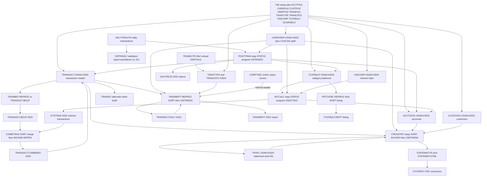

# CardDemo Dependency Map

Two dependency views of the application, both derived from the source rather than from documentation:

1. the **program call graph**, built from every `CALL`, `EXEC CICS XCTL PROGRAM(...)` and
   `EXEC CICS LINK PROGRAM(...)` in `app/cbl/`, `app/app-authorization-ims-db2-mq/cbl/`,
   `app/app-transaction-type-db2/cbl/` and `app/app-vsam-mq/cbl/`;
2. the **dataset lineage**, built from the DD statements of every job in `app/jcl/`, the sub-application
   `jcl/` directories and the PROCs in `app/proc/`.

Every edge below cites `path:line`.

- [1. Program call graph](#1-program-call-graph)
- [2. How dynamic targets were resolved](#2-how-dynamic-targets-were-resolved)
- [3. Program dependency table](#3-program-dependency-table)
- [4. External and system dependencies](#4-external-and-system-dependencies)
- [5. Dataset lineage per job](#5-dataset-lineage-per-job)
- [6. End-to-end batch pipeline](#6-end-to-end-batch-pipeline)
- [7. README order vs. actual JCL](#7-readme-order-vs-actual-jcl)
- [8. Consequences for modernization](#8-consequences-for-modernization)

## 1. Program call graph

Navigation is almost entirely CICS `XCTL` with the `CARDDEMO-COMMAREA` (`app/cpy/COCOM01Y.cpy:19`) as the
only state carrier: there is **exactly one** `EXEC CICS LINK` between application programs
(`COPAUS1C.cbl:248`) and only three application-to-application plain `CALL` relationships
(`CBSTM03A`→`CBSTM03B`, `CORPT00C`/`COTRN02C`→`CSUTLDTC`, `CBACT01C`→`COBDATFT`).

```mermaid
graph TD
    COSGN00C["COSGN00C signon"]
    COMEN01C["COMEN01C user menu"]
    COADM01C["COADM01C admin menu"]

    COSGN00C --> COMEN01C
    COSGN00C --> COADM01C
    COMEN01C --> COSGN00C
    COADM01C --> COSGN00C

    COACTVWC["COACTVWC account view"]
    COACTUPC["COACTUPC account update"]
    COCRDLIC["COCRDLIC card list"]
    COCRDSLC["COCRDSLC card detail"]
    COCRDUPC["COCRDUPC card update"]
    COTRN00C["COTRN00C transaction list"]
    COTRN01C["COTRN01C transaction view"]
    COTRN02C["COTRN02C transaction add"]
    CORPT00C["CORPT00C report submit"]
    COBIL00C["COBIL00C bill pay"]
    COPAUS0C["COPAUS0C pending auth summary"]

    COMEN01C --> COACTVWC
    COMEN01C --> COACTUPC
    COMEN01C --> COCRDLIC
    COMEN01C --> COCRDSLC
    COMEN01C --> COCRDUPC
    COMEN01C --> COTRN00C
    COMEN01C --> COTRN01C
    COMEN01C --> COTRN02C
    COMEN01C --> CORPT00C
    COMEN01C --> COBIL00C
    COMEN01C --> COPAUS0C

    COACTVWC --> COMEN01C
    COACTUPC --> COMEN01C
    COCRDLIC --> COMEN01C
    COCRDSLC --> COMEN01C
    COCRDUPC --> COMEN01C
    COTRN00C --> COMEN01C
    COTRN01C --> COMEN01C
    COTRN02C --> COMEN01C
    CORPT00C --> COMEN01C
    COBIL00C --> COMEN01C

    COCRDLIC --> COCRDSLC
    COCRDLIC --> COCRDUPC
    COTRN00C --> COTRN01C
    COTRN01C --> COTRN00C

    COUSR00C["COUSR00C user list"]
    COUSR01C["COUSR01C user add"]
    COUSR02C["COUSR02C user update"]
    COUSR03C["COUSR03C user delete"]
    COTRTLIC["COTRTLIC tran type list Db2"]
    COTRTUPC["COTRTUPC tran type update Db2"]

    COADM01C --> COUSR00C
    COADM01C --> COUSR01C
    COADM01C --> COUSR02C
    COADM01C --> COUSR03C
    COADM01C --> COTRTLIC
    COADM01C --> COTRTUPC

    COUSR00C --> COADM01C
    COUSR01C --> COADM01C
    COUSR02C --> COADM01C
    COUSR03C --> COADM01C
    COTRTLIC --> COADM01C
    COTRTUPC --> COADM01C

    COUSR00C --> COUSR02C
    COUSR00C --> COUSR03C
    COTRTLIC --> COTRTUPC

    COPAUS1C["COPAUS1C pending auth detail"]
    COPAUS2C["COPAUS2C fraud update"]
    COPAUS0C --> COPAUS1C
    COPAUS1C --> COPAUS0C
    COPAUS1C -->|"LINK"| COPAUS2C
    COPAUS0C --> COMEN01C
    COPAUS0C --> COSGN00C

    CBSTM03A["CBSTM03A statement driver batch"]
    CBSTM03B["CBSTM03B statement file I-O subprogram"]
    CSUTLDTC["CSUTLDTC date validation subprogram"]
    CBACT01C["CBACT01C account extract batch"]
    COBDATFT["COBDATFT date format subprogram not in repo"]

    CBSTM03A -->|"CALL"| CBSTM03B
    CORPT00C -->|"CALL"| CSUTLDTC
    COTRN02C -->|"CALL"| CSUTLDTC
    CBACT01C -->|"CALL"| COBDATFT

    TRANREPT["TRANREPT job via internal reader"]
    CORPT00C -->|"submits JCL"| TRANREPT
```



Programs with **no application-program edges at all** (reached only by a scheduler, an MQ trigger or an IMS
region): `CBACT01C` (as a job step), `CBACT02C`, `CBACT03C`, `CBACT04C`, `CBCUS01C`, `CBTRN01C`, `CBTRN02C`,
`CBTRN03C`, `CBEXPORT`, `CBIMPORT`, `COBSWAIT`, `CBPAUP0C`, `PAUDBLOD`, `PAUDBUNL`, `DBUNLDGS`, `COBTUPDT`,
`COPAUA0C`, `COACCT01`, `CODATE01`. They are coupled through **data**, not through calls — which is why the
dataset lineage in section 5 is the more important graph for the batch estate.

## 2. How dynamic targets were resolved

Only two `XCTL`s in the whole application name a program literally
(`COSGN00C.cbl:232` and `:237`). Everything else names a variable, so each target below was resolved by
following the `MOVE`s that set it.

| Variable | Where declared | How resolved | Resulting targets |
| :------- | :------------- | :----------- | :---------------- |
| `CDEMO-TO-PROGRAM` | `app/cpy/COCOM01Y.cpy:24` | Trace every `MOVE … TO CDEMO-TO-PROGRAM` in the program that issues the `XCTL`. Two idioms recur: a literal/`LIT-` constant, or `MOVE CDEMO-FROM-PROGRAM TO CDEMO-TO-PROGRAM` (return to caller) | Literals `'COSGN00C'`, `'COADM01C'`, `'COMEN01C'`, `'COTRN00C'`, `'COTRN01C'`, `'COUSR02C'`, `'COUSR03C'`; plus "whatever program invoked me" |
| `CCARD-NEXT-PROG` | `app/cpy/CVCRD01Y.cpy:21` | Same technique inside the card programs | `COCRDSLC` (`COCRDLIC.cbl:526`), `COCRDUPC` (`COCRDLIC.cbl:554`), self (re-display) |
| `CDEMO-MENU-OPT-PGMNAME(WS-OPTION)` | `app/cpy/COMEN02Y.cpy:97` | Subscripted table entry; the table is populated from `FILLER … VALUE` literals in the same copybook, so all 11 targets are statically known | `COACTVWC`, `COACTUPC`, `COCRDLIC`, `COCRDSLC`, `COCRDUPC`, `COTRN00C`, `COTRN01C`, `COTRN02C`, `CORPT00C`, `COBIL00C`, `COPAUS0C` (`COMEN02Y.cpy:28`, `:34`, `:40`, `:46`, `:52`, `:58`, `:64`, `:71`, `:77`, `:83`, `:89`) |
| `CDEMO-ADMIN-OPT-PGMNAME(WS-OPTION)` | `app/cpy/COADM02Y.cpy:59` | As above | `COUSR00C`, `COUSR01C`, `COUSR02C`, `COUSR03C`, `COTRTLIC`, `COTRTUPC` (`COADM02Y.cpy:29`, `:34`, `:39`, `:44`, `:49`, `:53`) |
| `LIT-MENUPGM`, `LIT-ADMINPGM`, `LIT-CARDDTLPGM`, `LIT-CARDUPDPGM`, `LIT-ADDTPGM` | per program, e.g. `COCRDLIC.cbl:187`, `:195`, `:203`; `COACTUPC.cbl:557`; `COTRTLIC.cbl:47`, `:50` | Constant `VALUE` clauses | `COMEN01C`, `COADM01C`, `COCRDSLC`, `COCRDUPC`, `COTRTUPC` |
| `WS-PGM-AUTH-SMRY`, `WS-PGM-AUTH-DTL`, `WS-PGM-AUTH-FRAUD`, `WS-PGM-MENU` | `COPAUS0C.cbl:33`–`:35`, `COPAUS1C.cbl:33`–`:35` | Constant `VALUE` clauses | `COPAUS0C`, `COPAUS1C`, `COPAUS2C`, `COMEN01C` |

The "return to caller" idiom is what makes the graph bidirectional. In
`COTRTUPC.cbl:438`–`:443` it is written out explicitly:

```cobol
IF CDEMO-FROM-PROGRAM EQUAL LOW-VALUES
OR CDEMO-FROM-PROGRAM EQUAL SPACES
    MOVE LIT-ADMINPGM TO CDEMO-TO-PROGRAM
ELSE
    MOVE CDEMO-FROM-PROGRAM TO CDEMO-TO-PROGRAM
END-IF
```

so the reverse edge is "caller if known, otherwise the module's default menu". `COACTVWC.cbl:336`–`:338`,
`COCRDSLC.cbl:318`–`:320`, `COCRDUPC.cbl:451`–`:453` and `COACTUPC.cbl:939`–`:941` use the identical
pattern. In the graph above those reverse edges are drawn to the default menu, because any other caller is
already represented by that caller's forward edge.

**Declared but never used** (dead navigation intent, not edges): `LIT-CARDDTLPGM` in `COACTVWC.cbl:176`,
`COACTUPC.cbl:565` and `COCRDUPC.cbl:243` — the constant exists but no `MOVE` references it, so there is no
account-view → card-detail transfer.

## 3. Program dependency table

Mechanism `XCTL` = `EXEC CICS XCTL PROGRAM(...)`, `LINK` = `EXEC CICS LINK PROGRAM(...)`, `CALL` = static
COBOL call.

| Source | Target | Mechanism | Citation | Dynamic resolution |
| :----- | :----- | :-------- | :------- | :----------------- |
| `COSGN00C` | `COADM01C` | XCTL | `app/cbl/COSGN00C.cbl:231`–`:232` | Literal `PROGRAM ('COADM01C')` — taken when `CDEMO-USRTYP-ADMIN` is true (`:227`, `:230`), i.e. `SEC-USR-TYPE = 'A'` |
| `COSGN00C` | `COMEN01C` | XCTL | `app/cbl/COSGN00C.cbl:236`–`:237` | Literal `PROGRAM ('COMEN01C')` |
| `COMEN01C` | 11 menu programs | XCTL | `app/cbl/COMEN01C.cbl:156`–`:157`, `:185` | `CDEMO-MENU-OPT-PGMNAME(WS-OPTION)`; targets from `COMEN02Y.cpy:28`–`:89` |
| `COMEN01C` | `COSGN00C` | XCTL | `app/cbl/COMEN01C.cbl:199`, `:202` | `MOVE 'COSGN00C' TO CDEMO-TO-PROGRAM` then `XCTL PROGRAM(CDEMO-TO-PROGRAM)` |
| `COADM01C` | 6 admin programs | XCTL | `app/cbl/COADM01C.cbl:146` | `CDEMO-ADMIN-OPT-PGMNAME(WS-OPTION)`; targets from `COADM02Y.cpy:29`–`:53` |
| `COADM01C` | `COSGN00C` | XCTL | `app/cbl/COADM01C.cbl:166`, `:169` | Literal move then variable `XCTL` |
| `COACTVWC` | `COMEN01C` or caller | XCTL | `app/cbl/COACTVWC.cbl:336`, `:338`, `:349`–`:350` | `LIT-MENUPGM` = `'COMEN01C'` (`:168`) when there is no caller |
| `COACTUPC` | `COMEN01C` or caller | XCTL | `app/cbl/COACTUPC.cbl:939`, `:941`, `:956`–`:957` | `LIT-MENUPGM` = `'COMEN01C'` (`:557`) |
| `COCRDLIC` | `COMEN01C` | XCTL | `app/cbl/COCRDLIC.cbl:402`–`:403` | `PROGRAM (LIT-MENUPGM)`, `VALUE 'COMEN01C'` (`:187`) |
| `COCRDLIC` | `COCRDSLC` | XCTL | `app/cbl/COCRDLIC.cbl:526`, `:538`–`:539` | `MOVE LIT-CARDDTLPGM TO CCARD-NEXT-PROG`; `LIT-CARDDTLPGM` = `'COCRDSLC'` (`:195`) |
| `COCRDLIC` | `COCRDUPC` | XCTL | `app/cbl/COCRDLIC.cbl:554`, `:566`–`:567` | `MOVE LIT-CARDUPDPGM TO CCARD-NEXT-PROG`; `LIT-CARDUPDPGM` = `'COCRDUPC'` (`:203`) |
| `COCRDSLC` | `COMEN01C` or caller | XCTL | `app/cbl/COCRDSLC.cbl:318`, `:320`, `:331`–`:332` | `LIT-MENUPGM` (`:179`) |
| `COCRDUPC` | `COMEN01C` or caller | XCTL | `app/cbl/COCRDUPC.cbl:451`, `:453`, `:473`–`:474` | `LIT-MENUPGM` (`:235`) |
| `COTRN00C` | `COTRN01C` | XCTL | `app/cbl/COTRN00C.cbl:188`, `:193` | Literal `'COTRN01C'` — "view selected transaction" |
| `COTRN00C` | `COMEN01C` | XCTL | `app/cbl/COTRN00C.cbl:123` | Literal move |
| `COTRN00C` | `COSGN00C` | XCTL | `app/cbl/COTRN00C.cbl:108`, `:513`, `:519` | Literal move |
| `COTRN01C` | `COTRN00C` | XCTL | `app/cbl/COTRN01C.cbl:126`, `:206` | Literal `'COTRN00C'` |
| `COTRN01C` | `COMEN01C`, `COSGN00C` | XCTL | `app/cbl/COTRN01C.cbl:117`, `:95`, `:200`, `:206` | Literal moves |
| `COTRN02C` | `COMEN01C`, `COSGN00C` | XCTL | `app/cbl/COTRN02C.cbl:138`, `:116`, `:503`, `:509` | Literal moves |
| `COTRN02C` | `CSUTLDTC` | CALL | `app/cbl/COTRN02C.cbl:393`, `:413` | `CALL 'CSUTLDTC' USING CSUTLDTC-DATE` — literal target |
| `COBIL00C` | `COMEN01C`, `COSGN00C` | XCTL | `app/cbl/COBIL00C.cbl:130`, `:108`, `:276`, `:282` | Literal moves |
| `CORPT00C` | `COMEN01C`, `COSGN00C` | XCTL | `app/cbl/CORPT00C.cbl:188`, `:173`, `:543`, `:549` | Literal moves |
| `CORPT00C` | `CSUTLDTC` | CALL | `app/cbl/CORPT00C.cbl:392`, `:412` | Literal target |
| `CORPT00C` | `TRANREPT` job | internal reader | `app/cbl/CORPT00C.cbl:84`, `:94`, `:462` | Builds `//TRNRPT00 JOB …` and `//STEP10 EXEC PROC=TRANREPT` in working storage and writes it to `INTRDR` — an online-to-batch dependency invisible to a call-graph tool |
| `COUSR00C` | `COUSR02C` | XCTL | `app/cbl/COUSR00C.cbl:192`, `:197` | Literal `'COUSR02C'` (update selected user) |
| `COUSR00C` | `COUSR03C` | XCTL | `app/cbl/COUSR00C.cbl:202`, `:207` | Literal `'COUSR03C'` (delete selected user) |
| `COUSR00C` | `COADM01C`, `COSGN00C` | XCTL | `app/cbl/COUSR00C.cbl:126`, `:111`, `:509`, `:515` | Literal moves |
| `COUSR01C` | `COADM01C`, `COSGN00C` | XCTL | `app/cbl/COUSR01C.cbl:94`, `:79`, `:168`, `:176` | Literal moves |
| `COUSR02C` | `COADM01C`, `COSGN00C` | XCTL | `app/cbl/COUSR02C.cbl:114`, `:125`, `:91`, `:253`, `:259` | Literal moves |
| `COUSR03C` | `COADM01C`, `COSGN00C` | XCTL | `app/cbl/COUSR03C.cbl:113`, `:124`, `:91`, `:200`, `:206` | Literal moves |
| `COTRTLIC` | `COTRTUPC` | XCTL | `app/app-transaction-type-db2/cbl/COTRTLIC.cbl:638`, `:648`–`:649` | `PROGRAM (LIT-ADDTPGM)`, `VALUE 'COTRTUPC'` (`:50`) |
| `COTRTLIC` | `COADM01C` | XCTL | `app/app-transaction-type-db2/cbl/COTRTLIC.cbl:603`, `:620`–`:621` | `LIT-ADMINPGM` = `'COADM01C'` (`:47`) |
| `COTRTUPC` | `COADM01C` or caller | XCTL | `app/app-transaction-type-db2/cbl/COTRTUPC.cbl:440`, `:442`, `:457`–`:458` | `LIT-ADMINPGM` (`:209`–`:210`) |
| `COPAUS0C` | `COPAUS1C` | XCTL | `app/app-authorization-ims-db2-mq/cbl/COPAUS0C.cbl:316`, `:323` | `WS-PGM-AUTH-DTL`, `VALUE 'COPAUS1C'` (`:34`) |
| `COPAUS0C` | `COMEN01C` | XCTL | `app/app-authorization-ims-db2-mq/cbl/COPAUS0C.cbl:236` | `WS-PGM-MENU`, `VALUE 'COMEN01C'` (`:35`) |
| `COPAUS0C` | `COSGN00C` | XCTL | `app/app-authorization-ims-db2-mq/cbl/COPAUS0C.cbl:669`, `:675` | Literal move |
| `COPAUS1C` | `COPAUS0C` | XCTL | `app/app-authorization-ims-db2-mq/cbl/COPAUS1C.cbl:168`, `:185`, `:368` | `WS-PGM-AUTH-SMRY`, `VALUE 'COPAUS0C'` (`:34`) |
| `COPAUS1C` | `COPAUS2C` | **LINK** | `app/app-authorization-ims-db2-mq/cbl/COPAUS1C.cbl:248`–`:252` | `PROGRAM(WS-PGM-AUTH-FRAUD)`, `VALUE 'COPAUS2C'` (`:35`); `COMMAREA(WS-FRAUD-DATA)`, `NOHANDLE`, result checked via `WS-FRD-UPDT-SUCCESS` (`:253`–`:254`). The only synchronous call-and-return between application programs |
| `CBSTM03A` | `CBSTM03B` | CALL | `app/cbl/CBSTM03A.CBL:351`, `:377`, `:401`, `:734`, `:746`, `:769`, `:787`, `:805`, `:835`, `:860`, `:877`, `:893`, `:909` | `CALL 'CBSTM03B' USING WS-M03B-AREA` — 13 call sites, all literal. `CBSTM03B` is a hand-written file-I/O layer (open/read/close driven by a request code in the shared area) |
| `CBACT01C` | `COBDATFT` | CALL | `app/cbl/CBACT01C.cbl:231` | `CALL 'COBDATFT' USING CODATECN-REC` — literal, but **`COBDATFT` does not exist in this repository**; only its interface copybook `app/cpy/CODATECN.cpy` does. An unresolved external at link time |

## 4. External and system dependencies

Not application programs, but they constrain any rewrite:

| Target | Kind | Callers (citations) |
| :----- | :--- | :------------------ |
| `CBLTDLI` | IMS DL/I interface | `PAUDBLOD.CBL:244`, `:296`, `:321`; `PAUDBUNL.CBL:213`, `:257`; `DBUNLDGS.CBL:222`, `:267`, `:302`, `:321` (all in `app/app-authorization-ims-db2-mq/cbl/`), with function codes from `IMSFUNCS.cpy:18`–`:26` |
| `MQOPEN`, `MQGET`, `MQPUT`, `MQPUT1`, `MQCLOSE` | IBM MQ API | `app/app-authorization-ims-db2-mq/cbl/COPAUA0C.cbl:262`, `:400`, `:758`, `:956`; `app/app-vsam-mq/cbl/CODATE01.cbl:182`, `:216`, `:251`, `:301`, `:383`, `:420`, `:461`, `:483`, `:506`; `app/app-vsam-mq/cbl/COACCT01.cbl:233`, `:267`, `:302`, `:352`, `:479`, `:516`, `:557`, `:579`, `:602` |
| `CEEDAYS` | Language Environment date service | `app/cbl/CSUTLDTC.cbl:116` — the leaf of every date validation in the application |
| `CEE3ABD` | LE abend service | `CBACT01C.cbl:410`, `CBACT02C.cbl:158`, `CBACT03C.cbl:158`, `CBACT04C.cbl:632`, `CBCUS01C.cbl:158`, `CBTRN01C.cbl:473`, `CBTRN02C.cbl:711`, `CBTRN03C.cbl:630`, `CBSTM03A.CBL:923`, `CBEXPORT.cbl:579`, `CBIMPORT.cbl:484` — the uniform batch failure path |
| `MVSWAIT` | MVS wait service | `app/cbl/COBSWAIT.cbl:38` |
| `DSNTIAC` | Db2 message formatter | `app/app-transaction-type-db2/cpy/CSDB2RPY.cpy:57`, copied into `COTRTLIC`, `COTRTUPC` and `COBTUPDT` |
| Db2 plan `CARDDEMO` | Db2 | `app/app-transaction-type-db2/jcl/MNTTRDB2.jcl:30` (`RUN PROGRAM(COBTUPDT) PLAN(CARDDEMO)`) |
| PSB `PSBPAUTB` / `PAUTBUNL` / `DLIGSAMP` | IMS | `app/app-authorization-ims-db2-mq/jcl/CBPAUP0J.jcl:24`, `UNLDPADB.JCL:38`, `UNLDGSAM.JCL:26` |

## 5. Dataset lineage per job

Producer/consumer per dataset, from the DD statements. `IN` = read, `OUT` = created, `I-O` = updated in
place. Dataset names are abbreviated from the `AWS.M2.CARDDEMO.` prefix.

### 5.1 Reference-data and master-file load jobs

| Job | Program/utility | IN | OUT / I-O |
| :-- | :-------------- | :- | :-------- |
| `app/jcl/ACCTFILE.jcl` | `IDCAMS` (`:22`, `:33`, `:54`) | `ACCTDATA.PS` (`:56`) | `ACCTDATA.VSAM.KSDS` (`:58`) |
| `app/jcl/CARDFILE.jcl` | `IDCAMS` + `BLDINDEX` | `CARDDATA.PS` (`:70`) | `CARDDATA.VSAM.KSDS` (`:72`), `CARDDATA.VSAM.AIX` + `.AIX.PATH` (`:80`–`:107`) |
| `app/jcl/CUSTFILE.jcl` | `IDCAMS` | `CUSTDATA.PS` (`:66`) | `CUSTDATA.VSAM.KSDS` (`:68`) |
| `app/jcl/XREFFILE.jcl` | `IDCAMS` + `BLDINDEX` | `CARDXREF.PS` (`:59`) | `CARDXREF.VSAM.KSDS` (`:61`), `CARDXREF.VSAM.AIX` + `.AIX.PATH` (`:69`–`:97`) |
| `app/jcl/TRANFILE.jcl` | `IDCAMS` | `DALYTRAN.PS.INIT` (`:69`) | `TRANSACT.VSAM.KSDS` (`:71`) + AIX/PATH |
| `app/jcl/TRANTYPE.jcl` | `IDCAMS` | `TRANTYPE.PS` (`:56`) | `TRANTYPE.VSAM.KSDS` (`:58`) |
| `app/jcl/TRANCATG.jcl` | `IDCAMS` | `TRANCATG.PS` (`:56`) | `TRANCATG.VSAM.KSDS` (`:58`) |
| `app/jcl/DISCGRP.jcl` | `IDCAMS` | `DISCGRP.PS` (`:56`) | `DISCGRP.VSAM.KSDS` (`:58`) |
| `app/jcl/TCATBALF.jcl` | `IDCAMS` | `TCATBALF.PS` (`:56`) | `TCATBALF.VSAM.KSDS` (`:58`) |
| `app/jcl/DUSRSECJ.jcl` | `IEBGENER` + `IDCAMS` | instream user records | `USRSEC.PS` (`:46`), `USRSEC.VSAM.KSDS` (`:83`) |
| `app/app-transaction-type-db2/jcl/TRANEXTR.jcl` | `DSNTIAUL` under `IKJEFT01` (`:65`, `:95`) | Db2 `TRANSACTION_TYPE`, `TRANSACTION_CATEGORY` | `TRANTYPE.PS` (`:72`), `TRANCATG.PS` (`:102`), backups `TRANTYPE.BKUP(+1)` (`:35`), `TRANCATG.PS.BKUP(+1)` (`:46`) |

The Db2 sub-application therefore **feeds** the VSAM reference files: `TRANEXTR` → `TRANTYPE.PS`/`TRANCATG.PS`
→ `TRANTYPE.jcl`/`TRANCATG.jcl` → the KSDSs that `CBTRN03C` reads.

### 5.2 Application jobs

| Job | Step → program | IN | I-O | OUT |
| :-- | :------------- | :- | :-- | :-- |
| `app/jcl/POSTTRAN.jcl` | `STEP15` → `CBTRN02C` (`:23`) | `DALYTRAN.PS` (`:30`), `CARDXREF.VSAM.KSDS` (`:32`) | `TRANSACT.VSAM.KSDS` (`:28`), `ACCTDATA.VSAM.KSDS` (`:39`), `TCATBALF.VSAM.KSDS` (`:41`) | `DALYREJS(+1)` (`:34`) |
| `app/jcl/INTCALC.jcl` | `STEP15` → `CBACT04C` `PARM='2022071800'` (`:22`) | `TCATBALF.VSAM.KSDS` (`:27`), `CARDXREF.VSAM.KSDS` (`:29`), `CARDXREF.VSAM.AIX.PATH` (`:31`), `DISCGRP.VSAM.KSDS` (`:35`) | `ACCTDATA.VSAM.KSDS` (`:33`) | `SYSTRAN(+1)` (`:37`) |
| `app/jcl/TRANBKP.jcl` | `STEP05R` → `REPROC`/`IDCAMS` (`:23`) | `TRANSACT.VSAM.KSDS` (`:26`) | | `TRANSACT.BKUP(+1)` (`:29`) |
| | `STEP05`, `STEP10` → `IDCAMS` (`:37`, `:51`) | | | redefines `TRANSACT.VSAM.KSDS` |
| `app/jcl/COMBTRAN.jcl` | `STEP05R` → `SORT` (`:22`) | `TRANSACT.BKUP(0)` (`:23`), `SYSTRAN(0)` (`:25`) | | `TRANSACT.COMBINED(+1)` (`:33`) |
| | `STEP10` → `IDCAMS` (`:41`) | `TRANSACT.COMBINED(+1)` (`:43`) | `TRANSACT.VSAM.KSDS` (`:45`) | |
| `app/jcl/CREASTMT.JCL` | `DELDEF01` → `IDCAMS` (`:22`) | | | defines `TRXFL` KSDS |
| | `STEP010` → `SORT` (`:44`) | `TRANSACT.VSAM.KSDS` (`:45`) | | `TRXFL.SEQ` (`:48`) |
| | `STEP020` → `IDCAMS` (`:56`) | `TRXFL.SEQ` (`:58`) | | `TRXFL.VSAM.KSDS` (`:59`) |
| | `STEP040` → `CBSTM03A` (`:79`) | `TRXFL.VSAM.KSDS` (`:83`), `CARDXREF.VSAM.KSDS` (`:84`), `ACCTDATA.VSAM.KSDS` (`:85`), `CUSTDATA.VSAM.KSDS` (`:86`) | | `STATEMNT.PS` (`:87`), `STATEMNT.HTML` (`:92`) |
| `app/jcl/TRANREPT.jcl` | `STEP05R` → `REPROC`/`IDCAMS` (`:23`) | `TRANSACT.VSAM.KSDS` (`:26`) | | `TRANSACT.BKUP(+1)` (`:29`) |
| | `STEP05R` (duplicate name) → `SORT` (`:37`) | `TRANSACT.BKUP(+1)` (`:38`) | | `TRANSACT.DALY(+1)` (`:51`) |
| | `STEP10R` → `CBTRN03C` (`:59`) | `TRANSACT.DALY(+1)` (`:65`), `CARDXREF.VSAM.KSDS` (`:67`), `TRANTYPE.VSAM.KSDS` (`:69`), `TRANCATG.VSAM.KSDS` (`:71`), `DATEPARM` (`:73`) | | `TRANREPT(+1)` (`:76`) |
| `app/jcl/PRTCATBL.jcl` | `STEP05R` → `REPROC`/`IDCAMS` (`:29`) | `TCATBALF.VSAM.KSDS` (`:32`) | | `TCATBALF.BKUP(+1)` (`:35`) |
| | `STEP10R` → `SORT` (`:43`) | `TCATBALF.BKUP(+1)` (`:44`) | | `TCATBALF.REPT` (`:59`) |
| `app/jcl/READACCT.jcl` | `STEP05` → `CBACT01C` (`:32`) | `ACCTDATA.VSAM.KSDS` (`:35`) | | `ACCTDATA.PSCOMP` (`:37`), `.ARRYPS` (`:41`), `.VBPS` (`:45`) |
| `app/jcl/READCARD.jcl` | `STEP05` → `CBACT02C` (`:22`) | `CARDDATA.VSAM.KSDS` (`:25`) | | `SYSOUT` listing |
| `app/jcl/READCUST.jcl` | `STEP05` → `CBCUS01C` (`:21`) | `CUSTDATA.VSAM.KSDS` (`:24`) | | `SYSOUT` listing |
| `app/jcl/READXREF.jcl` | `STEP05` → `CBACT03C` (`:22`) | `CARDXREF.VSAM.KSDS` (`:25`) | | `SYSOUT` listing |
| `app/jcl/CBEXPORT.jcl` | `STEP02` → `CBEXPORT` (`:43`) | `CUSTDATA` (`:49`), `ACCTDATA` (`:51`), `CARDXREF` (`:53`), `TRANSACT` (`:55`), `CARDDATA` (`:57`) | | `EXPORT.DATA` (`:62`) |
| `app/jcl/CBIMPORT.jcl` | `STEP01` → `CBIMPORT` (`:22`) | `EXPORT.DATA` (`:28`) | | `CUSTOUT` (`:33`), `ACCTOUT` (`:38`), `XREFOUT` (`:43`), `TRNXOUT` (`:48`), `IMPORT.ERRORS` (`:56`); `CARDOUT` selected by `CBIMPORT.cbl:63` is **missing** |
| `app/jcl/TXT2PDF1.JCL` | `TXT2PDF` → `IKJEFT1B` (`:24`) | `STATEMNT.PS` (`:33`) | | PDF output |
| `app/jcl/WAITSTEP.jcl` | `WAIT` → `COBSWAIT` (`:22`) | instream `SYSIN` (`:25`) | | none |

### 5.3 Sub-application jobs

| Job | Step → program | IN | OUT |
| :-- | :------------- | :- | :-- |
| `app/app-authorization-ims-db2-mq/jcl/LOADPADB.JCL` | `STEP01` → `PAUDBLOD` (BMP, `:26`) | `PAUTDB.ROOT.FILEO` (`:36`), `PAUTDB.CHILD.FILEO` (`:38`) | IMS DB `DDPAUTP0`/index `DDPAUTX0` (`:40`, `:41`) |
| `app/app-authorization-ims-db2-mq/jcl/UNLDPADB.JCL` | `STEP01` → `PAUDBUNL` (DLI, `:38`) | IMS DB | `PAUTDB.ROOT.FILEO` (`:48`), `PAUTDB.CHILD.FILEO` (`:53`) |
| `app/app-authorization-ims-db2-mq/jcl/UNLDGSAM.JCL` | `STEP01` → `DBUNLDGS` (DLI, `:26`) | IMS DB | `PAUTDB.ROOT.GSAM` (`:36`), `PAUTDB.CHILD.GSAM` (`:39`) |
| `app/app-authorization-ims-db2-mq/jcl/CBPAUP0J.jcl` | `STEP01` → `CBPAUP0C` (BMP, `:24`) | IMS DB + `SYSIN` parameters (`:36`) | IMS DB (deletes expired segments) |
| `app/app-authorization-ims-db2-mq/jcl/DBPAUTP0.jcl` | `UNLOAD` → `DFSRRC00` (`:15`) | IMS DB + RECONs (`:40`–`:42`) | `IMSDATA.DBPAUTP0` (`:25`) |
| `app/app-transaction-type-db2/jcl/CREADB21.jcl` | `CRCRDDB`, `LDTTYPE`, `LDTCCAT` (`:52`, `:64`, `:77`) | `&LBNM..CNTL(…)` members `DB2CREAT`, `DB2LTTYP`, `DB2LTCAT` | Db2 tables |
| `app/app-transaction-type-db2/jcl/MNTTRDB2.jcl` | `STEP1` → `COBTUPDT` (`:21`, `:30`) | `INPFILE` (`:27`) | Db2 `TRANSACTION_TYPE` |

The `LOADPADB`/`UNLDPADB` pair is a closed loop over `PAUTDB.ROOT.FILEO`/`PAUTDB.CHILD.FILEO`: the unload
job produces exactly what the load job consumes, so the IMS database can be rebuilt from the sequential
copies (the practical migration path off IMS).

### 5.4 Datasets that couple jobs

| Dataset | Produced by | Consumed by |
| :------ | :---------- | :---------- |
| `DALYTRAN.PS` | external/seed (`TRANFILE.jcl:69` uses `DALYTRAN.PS.INIT`) | `CBTRN02C` (`POSTTRAN.jcl:30`), `CBTRN01C` (source `CBTRN01C.cbl:29`, no job) |
| `TRANSACT.VSAM.KSDS` | `TRANFILE.jcl:71`, updated by `POSTTRAN`, reloaded by `COMBTRAN.jcl:45` | `CBEXPORT` (`:55`), `CREASTMT` sort (`:45`), `TRANBKP` (`:26`), `TRANREPT` (`:26`), online `COTRN00C`/`COTRN01C`/`COTRN02C`/`COBIL00C` |
| `ACCTDATA.VSAM.KSDS` | `ACCTFILE.jcl:58` | `CBTRN02C` (I-O), `CBACT04C` (I-O), `CBACT01C`, `CBSTM03A`, `CBEXPORT`, online account/card/transaction screens |
| `CARDXREF.VSAM.KSDS` (+ `CXACAIX` path) | `XREFFILE.jcl:61`, `:69`–`:97` | `CBTRN02C`, `CBACT04C` (both the KSDS and the AIX path), `CBTRN03C`, `CBSTM03A`, `CBEXPORT`, online screens |
| `CARDDATA.VSAM.KSDS` (+ `CARDAIX`) | `CARDFILE.jcl:72`, `:80`–`:107` | `CBACT02C`, `CBEXPORT`, `COCRDLIC`/`COCRDSLC`/`COCRDUPC` |
| `CUSTDATA.VSAM.KSDS` | `CUSTFILE.jcl:68` | `CBCUS01C`, `CBSTM03A`, `CBEXPORT`, `COACTVWC`/`COACTUPC` |
| `TCATBALF.VSAM.KSDS` | `TCATBALF.jcl:58` | `CBTRN02C` (I-O), `CBACT04C` (IN), `PRTCATBL` |
| `DISCGRP.VSAM.KSDS` | `DISCGRP.jcl:58` | `CBACT04C` only |
| `TRANTYPE.VSAM.KSDS`, `TRANCATG.VSAM.KSDS` | `TRANTYPE.jcl:58`, `TRANCATG.jcl:58` (data from Db2 via `TRANEXTR`) | `CBTRN03C`; Db2 equivalents used by `COTRTLIC`/`COTRTUPC`/`COBTUPDT` |
| `SYSTRAN(+1)` | `CBACT04C` (`INTCALC.jcl:37`) | `COMBTRAN.jcl:25` as `SYSTRAN(0)` |
| `TRANSACT.BKUP(+1)` | `TRANBKP.jcl:29`, also `TRANREPT.jcl:29` | `COMBTRAN.jcl:23` as `(0)`, `TRANREPT.jcl:38` |
| `TRANSACT.DALY(+1)` | `TRANREPT.jcl:51` | `CBTRN03C` (`TRANREPT.jcl:65`) |
| `TRXFL.VSAM.KSDS` | `CREASTMT.JCL:59` | `CBSTM03A` (`:83`) |
| `DALYREJS(+1)` | `CBTRN02C` (`POSTTRAN.jcl:34`) | nothing in this repository — a dead-end output that in practice needs manual/ops handling |
| `EXPORT.DATA` | `CBEXPORT` (`CBEXPORT.jcl:62`) | `CBIMPORT` (`CBIMPORT.jcl:28`) |
| `STATEMNT.PS` | `CBSTM03A` (`CREASTMT.JCL:87`) | `TXT2PDF1.JCL:33` |
| `DATEPARM` | maintained outside the repo | `CBTRN03C` (`TRANREPT.jcl:73`) — the report date range |

## 6. End-to-end batch pipeline

Nodes are jobs/programs; edges are datasets. The daily cycle runs left to right; `TRANBKP` must sit between
`POSTTRAN` and `COMBTRAN` because `COMBTRAN` reads the backup generation `TRANSACT.BKUP(0)` that `TRANBKP`
creates.



Reading of the core chain, with citations:

1. `DALYTRAN.PS` → `CBTRN02C` (`app/jcl/POSTTRAN.jcl:30`). `CBTRN02C` validates each daily transaction
   against the xref, account and category-balance records and, on success, writes it to the transaction
   master and updates the balances; on failure it writes the record plus a reason to `DALYREJS(+1)`
   (`:34`). The README's separate "validation" step (`CBTRN01C`) is **not** part of this chain — see
   section 7.
2. `TCATBALF` + `DISCGRP` + `CARDXREF` (KSDS and AIX path) → `CBACT04C` (`app/jcl/INTCALC.jcl:27`–`:35`),
   which updates `ACCTDATA` in place and emits interest transactions to `SYSTRAN(+1)` (`:37`).
3. `TRANBKP` copies the master to `TRANSACT.BKUP(+1)` (`app/jcl/TRANBKP.jcl:29`); `COMBTRAN` merges that
   generation with `SYSTRAN(0)` (`app/jcl/COMBTRAN.jcl:23`, `:25`) and REPROs the result back into the
   master (`:45`). This is where interest transactions become visible to the online screens.
4. `CREASTMT` re-keys the master by card into `TRXFL.VSAM.KSDS` (`app/jcl/CREASTMT.JCL:45`, `:48`, `:59`)
   and `CBSTM03A` joins it with xref, account and customer data to print statements (`:83`–`:92`).
5. `TRANREPT` unloads and filters the master into `TRANSACT.DALY(+1)` and `CBTRN03C` reports it against the
   type/category reference files for the range in `DATEPARM` (`app/jcl/TRANREPT.jcl:65`–`:76`).

## 7. README order vs. actual JCL

The README lists the batch sequence at `README.md:211`–`:233`. Verified against the JCL:

| README step | Actual | Impact on the lineage |
| :---------- | :----- | :-------------------- |
| "POSTTRAN — Post Transactions" (`README.md:225`) | `app/jcl/POSTTRAN.jcl:23` executes **only** `CBTRN02C` | `CBTRN01C` is referenced by **no** JCL member in the repository. The pipeline has one posting program, not a validate-then-post pair; `CBTRN01C` is a standalone read-only checker (`CBTRN01C.cbl:29`–`:58` selects the same six files but never writes) |
| "INTCALC — Calculate Interest" (`:226`) | `CBACT04C` with `PARM='2022071800'` (`app/jcl/INTCALC.jcl:22`) | The processing date is hard-coded in the JCL, so the pipeline is not date-driven as written |
| "TRANBKP — Creates Transaction database" (`:218`) and "Backup" (`:227`) | one member does both: REPRO to backup (`:23`) then delete/define (`:37`, `:51`) | The create/backup duality of a single member is easy to mis-schedule; the member that actually seeds the master from `DALYTRAN.PS.INIT` is `TRANFILE.jcl:69`, which the README table omits |
| "COMBTRAN" (`:228`) | `SORT` of `TRANSACT.BKUP(0)` + `SYSTRAN(0)` then REPRO (`app/jcl/COMBTRAN.jcl:23`, `:25`, `:45`) | Depends on generations produced by two *different* earlier jobs; ordering `POSTTRAN` → `TRANBKP` → `INTCALC` → `COMBTRAN` matters and is not stated in the README |
| "CREASTMT" (`:229`) | 5 steps, ending in `CBSTM03A` (`app/jcl/CREASTMT.JCL:79`) | Adds the intermediate `TRXFL` KSDS that the README does not mention |
| "TRANEXTR" (`:219`) | `app/app-transaction-type-db2/jcl/TRANEXTR.jcl:65`, `:95` | Confirms the Db2 tables are upstream of the VSAM reference files, i.e. an extra cross-technology hop in the lineage |
| not listed | `TRANREPT.jcl`, `PRTCATBL.jcl`, `READACCT/CARD/CUST/XREF`, `CBEXPORT`/`CBIMPORT`, `TXT2PDF1`, `TRANFILE`, `DALYREJS`, `REPTFILE`, `DEFGDGB/D` | Reporting/extract/GDG-definition jobs; `TRANREPT` matters because `CORPT00C` submits it from the online session (`app/cbl/CORPT00C.cbl:84`, `:94`, `:462`) |

Where the two disagree, the JCL is authoritative: it is what runs.

## 8. Consequences for modernization

1. **The COMMAREA is the API.** Because 20 programs route through `CDEMO-TO-PROGRAM`
   (`app/cpy/COCOM01Y.cpy:24`), a converted UI needs an explicit navigation/session model; there is no
   static call tree to lift. The `CDEMO-PGM-CONTEXT` enter/re-enter flag (`:29`) is the pseudo-conversational
   state machine and must be replaced by real request state.
2. **Menus are data, not code paths.** All 17 forward navigation targets come from the literal tables in
   `COMEN02Y.cpy` and `COADM02Y.cpy`. Externalising those two tables converts most of the graph into
   configuration and lets the menu programs shrink to a lookup plus a dispatch.
3. **Two special cases must not be missed by a graph tool**: the single `LINK`
   (`COPAUS1C.cbl:248`, synchronous with a result flag) and the internal-reader job submission from
   `CORPT00C` (`:462`), which is an online → batch dependency expressed as text in working storage.
4. **The batch estate is coupled by GDG generations**, not by calls: `SYSTRAN`, `TRANSACT.BKUP`,
   `TRANSACT.DALY`, `TRANSACT.COMBINED`, `DALYREJS`, `TRANREPT`, `TCATBALF.BKUP`. Relative references
   (`(+1)`/`(0)`) encode the run order, so any replacement scheduler has to reproduce generation semantics
   or the merge in `COMBTRAN` silently reads the wrong data.
5. **`CARDXREF` is the hub**: it is an input to `CBTRN02C`, `CBACT04C`, `CBTRN03C`, `CBSTM03A`, `CBEXPORT`
   and to nearly every online screen, and `CBACT04C` needs both the KSDS and its alternate-index path
   (`app/jcl/INTCALC.jcl:29`, `:31`). It should be modelled first and kept a single source of truth.
6. **Two unresolved edges** are worth fixing before any conversion baseline: the missing `COBDATFT`
   (`app/cbl/CBACT01C.cbl:231`) and the missing `CARDOUT` DD in `app/jcl/CBIMPORT.jcl` for
   `app/cbl/CBIMPORT.cbl:63`.
