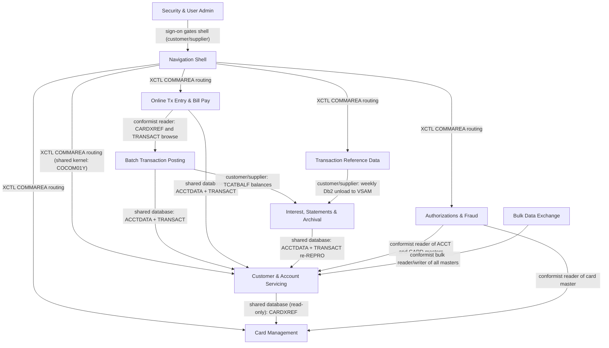

# CardDemo — Domain Decomposition

Empirical bounded-context model for the AWS CardDemo application, derived from what the code,
JCL, scheduler definitions and datasets actually do — not from the README's conceptual description.
Companion artifacts: `APPLICATION_INVENTORY.md`, `DATA_DICTIONARY.md`, `DEPENDENCY_MAP.md`,
`HOTSPOT_REPORT.md` (all on this branch).

---

## 1. Method

Three independent evidence sources were used, then cross-checked against each other:

1. **Copybook sharing.** Every `COPY` statement in `app/cbl/`,
   `app/app-authorization-ims-db2-mq/cbl/`, `app/app-transaction-type-db2/cbl/` and
   `app/app-vsam-mq/cbl/` was extracted by grep (both `COPY NAME.` and `COPY 'NAME'` forms; the
   two `COPY … REPLACING`-style hits in `app/app-vsam-mq/cbl/COACCT01.cbl:345` and
   `app/app-vsam-mq/cbl/CODATE01.cbl:294` are `INITIALIZE … REPLACING` statements on a variable
   named `REQUEST-MSG-COPY`, not copybook inclusions, and were excluded). Programs that copy the
   same *domain data* copybook read or write the same record layout and therefore share a model.
2. **JCL job grouping.** Job-to-job ordering was taken from the scheduler definitions —
   `app/scheduler/CardDemo.controlm` (Control-M folders with explicit `INCOND`/`OUTCOND`
   dependencies) and `app/scheduler/CardDemo.ca7` (CA-7 trigger chains) — verified against the DD
   statements in `app/jcl/`, sub-application `jcl/` directories and the two PROCs in `app/proc/`.
   Jobs the scheduler groups into one folder/chain belong to one operational unit.
3. **Dataset sharing vs. isolation.** The dataset lineage in `DEPENDENCY_MAP.md` §5
   (lines 233–322) was verified against actual DD statements and CICS `DATASET(...)` literals.
   Every dataset is classified **domain-private** (one context reads and writes it),
   **shared-read** (one writer context, other contexts read), or **shared-write** (two or more
   contexts write it). Shared-write datasets are the real boundaries and the hardest seams.

**Infrastructure-vs-domain copybook rule (stated explicitly).** Copybooks that carry screen
titles, message strings, screen attributes, key decodes, date work areas, CICS/BMS symbols or MQ
API structures — `COTTL01Y`, `CSMSG01Y`, `CSMSG02Y`, `CSDAT01Y`, `CSSTRPFY`, `CSSETATY`,
`CSUTLDWY`, `CSUTLDPY`, `DFHAID`, `DFHBMSCA`, the per-screen map copybooks (`COACTUP`,
`COTRN00`, …), and the `CMQ*` MQ copybooks — are **infrastructure**. All 21 online programs copy
`COTTL01Y`/`CSMSG01Y`/`CSDAT01Y`/`DFHAID`/`DFHBMSCA` (grep result, §2.1); treating that as domain
coupling would collapse every screen into a single context, which is wrong. Only *domain data*
copybooks (record layouts: `CVACT01Y`, `CVACT02Y`, `CVACT03Y`, `CVCUS01Y`, `CVTRA01Y`–`CVTRA07Y`,
`CSUSR01Y`, `CIPAUDTY`, `CIPAUSMY`, `CVEXPORT`, `CUSTREC`, `COSTM01`, `CSLKPCDY`) count as
coupling evidence. `COCOM01Y` (the navigation COMMAREA) is a special case: it is infrastructure
in intent but it carries domain fields (`CDEMO-ACCT-ID`, `CDEMO-CARD-NUM`, `CDEMO-CUST-ID`,
`app/cpy/COCOM01Y.cpy:33-41`), so it is treated as a seam in its own right (§5, seam S8).

**Limitations.**

- Static evidence only: no runtime traces, no transaction volumes, no CICS statistics. Difficulty
  ratings for concurrent access (e.g. batch vs. online on `ACCTDATA`) are inferred from the
  CLOSEFIL/OPENFIL bracketing in the scheduler, not from observed contention.
- The repo is a demo: some wiring is broken (`CBTRN01C` is run by no JCL; `CBACT01C.cbl:231`
  calls `COBDATFT`, which exists only as assembler at `app/asm/COBDATFT.asm:17` and so cannot be
  carried across by a COBOL translator), so the *documented* pipeline and the
  *actual* pipeline differ (`DEPENDENCY_MAP.md` §7, lines 431–445). Decomposition follows the
  actual wiring.
- Business intent (team ownership, product roadmap) is not observable here; where the text below
  reasons about it, it is labeled as an assumption.

---

## 2. Evidence tables

### 2.1 Copybook → programs (domain copybooks only)

Built by grep over the four `cbl/` directories (350 raw `COPY` lines). Programs listed by
member name; sub-application programs are marked (A)=authorization, (T)=transaction-type Db2,
(M)=vsam-mq.

| Copybook | Record (dataset) | Count | Programs that copy it |
|---|---|---|---|
| `CVACT01Y` | `ACCOUNT-RECORD` (ACCTDATA) | 14 | CBACT01C, CBACT04C, CBEXPORT, CBIMPORT, CBSTM03A, CBTRN01C, CBTRN02C, COACCT01 (M), COACTUPC, COACTVWC, COBIL00C, COPAUA0C (A), COPAUS0C (A), COTRN02C |
| `CVACT02Y` | `CARD-RECORD` (CARDDATA) | 10 | CBACT02C, CBEXPORT, CBIMPORT, CBTRN01C, COACTVWC, COCRDLIC, COCRDSLC, COCRDUPC, COPAUS0C (A), COTRTLIC (T) |
| `CVACT03Y` | `CARD-XREF-RECORD` (CARDXREF) | 14 | CBACT03C, CBACT04C, CBEXPORT, CBIMPORT, CBSTM03A, CBTRN01C, CBTRN02C, CBTRN03C, COACTUPC, COACTVWC, COBIL00C, COPAUA0C (A), COPAUS0C (A), COTRN02C |
| `CVCUS01Y` | `CUSTOMER-RECORD` (CUSTDATA) | 10 | CBCUS01C, CBEXPORT, CBIMPORT, CBTRN01C, COACTUPC, COACTVWC, COCRDSLC, COCRDUPC, COPAUA0C (A), COPAUS0C (A) |
| `CVTRA01Y` | `TRAN-CAT-BAL-RECORD` (TCATBALF) | 2 | CBACT04C, CBTRN02C |
| `CVTRA02Y` | `DIS-GROUP-RECORD` (DISCGRP) | 1 | CBACT04C |
| `CVTRA03Y` | `TRAN-TYPE-RECORD` (TRANTYPE) | 1 | CBTRN03C |
| `CVTRA04Y` | `TRAN-CAT-RECORD` (TRANCATG) | 1 | CBTRN03C |
| `CVTRA05Y` | `TRAN-RECORD` (TRANSACT) | 11 | CBACT04C, CBEXPORT, CBIMPORT, CBTRN01C, CBTRN02C, CBTRN03C, COBIL00C, CORPT00C, COTRN00C, COTRN01C, COTRN02C |
| `CVTRA06Y` | `DALYTRAN-RECORD` (DALYTRAN) | 2 | CBTRN01C, CBTRN02C |
| `CVTRA07Y` | transaction report print lines | 1 | CBTRN03C |
| `CSUSR01Y` | `SEC-USER-DATA` (USRSEC) | 14 | COACTUPC, COACTVWC, COADM01C, COCRDLIC, COCRDSLC, COCRDUPC, COMEN01C, COSGN00C, COTRTLIC (T), COTRTUPC (T), COUSR00C, COUSR01C, COUSR02C, COUSR03C |
| `CVCRD01Y` | online card/account work area | 7 | COACTUPC, COACTVWC, COCRDLIC, COCRDSLC, COCRDUPC, COTRTLIC (T), COTRTUPC (T) |
| `CIPAUDTY` | IMS pending-auth detail segment | 8 | CBPAUP0C (A), COPAUA0C (A), COPAUS0C (A), COPAUS1C (A), COPAUS2C (A), DBUNLDGS (A), PAUDBLOD (A), PAUDBUNL (A) |
| `CIPAUSMY` | IMS pending-auth summary segment | 7 | CBPAUP0C (A), COPAUA0C (A), COPAUS0C (A), COPAUS1C (A), DBUNLDGS (A), PAUDBLOD (A), PAUDBUNL (A) |
| `CVEXPORT` | branch-migration interchange record | 2 | CBEXPORT, CBIMPORT |
| `CUSTREC` | customer record (statement variant) | 1 | CBSTM03A |
| `COSTM01` | `TRNX-RECORD` (TRXFL statement work file) | 1 | CBSTM03A |
| `CSLKPCDY` | phone/state/ZIP validation tables | 1 | COACTUPC (`app/cbl/COACTUPC.cbl:602`) |
| `COCOM01Y` | navigation COMMAREA (seam, see §1) | 21 | all online programs incl. COPAUS0C, COPAUS1C (A), COTRTLIC, COTRTUPC (T) |

Note on `CSUSR01Y`: 12 of its 14 copiers only *display* the signed-on user id from the COMMAREA;
only `COSGN00C` and `COUSR00C`–`COUSR03C` actually read/write the `USRSEC` file
(`app/cbl/COSGN00C.cbl:212`, `app/cbl/COUSR01C.cbl:241`). The copybook count overstates security
coupling; the dataset evidence (§2.3) is authoritative.

### 2.2 Program → domain copybooks (clusters visible by eye)

| Program | Domain copybooks (infrastructure excluded) |
|---|---|
| CBACT01C | CVACT01Y, CODATECN |
| CBACT02C | CVACT02Y |
| CBACT03C | CVACT03Y |
| CBACT04C | CVACT01Y, CVACT03Y, CVTRA01Y, CVTRA02Y, CVTRA05Y |
| CBCUS01C | CVCUS01Y |
| CBEXPORT / CBIMPORT | CVACT01Y, CVACT02Y, CVACT03Y, CVCUS01Y, CVEXPORT, CVTRA05Y |
| CBSTM03A | COSTM01, CUSTREC, CVACT01Y, CVACT03Y |
| CBTRN01C | CVACT01Y, CVACT02Y, CVACT03Y, CVCUS01Y, CVTRA05Y, CVTRA06Y |
| CBTRN02C | CVACT01Y, CVACT03Y, CVTRA01Y, CVTRA05Y, CVTRA06Y |
| CBTRN03C | CVACT03Y, CVTRA03Y, CVTRA04Y, CVTRA05Y, CVTRA07Y |
| COACTVWC | CVACT01Y, CVACT02Y, CVACT03Y, CVCUS01Y, CVCRD01Y |
| COACTUPC | CVACT01Y, CVACT03Y, CVCUS01Y, CVCRD01Y, CSLKPCDY |
| COBIL00C | CVACT01Y, CVACT03Y, CVTRA05Y |
| COCRDLIC | CVACT02Y, CVCRD01Y |
| COCRDSLC / COCRDUPC | CVACT02Y, CVCUS01Y, CVCRD01Y |
| COTRN00C / COTRN01C | CVTRA05Y |
| COTRN02C | CVACT01Y, CVACT03Y, CVTRA05Y |
| CORPT00C | CVTRA05Y |
| COSGN00C, COUSR00C–COUSR03C | CSUSR01Y |
| COMEN01C / COADM01C | menu tables COMEN02Y / COADM02Y only |
| COTRTLIC (T) | CVACT02Y, CVCRD01Y (plus Db2 DCLGEN via SQL INCLUDE) |
| COTRTUPC (T) | CVCRD01Y (plus Db2 DCLGEN) |
| COBTUPDT (T) | Db2 DCLGEN only |
| COPAUA0C (A) | CIPAUDTY, CIPAUSMY, CCPAURQY, CCPAURLY, CCPAUERY, CVACT01Y, CVACT03Y, CVCUS01Y |
| COPAUS0C (A) | CIPAUDTY, CIPAUSMY, CVACT01Y, CVACT02Y, CVACT03Y, CVCUS01Y |
| COPAUS1C (A) | CIPAUDTY, CIPAUSMY |
| COPAUS2C (A) | CIPAUDTY (plus Db2 `AUTHFRDS` DCLGEN, `COPAUS2C.cbl:69`) |
| CBPAUP0C, PAUDBUNL, PAUDBLOD, DBUNLDGS (A) | CIPAUDTY, CIPAUSMY (+ IMS PCB copybooks) |
| COACCT01 (M) | CVACT01Y (+ CMQ* infrastructure) |
| CODATE01 (M) | none (pure date service over MQ) |

Clusters that emerge: an **account/customer/xref cluster** (CVACT01Y+CVACT03Y+CVCUS01Y), a
**card cluster** (CVACT02Y+CVCRD01Y), a **transaction cluster** (CVTRA05Y/06Y ± 01Y/03Y/04Y),
a **security cluster** (CSUSR01Y writers), and a fully separate **authorization cluster**
(CIPAUDTY/CIPAUSMY — shared with *zero* core programs).

### 2.3 Dataset → producers → consumers → classification

Dataset names abbreviated from `AWS.M2.CARDDEMO.`. "Load job" = initial IDCAMS REPRO setup job.
Contexts referenced ahead of §3: ACCT=Account/Customer, CARD=Card, POST=Batch posting,
ONLTX=Online transactions/bill pay, INTST=Interest+statements+archival, REF=Tx reference data,
SEC=Security, AUTH=Authorizations.

| Dataset | Producers (program @ job) | Consumers | Classification |
|---|---|---|---|
| `ACCTDATA.VSAM.KSDS` | load `ACCTFILE.jcl`; `CBTRN02C` REWRITE (`app/cbl/CBTRN02C.cbl:554` @ `POSTTRAN.jcl:40`); `CBACT04C` REWRITE (`app/cbl/CBACT04C.cbl:356` @ `INTCALC.jcl:34`); `COACTUPC` REWRITE (`app/cbl/COACTUPC.cbl:4066`); `COBIL00C` REWRITE (`app/cbl/COBIL00C.cbl:379`) | `CBACT01C` @ `READACCT.jcl`; `COACTVWC` (`app/cbl/COACTVWC.cbl:777`); `CBSTM03A` @ `CREASTMT.JCL:85`; `COACCT01` over MQ; `COTRN02C`; `COPAUS0C` | **Shared-write** (ACCT, POST, ONLTX, INTST) |
| `CUSTDATA.VSAM.KSDS` | load `CUSTFILE.jcl`; `COACTUPC` REWRITE (`app/cbl/COACTUPC.cbl:4086`) | `CBCUS01C`, `COACTVWC`, `COCRDSLC`, `CBTRN01C`, `CBSTM03A`, `COPAUS0C` | Shared-read (owner ACCT) |
| `CARDDATA.VSAM.KSDS` (+ `CARDAIX`, `CARDFILE.jcl:83`) | load `CARDFILE.jcl`; `COCRDUPC` REWRITE | `CBACT02C`, `COCRDLIC`, `COCRDSLC`, `COACTVWC`, `COTRTLIC`, `COPAUS0C` | Shared-read (owner CARD) |
| `CARDXREF.VSAM.KSDS` (+ AIX `CXACAIX`, `XREFFILE.jcl:72,90-92`) | load `XREFFILE.jcl` only — no program writes it | `CBTRN02C` (`POSTTRAN.jcl:33`), `CBACT04C` (`INTCALC.jcl:30-32`), `CBTRN03C` (`TRANREPT.jcl:68`), `CBSTM03A` (`CREASTMT.JCL:84`), `CBACT03C`, `COACTVWC`, `COACTUPC`, `COTRN02C`, `COBIL00C` (`app/cbl/COBIL00C.cbl:411`), `COPAUS0C`, `COPAUA0C` | **Shared-read, universal** — read by 5 contexts, written by none |
| `TRANSACT.VSAM.KSDS` (+ AIX `TRANIDX.jcl:25`) | `CBTRN02C` WRITE (`app/cbl/CBTRN02C.cbl:564`); `COTRN02C` WRITE (`app/cbl/COTRN02C.cbl:711-717`); `COBIL00C` WRITE (`app/cbl/COBIL00C.cbl:444`); re-REPRO by `COMBTRAN.jcl:44-48`; load `TRANFILE.jcl` | `COTRN00C` browse (`app/cbl/COTRN00C.cbl:593`), `COTRN01C`, `CORPT00C`; REPRO'd out by `TRANBKP.jcl:27,33`, `TRANREPT.jcl:27`, sorted by `CREASTMT.JCL:44-48` | **Shared-write** (POST, ONLTX, INTST-archival) |
| `TCATBALF.VSAM.KSDS` | load `TCATBALF.jcl`; `CBTRN02C` WRITE/REWRITE (`app/cbl/CBTRN02C.cbl:510,528` @ `POSTTRAN.jcl:42`) | `CBACT04C` @ `INTCALC.jcl:28`; printed by `PRTCATBL.jcl` | **Shared-write** (POST writes, INTST reads; load job also writes) |
| `DALYTRAN.PS` | external feed (no producing program in repo; seed via `TRANFILE.jcl`, `DEPENDENCY_MAP.md:305`) | `CBTRN02C` @ `POSTTRAN.jcl:31` | Private to POST (inbound) |
| `DALYREJS(+1)` GDG | `CBTRN02C` (`POSTTRAN.jcl:38`) | nothing (`DEPENDENCY_MAP.md:318`) | Private to POST (dead end) |
| `SYSTRAN(+1)` GDG | `CBACT04C` interest transactions (`INTCALC.jcl:41`) | `COMBTRAN.jcl:26` merge | Shared: INTST produces, archival step consumes (same monthly chain) |
| `TRANSACT.BKUP(+1)` GDG | `TRANBKP.jcl:33`, `TRANREPT.jcl:33` | `COMBTRAN.jcl:24`, `TRANREPT.jcl:39` | Private to archival/reporting |
| `TRANSACT.DALY(+1)`, `TRANREPT(+1)` | `TRANREPT.jcl:55,80` | `CBTRN03C` reads DALY (`TRANREPT.jcl:66`) | Private to reporting |
| `TRXFL.VSAM.KSDS`, `STATEMNT.PS`, `STATEMNT.HTML` | `CREASTMT.JCL:48,59,71,75` | `CBSTM03A` (`CREASTMT.JCL:83`) | Private to INTST (statements) |
| `TRANTYPE.VSAM.KSDS`, `TRANCATG.VSAM.KSDS` | loads `TRANTYPE.jcl`, `TRANCATG.jcl` from `TRANTYPE.PS`/`TRANCATG.PS` | `CBTRN03C` @ `TRANREPT.jcl:70,72` | Shared-read (owner REF) |
| `TRANTYPE.PS`, `TRANCATG.PS` | Db2 unload `TRANEXTR.jcl:65-108` | `TRANTYPE.jcl`, `TRANCATG.jcl` loads | Shared-read (REF → POST-side loads) |
| Db2 `CARDDEMO.TRANSACTION_TYPE`, `…_CATEGORY` | `COTRTUPC` online, `COBTUPDT` @ `MNTTRDB2.jcl:30` | `COTRTLIC`; unloaded by `TRANEXTR.jcl` | Private to REF (write); exported via files |
| Db2 `CARDDEMO.AUTHFRDS` | `COPAUS2C` INSERT/UPDATE (`COPAUS2C.cbl:142,223`) | same program (cursor) | Private to AUTH |
| IMS `PAUTDB` (PAUTBSUM/PAUTBDTL) | `COPAUA0C` (auth insert), `CBPAUP0C` purge @ `CBPAUP0J.jcl:24`, `PAUDBLOD`/`PAUDBUNL`/`DBUNLDGS` | `COPAUS0C` (`COPAUS0C.cbl:461,973`), `COPAUS1C` DLI REPL (`COPAUS1C.cbl:525`) | Private to AUTH |
| MQ `AWS.M2.CARDDEMO.PAUTH.REQUEST` / `.REPLY` | external requester; `COPAUA0C` MQGET/MQPUT1 (`COPAUA0C.cbl:400,758`) | AUTH trigger-started listener | Private to AUTH (interface) |
| `USRSEC.VSAM.KSDS` | `DUSRSECJ.jcl:25`; `COUSR01C` WRITE (`app/cbl/COUSR01C.cbl:241`), `COUSR02C`, `COUSR03C` | `COSGN00C` READ (`app/cbl/COSGN00C.cbl:212`), `COUSR00C` | Private to SEC |
| `EXPORT` interchange file | `CBEXPORT` @ `CBEXPORT.jcl` | `CBIMPORT` @ `CBIMPORT.jcl` | Private to bulk-exchange utility |

### 2.4 Job → ordering (from the schedulers)

Direct scheduler evidence — Control-M `INCOND`/`OUTCOND` pairs and CA-7 trigger chains:

| Job | Must follow | Must precede | Ordering created by | Evidence |
|---|---|---|---|---|
| CLOSEFIL | — | TRANBKP (daily), CBPAUP0J (CA-7 daily), DISCGRP (weekly), INTCALC (monthly), TRANTYPE / TRANCATG / TCATBALF loads | CICS files must be CLOSED before batch touches the VSAM clusters | `app/scheduler/CardDemo.controlm:3-5,33-35,64-66`; `app/scheduler/CardDemo.ca7:43,162,244,271` |
| CBPAUP0J | CLOSEFIL | POSTTRAN | CA-7 trigger chain (auth purge before posting) | `app/scheduler/CardDemo.ca7:43,70` |
| POSTTRAN | CBPAUP0J | WAITSTEP → OPENFIL | writes `TRANSACT`, `ACCTDATA`, `TCATBALF` while CICS files closed | `app/scheduler/CardDemo.ca7:70,97,124`; `app/jcl/POSTTRAN.jcl:29-42` |
| TRANBKP | CLOSEFIL | WAITSTEP → OPENFIL | REPROs `TRANSACT` to `TRANSACT.BKUP(+1)` | `app/scheduler/CardDemo.controlm:8-22`; `app/jcl/TRANBKP.jcl:27,33` |
| MNTTRDB2 | — | TRANEXTR, weekly DISCGRP chain | Db2 type/category update precedes unload | `app/scheduler/CardDemo.controlm:27-28,58-59,34` |
| TRANEXTR | MNTTRDB2 | (file loads TRANTYPE/TRANCATG, triggered per CA-7) | unloads Db2 to `TRANTYPE.PS`/`TRANCATG.PS` | `app/scheduler/CardDemo.controlm:57-62`; `app/app-transaction-type-db2/jcl/TRANEXTR.jcl:65-108` |
| DISCGRP | CLOSEFIL (weekly folder, gated on MNTTRDB2) | WAITSTEP → OPENFIL | reloads `DISCGRP.VSAM.KSDS` | `app/scheduler/CardDemo.controlm:32-52` |
| INTCALC | CLOSEFIL (monthly) | COMBTRAN | writes `SYSTRAN(+1)` that COMBTRAN merges | `app/scheduler/CardDemo.controlm:64-78`; `app/jcl/INTCALC.jcl:41`; `app/jcl/COMBTRAN.jcl:26` |
| COMBTRAN | INTCALC | WAITSTEP → OPENFIL | sorts `TRANSACT.BKUP(0)` + `SYSTRAN(0)` and re-REPROs into `TRANSACT` | `app/scheduler/CardDemo.controlm:75-89`; `app/jcl/COMBTRAN.jcl:24-48` |
| TRANTYPE / TRANCATG / TCATBALF loads | CLOSEFIL / CLOSEFIL1 / CLOSEFIL2 | OPENFIL | reload reference VSAM files | `app/scheduler/CardDemo.ca7:162,216-217,244,271` |
| TRANREPT, CREASTMT | not in either scheduler (submitted ad hoc; CORPT00C submits TRANREPT via intrader — `app/cbl/CORPT00C.cbl:462`) | — | reads `TRANSACT` via REPRO snapshot | `app/jcl/TRANREPT.jcl:23-33`; `app/jcl/CREASTMT.JCL:44-48` |

Key structural fact: **every batch chain is bracketed by CLOSEFIL … OPENFIL**
(`app/jcl/CLOSEFIL.jcl`, `app/jcl/OPENFIL.jcl` issue CEMT SET FIL CLO/OPE). Batch and online
never write the shared VSAM files concurrently today — the scheduler serializes them. Any
extraction must reproduce or replace that serialization guarantee.

---

## 3. Bounded contexts

Eight domain contexts plus two supporting ones. For each: OWNS = sole writer after
decomposition; READS = consumes but must not own.

### 3.1 Security & User Administration (SEC)

Sign-on and user CRUD against the `USRSEC` file.

- Programs: `COSGN00C`, `COUSR00C`–`COUSR03C` (`APPLICATION_INVENTORY.md:69-85`).
- Copybook: `CSUSR01Y` (`DATA_DICTIONARY.md:280-290`).
- Jobs: `DUSRSECJ.jcl` (define/load `USRSEC.PS` → KSDS, `app/jcl/DUSRSECJ.jcl:25,46`).
- OWNS: `USRSEC.VSAM.KSDS` (private, §2.3). READS: nothing else.
- CICS: sign-on transaction and user-list/add/update/delete screens (mapsets `COSGN00`,
  `COUSR00`–`COUSR03`).
- Candidate service: **Identity service**. API: `POST /auth/sign-in`, `GET /users`,
  `POST /users`, `PUT /users/{id}`, `DELETE /users/{id}`. Persistence: one relational table
  (80-byte flat record, key `SEC-USR-ID`, `DATA_DICTIONARY.md:280-290`) — or replace outright
  with an IdP; the record carries only id/name/password/type.
- Ubiquitous language: `SEC-USR-ID` (8-char user id), `SEC-USR-TYPE` `'A'`/`'U'`
  (admin vs regular — mirrored in `CDEMO-USER-TYPE`, `app/cpy/COCOM01Y.cpy:26-28`).

### 3.2 Navigation Shell (SHELL) — supporting context

Menu routing; owns no business data.

- Programs: `COMEN01C` (user menu), `COADM01C` (admin menu); menu tables `COMEN02Y`/`COADM02Y`
  (`DATA_DICTIONARY.md:328-353`).
- Mechanism: dynamic `EXEC CICS XCTL` via `CDEMO-TO-PROGRAM` (`app/cpy/COCOM01Y.cpy:24`;
  `DEPENDENCY_MAP.md:134-168`).
- OWNS: the `COCOM01Y` COMMAREA contract only. In a modernized system this becomes the web
  UI/router; it is not a microservice.

### 3.3 Customer & Account Servicing (ACCT)

Master data for customers and accounts; online view/update; MQ account inquiry.

- Programs: `COACTVWC`, `COACTUPC`, `CBACT01C` (account print), `CBCUS01C` (customer print),
  `CBACT03C` (xref print), `COACCT01` (MQ request/reply account lookup,
  `app/app-vsam-mq/cbl/COACCT01.cbl:171`).
- Domain copybooks: `CVACT01Y`, `CVCUS01Y`, `CVACT03Y` (read), `CSLKPCDY`
  (`app/cbl/COACTUPC.cbl:602`).
- Jobs: `ACCTFILE.jcl`, `CUSTFILE.jcl`, `READACCT.jcl`, `READCUST.jcl`, `READXREF.jcl`
  (`APPLICATION_INVENTORY.md:127-170`).
- OWNS: `ACCTDATA` (contested — see seams S2/S3), `CUSTDATA`. READS: `CARDXREF` (to find
  account/customer from card), `CARDDATA` (view only, `app/cbl/COACTVWC.cbl:186`).
- CICS: account view/update screens (mapsets `COACTVW`, `COACTUP`).
- Candidate service: **Account service** (customer sub-resource or separate customer service —
  assumption: keep together initially because `COACTUPC` rewrites both files in one flow,
  `app/cbl/COACTUPC.cbl:4066,4086`). API: `GET /accounts/{id}`, `PUT /accounts/{id}`,
  `GET /customers/{id}`, `PUT /customers/{id}`, `GET /cards/{cardNum}/account` (replaces xref
  read), plus internal `POST /accounts/{id}:adjustBalance` for posting/interest (seams S2/S3).
- Persistence: relational. `ACCOUNT-RECORD` is a 300-byte flat record with fixed-point money
  (`ACCT-CURR-BAL PIC S9(10)V99`, `app/cpy/CVACT01Y.cpy:7`) → `NUMERIC(12,2)` columns;
  `CUSTOMER-RECORD` 500 bytes flat with PII (`DATA_DICTIONARY.md:105-128`). No repeating groups
  → clean table mapping.
- Ubiquitous language: `ACCT-ID PIC 9(11)` (`app/cpy/CVACT01Y.cpy:5`), `ACCT-CREDIT-LIMIT`
  (`app/cpy/CVACT01Y.cpy:8`), `CUST-ID PIC 9(09)` (`app/cpy/CVCUS01Y.cpy:5`),
  `ACCT-GROUP-ID` → links account to a disclosure (interest) group.

### 3.4 Card Management (CARD)

Card inventory: list, view, update.

- Programs: `COCRDLIC`, `COCRDSLC`, `COCRDUPC`, `CBACT02C` (card print).
- Domain copybooks: `CVACT02Y`, `CVCRD01Y`.
- Jobs: `CARDFILE.jcl` (defines KSDS + `CARDAIX` on `CARD-ACCT-ID`, `app/jcl/CARDFILE.jcl:83`),
  `READCARD.jcl`.
- OWNS: `CARDDATA` (+AIX). READS: `CARDXREF` implicitly through account-path AIX usage
  (`app/cbl/COCRDSLC.cbl:784`).
- Candidate service: **Card service**. API: `GET /cards/{cardNum}`,
  `GET /accounts/{acctId}/cards` (replaces `CARDAIX` browse), `PUT /cards/{cardNum}`
  (name/status/expiry, per `COCRDUPC` behaviour). Persistence: relational table keyed
  `CARD-NUM PIC X(16)` (`app/cpy/CVACT02Y.cpy:5`) with index on `CARD-ACCT-ID`
  (`app/cpy/CVACT02Y.cpy:6`) — the AIX becomes a secondary index.
- Ubiquitous language: `CARD-NUM` (16-char PAN, also the `CARDXREF` primary key
  `XREF-CARD-NUM`, `app/cpy/CVACT03Y.cpy:5`), `CARD-ACTIVE-STATUS`.

### 3.5 Batch Transaction Posting (POST)

The daily posting engine: validate/post daily transactions, maintain category balances.

- Programs: `CBTRN02C` (posting), `CBTRN01C` (validation — **not wired to any JCL**,
  `DEPENDENCY_MAP.md` §7 / `APPLICATION_INVENTORY.md:200-228`).
- Domain copybooks: `CVTRA05Y`, `CVTRA06Y`, `CVTRA01Y`, `CVACT01Y`, `CVACT03Y`.
- Jobs: `POSTTRAN.jcl` (CA-7 chain CLOSEFIL → CBPAUP0J → POSTTRAN → WAITSTEP → OPENFIL,
  `app/scheduler/CardDemo.ca7:43,70,97,124`), `DALYREJS.jcl`, `TRANFILE.jcl`, `TCATBALF.jcl`.
- OWNS: `DALYTRAN.PS` (inbound feed), `DALYREJS(+1)`, `TCATBALF` (sole program writer,
  `app/cbl/CBTRN02C.cbl:510,528`). SHARED-WRITES: `TRANSACT` (`CBTRN02C.cbl:564`),
  `ACCTDATA` (`CBTRN02C.cbl:554`). READS: `CARDXREF` (`POSTTRAN.jcl:33`).
- Candidate service: **Posting engine** (batch worker or stream consumer). API/contract:
  `POST /transactions:post` (bulk), emitting per-transaction results; rejects become an event
  stream/dead-letter (today `DALYREJS` is written and never consumed, `POSTTRAN.jcl:38`,
  `DEPENDENCY_MAP.md:318`). Persistence: **event log / append-only transaction store** for
  posted transactions (the KSDS is append-only from this program's viewpoint) plus a relational
  `tran_category_balance` table (`TRAN-CAT-KEY` = acct+type+category,
  `app/cpy/CVTRA01Y.cpy:5-8`).
- Ubiquitous language: `DALYTRAN-*` (incoming, unposted), `TRAN-ID PIC X(16)`
  (`app/cpy/CVTRA05Y.cpy:5`), `TRAN-TYPE-CD`/`TRAN-CAT-CD` (`CVTRA05Y.cpy:6-7`),
  `TRAN-CAT-BAL` (`CVTRA01Y.cpy:9`) — the accumulated balance per account/type/category that
  interest calculation later consumes.

### 3.6 Online Transaction Entry & Bill Payment (ONLTX)

Customer-facing transaction list/view/add and balance-clearing bill payment.

- Programs: `COTRN00C` (list), `COTRN01C` (view), `COTRN02C` (add), `COBIL00C` (bill pay),
  `CORPT00C` (report request — submits `TRANREPT` JCL through the internal reader,
  `app/cbl/CORPT00C.cbl:6,462`).
- Domain copybooks: `CVTRA05Y`, `CVACT01Y`, `CVACT03Y`.
- OWNS: nothing exclusively. SHARED-WRITES: `TRANSACT` (`COTRN02C.cbl:711-717`,
  `COBIL00C.cbl:444`) and `ACCTDATA` (`COBIL00C.cbl:379` full-balance payment). READS:
  `CARDXREF` (`COTRN02C`, `COBIL00C.cbl:411`), `ACCTDATA`.
- CICS: mapsets `COTRN00`–`COTRN02`, `COBIL00`, `CORPT00`.
- Candidate service: **Transaction experience service**. API: `GET /transactions?after={id}`
  (paged browse mirrors `STARTBR`/`READNEXT`, `app/cbl/COTRN00C.cbl:593`),
  `GET /transactions/{id}`, `POST /transactions` (validated add), `POST /accounts/{id}/bill-payment`
  (reads balance, writes payment transaction, zeroes balance — exactly `COBIL00C`'s flow),
  `POST /reports:request` (async job trigger replacing intrader submit). Persistence: none of
  its own — it must call the transaction store and account service (today's shared files are the
  seams S2/S4).
- Ubiquitous language: `TRAN-SOURCE 'POS TERM'` vs `CORPT00C`'s async request; bill payment
  writes `TRAN-TYPE-CD '02'` style records against `ACCT-CURR-BAL`.

### 3.7 Interest, Statements & Archival (INTST)

The monthly cycle (interest accrual, transaction-file consolidation) plus backup and statement/report generation.

- Programs: `CBACT04C` (interest, `app/jcl/INTCALC.jcl:22` — note hard-coded
  `PARM='2022071800'`), `CBTRN03C` (transaction report @ `TRANREPT.jcl:59`), `CBSTM03A` +
  `CBSTM03B` (statements, `app/cbl/CBSTM03A.CBL:351` calls `CBSTM03B` for all file I/O).
- Domain copybooks: `CVTRA01Y` (read), `CVTRA02Y`, `CVTRA03Y`, `CVTRA04Y`, `CVTRA05Y`,
  `CVTRA07Y`, `COSTM01`, `CUSTREC`, `CVACT01Y`, `CVACT03Y`.
- Jobs: `INTCALC.jcl`, `COMBTRAN.jcl`, `TRANBKP.jcl`, `TRANREPT.jcl`, `CREASTMT.JCL`,
  `DISCGRP.jcl`, `PRTCATBL.jcl`; Control-M folders `MONTHLY-InterestCalculation`
  (`app/scheduler/CardDemo.controlm:64-89`), `DAILY-TransactionBackup`
  (`CardDemo.controlm:3-22`), `WEEKLY-DisclosureGroupsRefresh` (`CardDemo.controlm:32-52`).
- OWNS: `DISCGRP` (rates), `SYSTRAN(+1)`, `TRANSACT.BKUP(+1)`, `TRANSACT.DALY(+1)`,
  `TRANREPT(+1)`, `TRXFL`, `STATEMNT.PS`/`.HTML`. SHARED-WRITES: `ACCTDATA`
  (`CBACT04C.cbl:356` writes computed interest into `ACCT-CURR-BAL`) and `TRANSACT`
  (via `COMBTRAN.jcl:44-48` re-REPRO). READS: `TCATBALF` (`INTCALC.jcl:28`), `CARDXREF`
  (`INTCALC.jcl:30-32` via `CXACAIX`), `TRANTYPE`/`TRANCATG` (`TRANREPT.jcl:70-72`),
  `CUSTDATA` (statements).
- Candidate service: **Billing/statement engine** (scheduled worker). API/contract:
  `POST /interest-runs` (cycle date parameter — replacing the hard-coded PARM),
  `POST /statement-runs`, `GET /statements/{acctId}/{cycle}` (PS + HTML outputs already exist,
  `CREASTMT.JCL:71-75`). Persistence: relational `disclosure_group` (rate by
  group+type+category, `app/cpy/CVTRA02Y.cpy:6,9`), read model over the transaction store,
  object storage for rendered statements.
- Ubiquitous language: `DIS-ACCT-GROUP-ID` (`CVTRA02Y.cpy:6`) — account's pricing group;
  `DIS-INT-RATE` (`CVTRA02Y.cpy:9`) — monthly rate applied per category balance; `'DEFAULT'`
  group fallback (`app/cbl/CBACT04C.cbl` fallback logic; `HOTSPOT_REPORT.md` §interest);
  interest is written back as generated transactions into `SYSTRAN`, not directly into
  `TRANSACT`.

### 3.8 Transaction Reference Data (REF)

Db2-backed maintenance of transaction types and categories, exported weekly to VSAM.

- Programs: `COTRTLIC` (list, 10 of the repo's 19 `EXEC SQL`), `COTRTUPC` (update),
  `COBTUPDT` (batch update @ `MNTTRDB2.jcl:30`) (`APPLICATION_INVENTORY.md:93-115`).
- Jobs: `MNTTRDB2.jcl`, `TRANEXTR.jcl` (unload Db2 → `TRANTYPE.PS`/`TRANCATG.PS`,
  `TRANEXTR.jcl:65-108`), `CREADB21.jcl` (DDL); then core loads `TRANTYPE.jcl`/`TRANCATG.jcl`.
  Control-M: `WEEKLY-TransactionTypesDBRefresh` MNTTRDB2 → TRANEXTR, which also gates the
  weekly DISCGRP refresh (`CardDemo.controlm:26-62,34`).
- OWNS: Db2 `CARDDEMO.TRANSACTION_TYPE`, `CARDDEMO.TRANSACTION_CATEGORY`, the unload files,
  and (as publisher) `TRANTYPE`/`TRANCATG` VSAM replicas. READS: `CARDDATA` (`COTRTLIC` copies
  `CVACT02Y` for display context).
- Candidate service: **Reference-data service**. API: `GET /transaction-types`,
  `PUT /transaction-types/{cd}`, same for categories; consumers subscribe or cache (today's
  weekly file export is a batch-cache refresh). Persistence: two small relational tables
  (60-byte records, `DATA_DICTIONARY.md:169-188`).
- Ubiquitous language: `TRAN-TYPE-CD PIC X(02)` + description; `TRAN-CAT-CD` is qualified by
  type (`app/cpy/CVTRA04Y.cpy` composite key; `DATA_DICTIONARY.md:178-188`).

### 3.9 Authorizations & Fraud (AUTH)

Real-time authorization decisioning over MQ, pending authorizations in IMS, fraud marking in Db2.

- Programs: `COPAUA0C` (MQ-triggered decision engine: MQGET request `COPAUA0C.cbl:400`,
  rules, IMS insert, MQPUT1 reply `COPAUA0C.cbl:758`), `COPAUS0C`/`COPAUS1C` (CICS
  summary/detail screens, `EXEC DLI` reads `COPAUS0C.cbl:461,973`, detail update/delete
  `COPAUS1C.cbl:525`), `COPAUS2C` (fraud insert/update to Db2 `CARDDEMO.AUTHFRDS`,
  `COPAUS2C.cbl:142,223`), `CBPAUP0C` (purge @ `CBPAUP0J.jcl`), `PAUDBUNL`/`PAUDBLOD`/`DBUNLDGS`
  (IMS unload/load utilities).
- Domain copybooks: `CIPAUDTY`, `CIPAUSMY` (`DATA_DICTIONARY.md:532-582`), MQ message layouts
  `CCPAURQY`/`CCPAURLY` (`DATA_DICTIONARY.md:584-616`).
- Jobs: `CBPAUP0J.jcl` (IMS BMP purge, scheduled daily *before* POSTTRAN,
  `app/scheduler/CardDemo.ca7:43,70`), IMS unload/load JCL in the sub-app.
- OWNS: IMS `PAUTDB`, Db2 `AUTHFRDS`, the MQ request/reply queue pair. READS: `ACCTDATA`,
  `CUSTDATA`, `CARDDATA`, `CARDXREF` (`COPAUA0C`/`COPAUS0C` copy `CVACT01Y`/`CVACT03Y`/
  `CVCUS01Y`/`CVACT02Y` — §2.2) for credit-limit and relationship checks.
- The **only** static `EXEC CICS LINK` in the app is here: `COPAUS1C.cbl:248` links to
  `COPAUS2C` (value set at `COPAUS1C.cbl:35`) passing `WS-FRAUD-DATA`.
- Candidate service: **Authorization service**. API: `POST /authorizations:decide`
  (request/reply — today MQ), `GET /accounts/{id}/pending-authorizations` (summary + details,
  mirroring the IMS parent/child read pattern), `POST /authorizations/{id}/fraud`,
  `DELETE /pending-authorizations` (purge policy). Persistence: **key-value/document store**
  fits the IMS hierarchy (root `PAUT-SMRY` keyed by account with `PA-CARD-NUM` children,
  `DATA_DICTIONARY.md:566-582`); fraud markings relational (`AUTHFRDS`); the MQ pair maps to a
  request/reply API or message broker.
- Ubiquitous language: `PA-APPROVED-AMT` vs `PA-TRANSACTION-AMT`, `PA-MATCH-STATUS`
  (auth-to-transaction matching), `PA-AUTH-FRAUD` flag (`DATA_DICTIONARY.md:532-564`).

### 3.10 Bulk Data Exchange (XCHG) — supporting utility

`CBEXPORT`/`CBIMPORT` serialize/deserialize account+customer+card+xref+transactions to a single
`CVEXPORT` interchange file (`app/jcl/CBEXPORT.jcl`, `app/jcl/CBIMPORT.jcl`; copybook
`DATA_DICTIONARY.md:480-505`). They touch every master file, so they are a *conformist consumer*
of everyone's models, not a domain. In a modernized system this becomes an ETL/migration tool.
`CODATE01` (MQ date service, no domain copybooks) is likewise a stateless utility.

---

## 4. Context map

DDD pattern evidence:

- **Shared database** — POST/ONLTX/INTST/ACCT all rewrite `ACCTDATA` and write `TRANSACT`
  (§2.3, seam evidence S2/S3/S4). No API mediates access; each program embeds the record layout
  via copybook. This is the classic shared-database integration and the dominant pattern in
  CardDemo.
- **Customer/supplier** — POST supplies `TCATBALF` that INTST consumes
  (`CBTRN02C.cbl:510,528` → `INTCALC.jcl:28`); REF supplies weekly unloads consumed by
  INTST reporting (`TRANEXTR.jcl:65-108` → `TRANREPT.jcl:70-72`); SEC supplies the
  authenticated user/type consumed by SHELL (`COSGN00C.cbl:212` →
  `CDEMO-USER-TYPE`, `COCOM01Y.cpy:26`). Downstream needs are known and scheduled upstream.
- **Conformist** — AUTH reads core master files using the core's copybooks unchanged
  (`COPAUA0C` copies `CVACT01Y`/`CVACT03Y`/`CVCUS01Y`, §2.2) and cannot influence them; ONLTX
  browses `TRANSACT` conforming to `CVTRA05Y`; XCHG conforms to every master layout.
- **Shared kernel** — `COCOM01Y` is compiled into all 21 online programs
  (§2.1); its layout is a single shared contract that all screens must agree on
  (`DEPENDENCY_MAP.md:24-27`).
- **Anticorruption layer** — none exists today; the extraction bridges in §5 introduce them.

---

## 5. Extraction seams

Every observed interaction point between two contexts. Difficulty: how hard it is to cut the
seam and put a bridge in place, in the context of a Java/Blu Age target.

| # | Seam | Contexts joined | Mechanism | Evidence | Data coupling | Difficulty | Why | Suggested bridge |
|---|---|---|---|---|---|---|---|---|
| S1 | `CARDXREF` cross-reference | ACCT, CARD, POST, ONLTX, INTST, AUTH | shared dataset (read-only) + AIX `CXACAIX` | `XREFFILE.jcl:72,90-92`; readers: `POSTTRAN.jcl:33`, `INTCALC.jcl:30-32`, `TRANREPT.jcl:68`, `CREASTMT.JCL:84`, `COBIL00C.cbl:411`, `COACTVWC`, `COPAUS0C` | `XREF-CARD-NUM` → `XREF-CUST-ID` + `XREF-ACCT-ID` (`CVACT03Y.cpy:5-7`) | **Hard** | Read by 5+ contexts in both directions (card→account and account→cards via AIX); no program writes it, so ownership is ambiguous; every batch job DDs it directly | Make it a relationship API/read model owned by ACCT (`GET /cards/{num}/account`, `GET /accounts/{id}/cards`); during migration serve legacy batch via nightly extract file |
| S2 | `ACCTDATA` balance updates | ACCT, POST, ONLTX, INTST | shared dataset (write) | `CBTRN02C.cbl:554` @ `POSTTRAN.jcl:40`; `COACTUPC.cbl:4066`; `COBIL00C.cbl:379`; `CBACT04C.cbl:356` @ `INTCALC.jcl:34` | whole 300-byte `ACCOUNT-RECORD`, esp. `ACCT-CURR-BAL`, cycle credit/debit (`CVACT01Y.cpy:5-12`) | **Hard** | Four writer programs in three different runtime modes (CICS online, daily batch, monthly batch) rewrite the same record in place; serialization is provided only by CLOSEFIL/OPENFIL scheduling (§2.4) | Account service owns the record; posting/interest go through `POST /accounts/{id}:adjustBalance`; during migration dual-write with batch reconciliation, or CDC from VSAM until batch is lifted |
| S3 | `TCATBALF` category balances | POST → INTST | shared dataset (write then read) + JCL ordering | writer `CBTRN02C.cbl:510,528` @ `POSTTRAN.jcl:42`; reader `CBACT04C` @ `INTCALC.jcl:28`; load `TCATBALF.jcl` (CA-7 `CardDemo.ca7:271`) | `TRAN-CAT-KEY` acct+type+category → `TRAN-CAT-BAL` (`CVTRA01Y.cpy:5-9`) | Medium | Single writer, single reader, direction is one-way and scheduler-enforced (daily posting before monthly interest); the coupling is a materialized aggregate | Posting emits balance-update events; interest engine keeps its own read model; or expose `GET /accounts/{id}/category-balances` |
| S4 | `TRANSACT` master | POST, ONLTX, INTST | shared dataset (write) + REPRO/sort lifecycle | writers `CBTRN02C.cbl:564`, `COTRN02C.cbl:711-717`, `COBIL00C.cbl:444`; lifecycle `TRANBKP.jcl:27,33`, `COMBTRAN.jcl:24-48`, `TRANREPT.jcl:23-39`, `CREASTMT.JCL:44-48`; AIX `TRANIDX.jcl:25` | full 350-byte `TRAN-RECORD` (`CVTRA05Y.cpy:5-15`); `TRAN-ID` keys generated independently by online (READPREV max+1, `COTRN02C`) and batch | **Hard** | Three writer contexts; plus the file is periodically *replaced wholesale* (COMBTRAN sorts backup+interest and re-REPROs, `COMBTRAN.jcl:44-48`) — an event log rebuilt by batch; online browse (`COTRN00C.cbl:593`) assumes keyed VSAM access | Introduce an append-only transaction store owned by POST; ONLTX writes via `POST /transactions`; archival/merge becomes compaction inside the store; legacy readers fed by CDC-generated KSDS until lifted |
| S5 | Db2 type/category → VSAM replicas | REF → INTST (and any `TRANTYPE`/`TRANCATG` reader) | Db2 table + JCL unload/reload + scheduler ordering | `MNTTRDB2.jcl:30`; `TRANEXTR.jcl:65-108`; loads `TRANTYPE.jcl`/`TRANCATG.jcl` (CA-7 `CardDemo.ca7:162,244`); Control-M gate `CardDemo.controlm:26-62` | 60-byte type/category rows (`DATA_DICTIONARY.md:169-188`) | Easy | One-way, weekly, file-based cache refresh of slow-changing reference data; consumers tolerate week-old data by design | Reference-data API with client-side caching; during migration keep generating the VSAM files from the new service |
| S6 | `DALYTRAN` inbound feed | external → POST | dataset handoff | `POSTTRAN.jcl:31`; no producing program in repo (`DEPENDENCY_MAP.md:305`) | 350-byte `DALYTRAN-RECORD` (`CVTRA06Y`) | Easy | Already an asynchronous file interface with a single consumer | Replace with file-drop-to-queue ingestion; keep the record layout as the wire schema initially |
| S7 | `CBPAUP0J` before `POSTTRAN` | AUTH → POST | JCL ordering (CA-7 trigger) | `CardDemo.ca7:43,70` | none (no shared dataset — purge only touches IMS `PAUTDB`) | Easy | Pure scheduling convention; no data flows between them | Keep as orchestration dependency in the new scheduler; document why (assumption: purge expired auths before posting to avoid matching against stale auths) |
| S8 | `COCOM01Y` COMMAREA navigation | SHELL ↔ every online context | `XCTL` COMMAREA (dynamic target) | `COCOM01Y.cpy:24` (`CDEMO-TO-PROGRAM`); resolution table `DEPENDENCY_MAP.md:134-168`; 21 copiers (§2.1) | routing fields + `CDEMO-ACCT-ID`, `CDEMO-CARD-NUM`, `CDEMO-CUST-ID`, user type, screen-specific overlays (`COCOM01Y.cpy:33-41` and below) | **Hard** | It is a shared in-memory struct compiled into every online program; screens pass entity ids and pending state through it; any change recompiles everything; dynamic `XCTL` targets mean the call graph is data-driven | In the target, replace with web session/route state behind the UI; extract screens context-by-context, translating COMMAREA fields at an ACL facade; freeze the copybook layout during migration |
| S9 | IMS `PAUTDB` + MQ request/reply | AUTH ↔ external network; AUTH screens ↔ AUTH engine | MQ + `EXEC DLI` + `LINK` | MQ: `COPAUA0C.cbl:262,400,758`; DLI: `COPAUS0C.cbl:461,973`, `COPAUS1C.cbl:525`; LINK: `COPAUS1C.cbl:248` | `CCPAURQY` request / `CCPAURLY` reply (`DATA_DICTIONARY.md:584-616`); `PAUT-SMRY`/`PAUT-DTL` hierarchy (`DATA_DICTIONARY.md:532-582`) | **Hard** | Three middleware stacks (MQ, IMS DL/I, Db2) inside one context; MQ trigger-start semantics and IMS hierarchic access have no direct Java analogue; realtime latency constraints (assumption) | Lift AUTH as one unit; MQ pair → broker or sync API preserving `CCPAURQY`/`CCPAURLY` shape as an ACL; IMS hierarchy → document store keyed by account; fraud Db2 table → relational |
| S10 | `CSLKPCDY` validation tables | ACCT (today); potentially any address/phone validation | copybook (compile-time shared data) | sole copier `COACTUPC.cbl:602`; 1318 lines of 88-levels (`CSLKPCDY.cpy:30,1012-1013,1073`) | phone area codes, state codes, state+ZIP combos | Easy | Despite being "shared validation tables" in intent, grep shows exactly one consumer today; it is static reference data frozen at compile time | Extract to a validation library/service seeded from the copybook values; version it — compile-time freezing means legacy and new must agree only at release time |
| S11 | `USRSEC` sign-on gate | SEC → SHELL (then all) | shared dataset (private) + COMMAREA field | `COSGN00C.cbl:212`; `CDEMO-USER-TYPE` 88s (`COCOM01Y.cpy:26-28`) | user id + admin flag | Easy | Single private file, single reader path; the only leakage is the user-type flag in the COMMAREA | Replace with IdP/token; map `SEC-USR-TYPE` to a role claim |
| S12 | AUTH reads core masters | AUTH → ACCT, CARD | shared dataset (read-only from CICS) | `COPAUS0C`/`COPAUA0C` copy `CVACT01Y`, `CVACT02Y`, `CVACT03Y`, `CVCUS01Y` (§2.2) | credit limit, card status, relationship data | Medium | Read-only, but latency-sensitive (auth decisioning) — a REST hop may not be acceptable; needs a local replica (assumption: sub-second auth SLA) | CDC-fed read replica inside AUTH; treat core data as a conformist cache with staleness budget |
| S13 | CLOSEFIL/OPENFIL bracket | SHELL(CICS) ↔ all batch | JCL ordering (CEMT file close/open) | every scheduler chain (§2.4); `CardDemo.controlm:3-22,64-89`; `CardDemo.ca7:43-124` | availability window, not data | Medium | It is the *only* concurrency control between online and batch writers; removing batch jobs one at a time changes the residual bracket semantics each time | For each lifted batch job, replace its slot in the chain with an API-driven job; keep the bracket until the last VSAM writer is gone |

### Hard seam S1 — `CARDXREF`

**Why hard.** It encodes the card↔account↔customer relationship that *every* context needs, in
both directions (primary key `XREF-CARD-NUM`, AIX `CXACAIX` on `XREF-ACCT-ID`,
`XREFFILE.jcl:72-92`, `DATA_DICTIONARY.md:93-101`). Five contexts read it directly by DD or CICS
file name (§2.3), yet no program maintains it — it is loaded once by `XREFFILE.jcl`, so there is
no natural owning workflow to convert into a service. Cutting it means every batch job and four
online programs change how they resolve relationships.

**Options.** (a) Give ownership to ACCT and expose two lookups (`GET /cards/{num}/account`,
`GET /accounts/{id}/cards`); batch consumers get a nightly extract in the exact `CVACT03Y`
50-byte layout until each job is lifted. (b) Fold the relationship into the Card service
(card row already carries `CARD-ACCT-ID`, `CVACT02Y.cpy:6` — the xref is arguably a
denormalization of the card table plus customer id) and derive the xref file from it. Option (b)
eliminates a dataset but requires adding `CUST-ID` to the card model. Either way, an
anticorruption layer must keep emitting the legacy file until POST/INTST are migrated.
Estimated effort: about 1 Devin session for the API + extract generator, spread across the
migrations that consume it.

### Hard seam S2 — `ACCTDATA` write contention

**Why hard.** Four programs rewrite the account record in place: daily posting
(`CBTRN02C.cbl:554`), monthly interest (`CBACT04C.cbl:356`), online update (`COACTUPC.cbl:4066`)
and online bill payment (`COBIL00C.cbl:379`). They update *different fields of the same 300-byte
record* (balance + cycle counters vs. address/status vs. balance zeroing), and today's only
isolation is temporal: the scheduler closes CICS files first (§2.4). Splitting ownership
naively (ACCT owns the record, POST calls an API) turns a single-node batch REWRITE loop into
millions of remote calls; keeping shared writes blocks both contexts from moving.

**Options.** (a) ACCT owns the account; POST and INTST submit *balance adjustment commands* in
bulk (`POST /accounts:adjustBalances` batch endpoint) — preserves ownership, needs a bulk API
designed for the posting loop's throughput. (b) Split the record itself: master/demographic
fields to ACCT, financial-position fields (`ACCT-CURR-BAL`, cycle credit/debit,
`CVTRA01Y`-style balances) to a new Ledger owned by POST — cleaner DDD, bigger refactor of
`COACTVWC`/`COACTUPC` which display balances. (c) Interim: dual-write with nightly batch
reconciliation comparing VSAM vs. the new store (the CLOSEFIL window is a natural reconciliation
point). Recommended: (b) as target, (c) as bridge. Effort: 1–2 Devin sessions for the ledger
split + reconciliation harness.

### Hard seam S4 — `TRANSACT` lifecycle

**Why hard.** Not only do three contexts write it (batch posting, online add, online bill pay),
but the *file itself is periodically rebuilt*: TRANBKP REPROs it out daily
(`TRANBKP.jcl:27,33`), and monthly COMBTRAN sorts backup + interest transactions and REPROs the
result back over the KSDS (`COMBTRAN.jcl:24-48`). The dataset is simultaneously an operational
store (keyed reads, `COTRN00C.cbl:593`), an archive source and a rebuild target. Online `TRAN-ID`
generation (READPREV highest key + 1) and batch id ranges are implicit conventions with no
arbiter.

**Options.** (a) Append-only transaction store (event log) owned by POST with a keyed read model
for ONLTX browse; COMBTRAN's merge becomes store compaction; TRANBKP becomes storage-level
backup. (b) Relational `transactions` table with monotonic ids — simpler, loses the natural
event-sourcing fit but matches Blu Age's default VSAM→RDBMS mapping. During migration, CDC from
the new store regenerates the KSDS for CBTRN03C/CBSTM03A until INTST is lifted. Id generation
must move to the store *first* (single arbiter) — that alone removes the online/batch collision
risk. Effort: 1–2 Devin sessions including the CDC bridge.

### Hard seam S8 — `COCOM01Y` COMMAREA

**Why hard.** All 21 online programs compile the same COMMAREA (§2.1) and navigate by writing a
literal program name into `CDEMO-TO-PROGRAM` and issuing dynamic `XCTL`
(`COCOM01Y.cpy:24`; `DEPENDENCY_MAP.md:134-168`). Entity ids and in-flight state ride along
(`CDEMO-ACCT-ID`, `CDEMO-CARD-NUM`, `CDEMO-CUST-ID`, plus per-screen overlays). Extracting one
screen means its predecessors still `XCTL` to a program that no longer exists in the region.

**Options.** (a) Strangler routing shim: a dispatcher program keeps the CICS name and forwards
to the new implementation (CICS web support or an API gateway), translating COMMAREA fields —
an explicit anticorruption layer. (b) Extract whole navigation subtrees at once (e.g. all card
screens) so intra-subtree XCTLs disappear together; only the menu's entry XCTL needs shimming
(menu tables `COMEN02Y`/`COADM02Y` list the entry points, `DATA_DICTIONARY.md:328-353`).
(c) Freeze `COCOM01Y` (no layout changes during migration) — cheap and mandatory in any case.
Recommended: (b) + (c), with (a) only for screens that must split mid-subtree. Effort: the shim
itself is well under 1 Devin session; the cost is distributed across each screen migration.

### Hard seam S9 — IMS pending authorizations + MQ

**Why hard.** AUTH spans three middleware stacks in one flow: MQ trigger-started `COPAUA0C` gets
a request (`COPAUA0C.cbl:400`), reads VSAM masters, inserts into the IMS hierarchy, and replies
via MQPUT1 (`COPAUA0C.cbl:758`); CICS screens read the same IMS data with `EXEC DLI`
(`COPAUS0C.cbl:461,973`) and update/delete pending auths (`COPAUS1C.cbl:525`); fraud marking
goes to Db2 (`COPAUS2C.cbl:142,223`) via the app's only `LINK` (`COPAUS1C.cbl:248`). IMS DL/I
parent/child semantics (GU/GNP under a PCB) and MQ syncpointing have no drop-in Java equivalent,
and the request/reply contract (`CCPAURQY`/`CCPAURLY`) is consumed by an external network
(assumption: the message shapes are an external contract that cannot change unilaterally).

**Options.** (a) Lift AUTH as a single unit (its data is already private — §2.3): IMS →
document/key-value store keyed `ACCT-ID` with embedded auth children; MQ preserved as the wire
protocol initially (JMS/managed MQ), later fronted by a sync API; the fixed-format messages
become the ACL boundary. (b) Split engine (COPAUA0C) from screens (COPAUS0C/1C/2C) — possible
because they share only the IMS DB, but that creates a *new* shared database mid-migration;
avoid unless screens must move early. Master-file reads become a CDC-fed replica (seam S12).
Effort: 2 Devin sessions (largest single context), plus external waits for MQ/IMS environment
provisioning and coordination with the external requester.

---

## 6. Extraction order implied by the seams

Ordering implication only (a separate session is producing the cutover plan):

1. **Liftable now (only easy seams):** SEC (S11 — private file, replace with IdP), REF
   (S5 — one-way weekly export; keep emitting the unload files), XCHG utilities, `CSLKPCDY`
   validation library (S10), DALYTRAN ingestion (S6).
2. **Liftable after S1 bridging:** CARD (owns `CARDDATA` outright; needs only the xref
   lookup/extract), then ACCT reads/updates of non-financial fields.
3. **Gated behind hard seams S2 + S4 (the shared-write core):** POST, ONLTX, INTST and the
   financial half of ACCT. Within them, S3 (TCATBALF) and S13 (CLOSEFIL bracket) dictate that
   POST moves before INTST, and that ONLTX's `TRANSACT`/`ACCTDATA` writes move at the same time
   as, or after, the transaction store and ledger exist (transaction-id arbitration first).
4. **Gated behind S9 (and S12):** AUTH — independent data, heaviest middleware; can proceed in
   parallel with 2–3 once a master-data replica feed exists, and is the natural last-or-parallel
   track. External waits (MQ/IMS provisioning, external requester coordination) dominate its
   calendar time, not engineering effort.
5. SHELL (S8) is not extracted; it dissolves as each navigation subtree leaves, with the XCTL
   shim covering stragglers.
