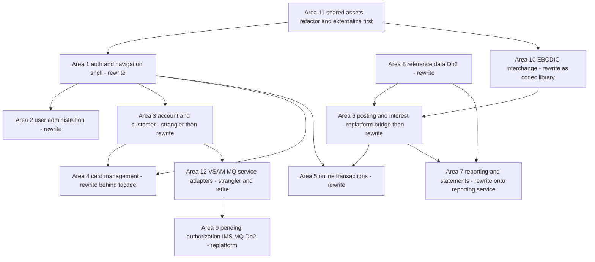
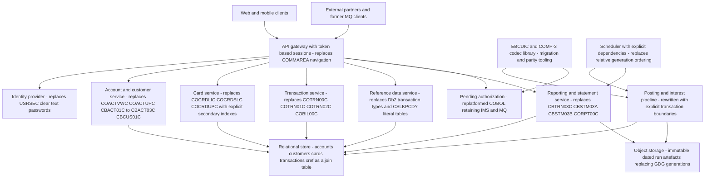

# CardDemo Modernization Blueprint

Opinionated, evidence-backed modernization plan for the AWS Mainframe Modernization **CardDemo**
application as it exists in this repository. Every substantive claim cites either a `path:line` in the
repository or a numbered section of the four analysis artifacts (`APPLICATION_INVENTORY.md`,
`DATA_DICTIONARY.md`, `DEPENDENCY_MAP.md`, `HOTSPOT_REPORT.md`).

**Effort unit.** All effort figures are **Devin sessions**. One session is roughly 1–2 human-weeks of
delivery work. Session counts cover analysis, implementation, and test-parity work that Devin can do
inside the repository. They exclude **external waits** — cloud account and landing-zone provisioning, Db2
and IMS extract windows, RACF/identity-provider decisions, security review and change-approval boards —
which are called out separately per area because they are calendar risk, not effort.

**Verified corrections to the received brief.** Two facts given as established are wrong or imprecise, and
the plan below relies on the corrected versions:

| Received as fact | Verified position | Evidence |
| :--------------- | :---------------- | :------- |
| `CBACT01C` calls `'COBDATFT'`, which does not exist in the repository | The COBOL call exists, and an **assembler** implementation also exists; what is missing is a COBOL implementation | `app/cbl/CBACT01C.cbl:231` (the `CALL 'COBDATFT'`), `app/asm/COBDATFT.asm:17` (`COBDATFT` CSECT) |
| 44 copybooks | 30 copybooks in `app/cpy/` plus 15 in the sub-application libraries; 17 further BMS symbolic-map copybooks live in `app/cpy-bms/` | `APPLICATION_INVENTORY.md` §"Scope and method" |
| `samples/m2/` ships AWS Blu Age / Micro Focus artifacts | `samples/m2/` ships exactly **two ZIP archives**: `samples/m2/mf/CardDemo_runtime.zip` (a Micro Focus / AWS M2 runtime package of compiled load modules plus configuration) and `samples/m2/unikix/UniKix_CardDemo_runtime_v1.zip` (a UniKix migrated-source tree plus TPE/BPE region definitions). No Blu Age artifact is present, and no product name appears in `README.md` | repository paths as listed; see §4.2 |

The `samples/m2/` archives are binary ZIPs, so they cannot carry `path:line` citations. Where their
contents matter, the member path inside the archive is named explicitly and labelled as archive-internal
evidence.

---

## 1. Executive summary

### 1.1 Recommended strategy mix

| # | Functional area | Recommended strategy | One-line why | Sessions |
| -: | :-------------- | :------------------- | :----------- | -------: |
| 1 | Authentication and session/navigation shell | **Rewrite** | 574 LOC of trivial logic but the highest blast radius in the estate (`COMEN01C` degree 24); the COMMAREA model has to die first or every other area inherits it | 3 |
| 2 | User administration | **Rewrite** | Four small CRUD screens over one KSDS, and the clear-text password field makes any strategy that preserves the record a security decision | 2 |
| 3 | Account and customer servicing | **Strangler, then rewrite** | `COACTUPC` is 3368 LOC / 175 conditions / 18 copybooks — the single largest rewrite risk in the repository; wrap reads first, rewrite the update path last | 8 |
| 4 | Card management | **Rewrite behind a strangler façade** | Three screens of moderate complexity, but the whole area depends on alternate-index browse semantics that must be re-specified, not translated | 5 |
| 5 | Online transaction capture and inquiry | **Rewrite** | Cleanest online slice: four programs, one master file, no Db2/IMS/MQ surface | 4 |
| 6 | Batch transaction posting and interest/balance pipeline | **Replatform as a bridge, rewrite as the target** | This is the actual business logic of the product; file-in/file-out shape makes golden-master parity testing cheap, but it updates three masters in place, so it must not be the first thing cut over | 7 |
| 7 | Reporting and statements | **Rewrite onto a reporting service** | Output is presentation, not business rules; `CBSTM03A` reaches `CBSTM03B` at 13 call sites and emits both text and HTML, so replacing the renderer is lower risk than translating it | 4 |
| 8 | Reference data / transaction type and category (Db2) | **Rewrite** | Already relational, only 17 of the 19 `EXEC SQL` statements in the estate, and it is the upstream feeder for the VSAM reference files — highest value per session | 3 |
| 9 | Pending authorization / fraud (IMS + MQ + Db2) | **Replatform** | The only area carrying three separate legacy middleware dependencies (DL/I, MQ, Db2) plus the estate's only `EXEC CICS LINK`; rewriting it means replacing IMS and MQ at the same time | 4 |
| 10 | Data interchange / EBCDIC export-import | **Rewrite as a codec library** | 500-byte five-way discriminated union with COMP-3 and COMP fields — a byte-level converter is needed anyway, so build it once as a reusable library | 3 |
| 11 | Cross-cutting shared assets | **Refactor / externalize first** | 1318 lines of literal validation tables and an LE date service are consumed by everything; externalizing them is the enabler for areas 1–10 | 3 |
| 12 | VSAM/MQ sub-application (`COACCT01`, `CODATE01`) | **Strangler (replace the edge)** | It is not an application — it is a pair of MQ request/reply service adapters over the account master, i.e. a hand-rolled API layer that the target architecture supersedes | 2 |
| — | **Total** | — | — | **48** |

### 1.2 The shape of the programme

The estate is 44 COBOL programs, 45 copybooks and 46 JCL members (`APPLICATION_INVENTORY.md` §"Scope and
method"), and it is far more lopsided than that count suggests: the top four programs by consolidated
hotspot score are all online CICS screens, and one of them, `COACTUPC`, is 3368 LOC — larger than the
entire batch posting pipeline put together (`HOTSPOT_REPORT.md` §7). Complexity therefore lives in the
presentation and field-validation layer, while *business* value lives in a handful of small, dense batch
programs (`CBTRN02C` 619 LOC / 48 conditions, `CBACT04C` 552 LOC / 43 conditions, `CBTRN03C` 545 LOC / 40
conditions — `HOTSPOT_REPORT.md` §7).

That asymmetry is the whole argument for a non-uniform strategy. The online estate is mostly 3270 screen
handling that a rewrite deletes rather than translates; the batch estate is real arithmetic that a rewrite
must reproduce to the cent; and the optional sub-applications are gated on middleware (IMS DL/I, IBM MQ)
whose replacement is a separate programme in its own right. Sequencing follows dependency, not size:
externalize the shared assets (area 11), replace the navigation shell (area 1), then work outward through
the online areas while the batch pipeline runs replatformed and unchanged until its parity harness is
trustworthy.

The repository already proves that replatform is technically available: the UniKix archive ships a
*compiled and catalogued* base application with 14 FCT file entries, 18 PCT transaction entries and 35 PPT
program entries (§4.2). That matters as a de-risking tool, not as a destination — the same archive shows
the limit, because it contains no IMS, Db2 or MQ resource definitions, so the three optional
sub-applications are precisely the parts the shipped replatform does not cover.

Two facts should be treated as programme gates rather than defects to fix later. First, the documented
validation stage of the posting pipeline is not wired up: `app/jcl/POSTTRAN.jcl:23` runs `CBTRN02C`, and no
JCL or scheduler definition in the repository runs `CBTRN01C` (`DEPENDENCY_MAP.md` §8; verified absent from
both `app/scheduler/CardDemo.ca7` and `app/scheduler/CardDemo.controlm`). Second, `CBTRN02C` writes
rejected transactions to `DALYREJS(+1)` (`app/jcl/POSTTRAN.jcl:34`) and nothing in the repository consumes
them (`DEPENDENCY_MAP.md` §5.4). Both are business questions, and both are listed in §7.

---

## 2. Evaluation framework

### 2.1 Dimensions

Each area is scored on six dimensions. Three are **measured** from the repository and the analysis
artifacts; three are **assumed** because the information does not exist in the repository. The distinction
is stated on every score.

| Dimension | Measured or assumed | How it is scored | Source |
| :-------- | :------------------ | :--------------- | :----- |
| Business-logic complexity | **Measured** | LOC, IF/EVALUATE count, condition density per 100 LOC, and max nesting depth for every program in the area | `HOTSPOT_REPORT.md` §2, §5, §6, §7 |
| Data coupling | **Measured** | Number of shared datasets the area reads or updates that another area also touches, plus shared copybook count | `DEPENDENCY_MAP.md` §5.4; `HOTSPOT_REPORT.md` §3 |
| Blast radius | **Measured** | Call-graph degree of the area's programs, and how many other areas break if this area's contract changes | `HOTSPOT_REPORT.md` §6; `DEPENDENCY_MAP.md` §2, §3 |
| Technology risk | **Measured** | Which of CICS, BMS, VSAM, Db2, IMS DL/I and MQ the area depends on, counted from actual call sites | `DEPENDENCY_MAP.md` §4 |
| Team skill availability | **Assumed** | See §2.3 | none — not in the repository |
| Risk tolerance | **Assumed** | See §2.3 | none — not in the repository |

### 2.2 Measured inputs, stated plainly

The four measured dimensions reduce to a small number of hard numbers, repeated here so the per-area tables
do not have to re-derive them.

| Measured input | Value | Source |
| :------------- | :---- | :----- |
| Programs / copybooks / JCL members / PROCs | 44 / 45 / 46 / 2 | `APPLICATION_INVENTORY.md` §"Scope and method" |
| Largest program | `COACTUPC` 3368 LOC, 18 copybooks, 175 conditions, nesting 5, score 4.62 | `HOTSPOT_REPORT.md` §7 |
| Highest-connectivity program | `COMEN01C`, call-graph degree 24 | `HOTSPOT_REPORT.md` §6, §7 |
| Executable `EXEC SQL` statements in the estate | 19, in `COTRTLIC` (10), `COTRTUPC` (4), `COBTUPDT` (3), `COPAUS2C` (2) | `APPLICATION_INVENTORY.md` §"Transaction-type Db2 sub-application"; `HOTSPOT_REPORT.md` §4 |
| `EXEC CICS LINK` sites between application programs | exactly 1 | `app/app-authorization-ims-db2-mq/cbl/COPAUS1C.cbl:248` |
| IMS DL/I call sites | 9, all in three batch programs | `DEPENDENCY_MAP.md` §4 |
| MQ API call sites | 4 in `COPAUA0C`, 9 in `CODATE01`, 9 in `COACCT01` | `DEPENDENCY_MAP.md` §4 |
| Uniform batch abend path | 11 `CEE3ABD` call sites | `DEPENDENCY_MAP.md` §4 |
| Date validation leaf | 1 `CEEDAYS` call site, `app/cbl/CSUTLDTC.cbl:116` | `DEPENDENCY_MAP.md` §4 |
| Literal reference data in code | `app/cpy/CSLKPCDY.cpy`, 1318 lines | `DATA_DICTIONARY.md` §8 (`CSLKPCDY` tables) |
| Datasets shared by three or more consumers | `TRANSACT.VSAM.KSDS`, `ACCTDATA.VSAM.KSDS`, `CARDXREF.VSAM.KSDS` (+ `CXACAIX`), `CUSTDATA.VSAM.KSDS`, `CARDDATA.VSAM.KSDS` (+ `CARDAIX`) | `DEPENDENCY_MAP.md` §5.4 |

Scoring is ordinal — High / Medium / Low — because the underlying metrics are not commensurable (LOC and
call-graph degree do not add up to anything meaningful). Where a score is driven by one number, that number
is named inline.

### 2.3 Assumptions, labelled as such

These are **assumptions**. Nothing in the repository speaks to them, and every recommendation that leans on
them says so.

| Assumption | Stated value | Why it matters | If it is wrong |
| :--------- | :----------- | :------------- | :------------- |
| A1 — Team skill availability | Java/Kotlin and cloud-native skills are readily available; COBOL and CICS skills exist but are scarce and ageing; IMS DL/I and CICS-MQ skills are the scarcest of all | Drives rewrite-versus-refactor: refactoring COBOL is only cheap if COBOL people exist | If deep COBOL/CICS capacity is plentiful and Java capacity is not, areas 3, 4 and 5 shift from rewrite to refactor, and the total drops but the estate stays on COBOL |
| A2 — Risk tolerance | Moderate: parallel-run and reversible cutover are required for anything that touches money; screen-only changes may cut over directly | Drives whether the batch pipeline can be rewritten before it is replatformed | If tolerance is low, area 6 becomes replatform-only and the rewrite is deferred; if high, the replatform bridge in area 6 can be skipped, saving ~2 sessions |
| A3 — Target is a cloud runtime, not a new mainframe | Modernization ends on cloud infrastructure | Determines whether replatform means "AWS M2 / UniKix in the cloud" or "same LPAR, tidier code" | If the mainframe is staying, replatform collapses into refactor and areas 6 and 9 both become refactor |
| A4 — Reference data is authoritative in Db2, not in the copybook | The Db2 transaction-type/category tables are the master, and the VSAM reference files are derived | Supported but not proven by lineage: `TRANEXTR` unloads Db2 into `TRANTYPE.PS`/`TRANCATG.PS`, which the VSAM loads then consume (`DEPENDENCY_MAP.md` §5.1) | If the VSAM files are the real master and Db2 is a demo, area 8 loses its "upstream feeder" value and drops down the sequence |
| A5 — The optional modules are in scope | Areas 8, 9 and 12 are being modernized, not retired | `README.md:62`–`:92` presents them as optional features | If they are out of scope, 9 sessions come off the total and the IMS/MQ risk disappears entirely |

### 2.4 Strategy definitions used throughout

| Strategy | What it means here | What "Fit" measures |
| :------- | :----------------- | :------------------ |
| Strangler | Put an API in front of the existing programs and replace call paths incrementally, leaving the COBOL running behind the façade | Whether a stable seam exists to wrap |
| Replatform | Keep the COBOL source, recompile and run it on a cloud runtime (the shipped UniKix TPE/BPE or Micro Focus / AWS M2 packages) | Whether the shipped artifacts already cover the area |
| Refactor | Restructure the COBOL in place — split programs, externalize literals, remove duplication — without changing language or runtime | Whether the area's problem is structural rather than technological |
| Rewrite | Re-implement in Java/Kotlin/Python against a modern data store | Whether the logic is small enough, or valuable enough, to re-specify |

---

## 3. Per-area analysis

### 3.1 Area 1 — Authentication and session/navigation shell

**In scope.** Programs `COSGN00C`, `COMEN01C`, `COADM01C`. Copybooks `app/cpy/COCOM01Y.cpy:19` (the
`CARDDEMO-COMMAREA`), `app/cpy/CSUSR01Y.cpy` (security record), `app/cpy/COMEN02Y.cpy` (user menu
table) and `app/cpy/COADM02Y.cpy` (admin menu table). Dataset `USRSEC.VSAM.KSDS`, loaded by
`app/jcl/DUSRSECJ.jcl` (`DEPENDENCY_MAP.md` §5.1). Transaction IDs `CC00`, `CM00`, `CA00` (`README.md:271`, `README.md:272`, `README.md:286`).

**Measured facts.**

| Fact | Value | Citation |
| :--- | :---- | :------- |
| Combined LOC | 574 (`COSGN00C` 172, `COMEN01C` 213, `COADM01C` 189) | `HOTSPOT_REPORT.md` §7 |
| Combined conditions | 25 — trivial logic | `HOTSPOT_REPORT.md` §7 |
| Call-graph degree | `COMEN01C` 24, `COSGN00C` 14, `COADM01C` 14 — ranks 1, 2 and 2 in the estate | `HOTSPOT_REPORT.md` §6, §7 |
| Menu targets resolved from literal tables | 11 user options (`app/cpy/COMEN02Y.cpy:21`, table `OCCURS 12`, `:94`), 9 admin slots (`app/cpy/COADM02Y.cpy:56`) | as cited |
| Password comparison | clear text, `IF SEC-USR-PWD = WS-USER-PWD` | `app/cbl/COSGN00C.cbl:223` |
| Password field | `05 SEC-USR-PWD PIC X(08)` | `app/cpy/CSUSR01Y.cpy:21` |
| Navigation mechanism | dynamic `XCTL` on `CDEMO-TO-PROGRAM` | `app/cpy/COCOM01Y.cpy:24`; `DEPENDENCY_MAP.md` §2, §3 |

**Strategy scoring.**

| Strategy | Fit | Effort (sessions) | Risk | Key enabler | Key blocker |
| :------- | :-- | ----------------: | :--- | :---------- | :---------- |
| Strangler | Poor | 4 | High | The signon screen is the natural front door for an API gateway | There is nothing to wrap — the shell's only product is a COMMAREA that no external consumer can hold; wrapping it preserves the model this programme exists to remove |
| Replatform | Good | 1 | Low | All three programs are already in the shipped UniKix PCT (18 online entries, §4.2) and `USRSEC` is in the FCT | Keeps clear-text passwords and 3270 sessions; buys time, not progress |
| Refactor | Poor | 2 | Medium | Menu tables are already `REDEFINES`-driven data (`app/cpy/COMEN02Y.cpy:94`) and externalize easily | Refactoring 574 LOC of screen plumbing is effort spent on code the target does not need |
| Rewrite | **Excellent** | **3** | Medium | Only 25 conditions to re-specify, and the navigation contract is one 160-byte copybook | Every other online program reads `CDEMO-FROM-PROGRAM`/`CDEMO-TO-PROGRAM` (`app/cpy/COCOM01Y.cpy:22`, `:24`), so the shell cannot be replaced in isolation — it needs a compatibility shim while areas 2–5 migrate |

**Recommendation — Rewrite, first in sequence.** Complexity is negligible (25 conditions) and blast radius
is maximal (degree 24), which is exactly the profile that should be rewritten early: the cost of getting it
wrong is bounded by how little logic there is, while the cost of leaving it in place is that every
subsequent area inherits the COMMAREA session model. Replace signon with a real identity mechanism and
token-based sessions, and replace the menu tables with configuration. Against the four named factors:
complexity **low** (measured), coupling **high** (measured — the COMMAREA is the estate's shared mutable
state), skills **favourable to rewrite** under A1 (assumed), risk tolerance **satisfied** under A2 because
no money moves through these programs (assumed).

The clear-text password (`app/cbl/COSGN00C.cbl:223`) is not a migration detail, it is a live security
defect, and it is a reason to prefer rewrite over any strategy that preserves the 80-byte `USRSEC` record.
Note that `README.md` publishes the demo credentials in plain text (`:203`–`:204`), which is fine for a
demo and unacceptable for anything derived from it.

**Sensitivity.**

- If a federated identity provider cannot be adopted, the rewrite still stands but `USRSEC` must be
  migrated to a hashed-credential store, adding ~1 session.
- If a hard cutover of the whole online estate is mandated (no shim period), the shell must be rewritten
  simultaneously with areas 2–5, turning 3 sessions into a single 22-session release — worse in every way,
  and the reason the shim is recommended.
- If A1 inverts and COBOL skills dominate, refactor becomes defensible only as a holding action.

**External waits.** Identity-provider selection and security review before the new signon can be accepted.

### 3.2 Area 2 — User administration

**In scope.** `COUSR00C`, `COUSR01C`, `COUSR02C`, `COUSR03C`; copybook `app/cpy/CSUSR01Y.cpy`; dataset
`USRSEC.VSAM.KSDS` produced by `app/jcl/DUSRSECJ.jcl` (`DEPENDENCY_MAP.md` §5.1); transactions `CU00`–`CU03`
(`README.md:287`–`:290`).

**Measured facts.**

| Fact | Value | Citation |
| :--- | :---- | :------- |
| LOC | 531 / 198 / 303 / 251 = 1283 total | `HOTSPOT_REPORT.md` §7 |
| Conditions | 33 / 7 / 18 / 13 = 71 total, max nesting 4 | `HOTSPOT_REPORT.md` §7 |
| Call-graph degree | 5 / 3 / 4 / 4 — all reached from the admin menu | `HOTSPOT_REPORT.md` §7 |
| Datasets touched | one, `USRSEC`; no other area writes it | `DEPENDENCY_MAP.md` §5.4 |
| Record size | 80 bytes, password `X(08)` clear text | `DATA_DICTIONARY.md` §"Security"; `app/cpy/CSUSR01Y.cpy:21` |
| Duplicate definition | `CSUSR01Y` is duplicated as unused `UNUSED1Y` | `DATA_DICTIONARY.md` §10 item 2 |

**Strategy scoring.**

| Strategy | Fit | Effort (sessions) | Risk | Key enabler | Key blocker |
| :------- | :-- | ----------------: | :--- | :---------- | :---------- |
| Strangler | Fair | 3 | Medium | A user-management API is a clean, well-understood contract | Wrapping four screens to reach one 80-byte file costs more than replacing them |
| Replatform | Good | 1 | Low | All four programs are in the shipped UniKix PCT and `USRSEC` is in the FCT (§4.2) | Carries the clear-text password forward, which makes it the worst area to freeze |
| Refactor | Poor | 2 | Low | The four programs share one record layout | Restructuring does not address the only real defect here |
| Rewrite | **Excellent** | **2** | Low | Isolated dataset, 71 conditions, and a CRUD contract that needs no reverse engineering | Password migration requires a one-off credential reset or a hash-on-first-use path — a business decision, not a technical one |

**Recommendation — Rewrite, immediately after area 1.** This is the lowest-risk rewrite in the estate:
lowest coupling (one dataset, no other writer — measured), low complexity (71 conditions — measured), and
the security defect makes standing still the expensive option. It also delivers the credential store that
area 1 needs, so the two should ship as one release even though they are estimated separately. Skills
(A1, assumed) and risk tolerance (A2, assumed) both favour rewrite because no financial data is involved.

**Sensitivity.**

- If RACF (`README.md:47`) rather than `USRSEC` is the production authority, this area shrinks to an
  administrative UI over an external directory and drops to 1 session.
- If existing passwords must keep working through cutover, the clear-text field has to be carried
  temporarily, which is a security-review item, not extra build effort.

**External waits.** Approval for a credential reset or migration approach.

### 3.3 Area 3 — Account and customer servicing

**In scope.** Online `COACTVWC`, `COACTUPC`; batch `CBACT01C`, `CBACT02C`, `CBACT03C`, `CBCUS01C`.
Copybooks `app/cpy/CVACT01Y.cpy` (account, 300 bytes), `app/cpy/CVCUS01Y.cpy` (customer, 500 bytes),
`app/cpy/CVACT03Y.cpy` (xref, 50 bytes). Datasets `ACCTDATA.VSAM.KSDS`, `CUSTDATA.VSAM.KSDS`,
`CARDXREF.VSAM.KSDS`. JCL `app/jcl/ACCTFILE.jcl`, `app/jcl/CUSTFILE.jcl`, `app/jcl/READACCT.jcl`,
`app/jcl/READCARD.jcl`, `app/jcl/READCUST.jcl`, `app/jcl/READXREF.jcl` (`DEPENDENCY_MAP.md` §5.1, §5.2).
Transactions `CAVW`, `CAUP` (`README.md:273`–`:274`).

**Measured facts.**

| Fact | Value | Citation |
| :--- | :---- | :------- |
| `COACTUPC` | 3368 LOC, 18 copybooks, 175 conditions, nesting 5, score 4.62 — rank 1 in the estate | `HOTSPOT_REPORT.md` §7 |
| `COACTVWC` | 703 LOC, 15 copybooks, 33 conditions, score 1.95 | `HOTSPOT_REPORT.md` §7 |
| Batch readers | `CBACT01C` 358 LOC; `CBACT02C`, `CBACT03C`, `CBCUS01C` ~130 LOC each, 11 conditions each | `HOTSPOT_REPORT.md` §7 |
| Shared-dataset fan-out | `ACCTDATA` is read or updated by `CBTRN02C`, `CBACT04C`, `CBACT01C`, `CBSTM03A`, `CBEXPORT` and the online screens; `CUSTDATA` by `CBCUS01C`, `CBSTM03A`, `CBEXPORT`, `COACTVWC`, `COACTUPC` | `DEPENDENCY_MAP.md` §5.4 |
| Join hub | `CARD-XREF-RECORD` is the only place card, customer and account identifiers meet | `DATA_DICTIONARY.md` §10 item 1 |
| Missing-module edge | `CBACT01C` calls `COBDATFT`, implemented only in assembler | `app/cbl/CBACT01C.cbl:231`; `app/asm/COBDATFT.asm:17` |
| Abend path | `app/cbl/CBACT01C.cbl:410` and the other batch readers call `CEE3ABD` | `DEPENDENCY_MAP.md` §4 |

**Strategy scoring.**

| Strategy | Fit | Effort (sessions) | Risk | Key enabler | Key blocker |
| :------- | :-- | ----------------: | :--- | :---------- | :---------- |
| Strangler | **Excellent for reads** | 4 | Low | `COACTVWC` and the four batch readers are pure read paths over stable KSDS records, so an account/customer read API can be stood up without touching update logic | The update path shares no seam: `COACTUPC` validates and rewrites in the same 3368-LOC program |
| Replatform | Good | 1 | Low | `COACTUPC`/`COACTVWC` are in the shipped UniKix PCT; `ACCTDAT`, `CUSTDAT`, `CCXREF` and `CXACAIX` are in the FCT (§4.2) | Freezes the estate's largest maintenance liability exactly as it is |
| Refactor | Fair | 5 | Medium | 175 conditions at nesting 5 in one program is the textbook case for decomposition into validation, retrieval and update modules | Spends 5 sessions and still leaves COBOL/CICS/VSAM; only worth it under A1-inverted |
| Rewrite (whole area) | Fair | 10 | **High** | Record layouts are fully documented field by field (`DATA_DICTIONARY.md` §"Account/card/xref/customer") | 175 conditions is a large re-specification surface, and `ACCTDATA` is updated in place by two batch programs in area 6 — a big-bang rewrite would have to move both areas at once |

**Recommendation — Strangler first, then a staged rewrite (8 sessions total: 3 façade, 5 update path).**
Split the area by access mode rather than by program. Stand up a read API over account, customer and xref
(replacing `COACTVWC` and the four batch listing programs, which together are only ~1400 LOC and 66
conditions — measured); then rewrite the update path behind that API, decomposing `COACTUPC` field-group by
field-group with the existing screen validation as the specification. Justification against the four
factors: complexity **high and concentrated in one program** (measured — 175 conditions, 18 copybooks),
coupling **highest in the estate** (measured — `ACCTDATA` has six consumers), skills **favour rewrite**
(A1, assumed), risk tolerance **moderate** (A2, assumed) which forbids rewriting an in-place-updated master
in one step. This is the one area where a two-strategy sequence genuinely beats either strategy alone.

Two housekeeping items belong to this area: resolve `COBDATFT` (`app/cbl/CBACT01C.cbl:231`) before using
`CBACT01C` as a parity baseline, since the only implementation is assembler; and preserve the
alphanumeric/numeric `REDEFINES` pairs that distinguish blank from zero on screen input
(`DATA_DICTIONARY.md` §10 item 3) — in a rewrite that distinction is a nullable field, and losing it
silently changes validation behaviour.

**Sensitivity.**

- If `COACTUPC`'s 175 conditions turn out to be predominantly screen-field edits rather than business
  rules, the update-path rewrite drops toward 3 sessions; if they encode undocumented policy, it grows past
  7. This is the single largest estimate uncertainty in the blueprint and should be resolved by a condition
  census before commitment.
- If area 6 cannot be moved on a compatible timeline, the account rewrite must keep writing the VSAM
  `ACCTDATA` record layout, which forces a byte-level compatibility adapter (area 10's codec) and adds
  1 session.
- If risk tolerance is low (A2 inverted), stop after the read façade and leave `COACTUPC` replatformed.

**External waits.** None specific; a production data extract is needed for parity testing.

### 3.4 Area 4 — Card management

**In scope.** `COCRDLIC`, `COCRDSLC`, `COCRDUPC`. Copybooks `app/cpy/CVACT02Y.cpy` (card master, 150
bytes), `app/cpy/CVCRD01Y.cpy` (screen fields), `app/cpy/CVACT03Y.cpy` (xref). Datasets
`CARDDATA.VSAM.KSDS` + `CARDAIX` (built by `app/jcl/CARDFILE.jcl`, `DEPENDENCY_MAP.md` §5.1) and
`CARDXREF.VSAM.KSDS` + `CXACAIX`. Transactions `CCLI`, `CCDL`, `CCUP` (`README.md:275`–`:277`).

**Measured facts.**

| Fact | Value | Citation |
| :--- | :---- | :------- |
| `COCRDLIC` | 1093 LOC, 11 copybooks, 8 I/O ops, 70 conditions, nesting 6, degree 4, score 3.30 — rank 3 | `HOTSPOT_REPORT.md` §7 |
| `COCRDUPC` | 1194 LOC, 13 copybooks, 83 conditions, nesting 6, score 2.98 — rank 4 | `HOTSPOT_REPORT.md` §7 |
| `COCRDSLC` | 642 LOC, 13 copybooks, 40 conditions, nesting 5 | `HOTSPOT_REPORT.md` §7 |
| Alternate indexes | both application AIXs exist to traverse the xref: `CARDAIX` on `CARD-ACCT-ID`, `CXACAIX` on `XREF-ACCT-ID` | `DATA_DICTIONARY.md` §10 item 1 |
| AIX construction | `BLDINDEX` plus `.AIX.PATH` definitions | `app/jcl/CARDFILE.jcl` and `app/jcl/XREFFILE.jcl` per `DEPENDENCY_MAP.md` §5.1 |
| Type inconsistency for the same key | card number is `X(16)` in the master but `9(16)` in the COMMAREA | `DATA_DICTIONARY.md` §10 item 3 (`app/cpy/CVACT02Y.cpy:5`, `app/cpy/COCOM01Y.cpy:41`) |
| Max nesting 6 | the deepest nesting in the estate, shared with `COTRTLIC` | `HOTSPOT_REPORT.md` §5 |

**Strategy scoring.**

| Strategy | Fit | Effort (sessions) | Risk | Key enabler | Key blocker |
| :------- | :-- | ----------------: | :--- | :---------- | :---------- |
| Strangler | Good | 4 | Low | Card list/detail are read paths, and `COCRDLIC`'s paging loop is a natural API resource | The AIX-backed browse order becomes part of the API contract if it is wrapped rather than re-specified |
| Replatform | Good | 1 | Low | All three programs are in the shipped UniKix PCT; `CARDDAT`/`CARDAIX`/`CCXREF`/`CXACAIX` are all in the FCT with alternate-index flags (§4.2) | Nesting-6 code stays nesting-6 code |
| Refactor | Fair | 3 | Medium | Nesting 6 in two programs is a mechanical decomposition target | Does not resolve the `X(16)`/`9(16)` key inconsistency, which is a data-model problem |
| Rewrite | **Good** | **5** | Medium | 193 conditions total across three programs, all of them screen and card-status validation; card is the smallest master record at 150 bytes | Alternate-index browse semantics — start-key positioning, sequential read of duplicates, and the resulting screen ordering — are implicit in the VSAM behaviour and must be written down before they can be reproduced |

**Recommendation — Rewrite behind a strangler façade (5 sessions).** Take the read paths through an API
first so paging order can be pinned by test, then rewrite all three programs onto indexed queries.
Complexity is **medium-high but shallowly distributed** (measured — 193 conditions spread over three
programs, none individually as bad as `COACTUPC`), coupling is **medium** (measured — card master has three
consumers, xref has six), skills **favour rewrite** (A1, assumed), and risk tolerance is satisfied because
card maintenance does not post financial transactions (A2, assumed).

The decisive constraint is that this area is where AIX semantics are load-bearing. Both of the
application's alternate indexes exist to traverse the xref record (`DATA_DICTIONARY.md` §10 item 1), and
the shipped UniKix FCT reproduces them explicitly rather than flattening them (§4.2) — which is
confirmation that the semantics matter, not just the data. Re-specify list ordering and duplicate handling
as acceptance tests before writing any target code.

**Sensitivity.**

- If the target store cannot reproduce start-key browse with duplicates in a stable order, either the UI
  contract changes (a product decision) or a secondary index must be maintained explicitly, adding
  1 session.
- If area 3's read façade lands first, this area reuses it and drops to 4 sessions.
- If the `X(16)`/`9(16)` mismatch turns out to hide real data with non-numeric card numbers, data
  remediation becomes a prerequisite; the repository cannot answer this, only the production extract can.

**External waits.** Production card-data extract for ordering and data-quality validation.

### 3.5 Area 5 — Online transaction capture and inquiry

**In scope.** `COTRN00C` (list), `COTRN01C` (view), `COTRN02C` (add), `COBIL00C` (bill payment).
Copybooks `app/cpy/CVTRA05Y.cpy` (transaction, 350 bytes) and the corresponding BMS symbolic maps in
`app/cpy-bms/`. Dataset `TRANSACT.VSAM.KSDS`. Transactions `CT00`, `CT01`, `CT02`, `CB00`
(`README.md:278`–`:282`).

**Measured facts.**

| Fact | Value | Citation |
| :--- | :---- | :------- |
| LOC / conditions | `COTRN00C` 529 / 34; `COTRN01C` 231 / 10; `COTRN02C` 614 / 27; `COBIL00C` 420 / 19 | `HOTSPOT_REPORT.md` §7 |
| I/O ops | `COTRN02C` 6, `COBIL00C` 7 — both write the transaction master online | `HOTSPOT_REPORT.md` §4, §7 |
| Technology surface | CICS + BMS + VSAM only; no Db2, IMS or MQ | `DEPENDENCY_MAP.md` §4 (none of these programs appear in the external-dependency table) |
| Shared dataset | `TRANSACT.VSAM.KSDS` is also written by `POSTTRAN`, reloaded by `COMBTRAN`, and read by `CBEXPORT`, `CREASTMT`, `TRANBKP` and `TRANREPT` | `DEPENDENCY_MAP.md` §5.4 |
| Record aliasing | `TRAN-RECORD`, `DALYTRAN-RECORD` and `TRNX-RECORD` are three names for the same 350-byte shape | `DATA_DICTIONARY.md` §10 item 2 |

**Strategy scoring.**

| Strategy | Fit | Effort (sessions) | Risk | Key enabler | Key blocker |
| :------- | :-- | ----------------: | :--- | :---------- | :---------- |
| Strangler | Fair | 3 | Medium | Transaction inquiry is an obvious API | The add and bill-payment paths write the same master that area 6's batch posting updates, so a façade does not remove the write conflict, it just hides it |
| Replatform | Good | 1 | Low | All four programs are in the shipped UniKix PCT and `TRANSACT` is in the FCT (§4.2) | No progress on the record aliasing or the online/batch write overlap |
| Refactor | Poor | 2 | Low | Nothing structurally alarming — max nesting 4, no program over 614 LOC | There is no maintainability crisis here to justify spending sessions on COBOL |
| Rewrite | **Excellent** | **4** | Medium | Cleanest slice in the estate: 90 conditions total, one dataset, zero legacy middleware; the 350-byte layout is fully documented and appears three times under different names, so consolidating it is a net simplification | Online writes and batch posting both mutate `TRANSACT.VSAM.KSDS`, so the cutover must be coordinated with area 6 |

**Recommendation — Rewrite (4 sessions).** This is the area where rewrite is least contested: complexity
**low** (measured — 90 conditions, max nesting 4), technology risk **lowest in the estate** (measured — no
Db2/IMS/MQ), coupling **medium and confined to one dataset** (measured), skills **favour rewrite** (A1,
assumed). Collapse the three aliases of the 350-byte transaction record into one target model as part of
the work — `DATA_DICTIONARY.md` §10 item 2 shows they differ only by prefix and key composition, so
carrying three of them forward would be importing legacy accident into a new schema.

Sequence this area *after* area 6's data store decision, not before it. Both write the transaction master,
and whichever moves first defines the store the other must use.

**Sensitivity.**

- If bill payment turns out to have settlement obligations not visible in the 420 LOC of `COBIL00C`, treat
  it as part of area 6 rather than area 5.
- If area 6 stays replatformed indefinitely (A2 inverted), this area must either write through to VSAM via
  a compatibility adapter (+1 session) or also stay replatformed.

**External waits.** None.

### 3.6 Area 6 — Batch transaction posting and interest/balance pipeline

**In scope.** `CBTRN02C` (posting, run by `app/jcl/POSTTRAN.jcl:23`), `CBACT04C` (interest and fees, run by
`app/jcl/INTCALC.jcl:22`), `CBTRN01C` (validation report — **no job runs it**). Supporting JCL
`app/jcl/TRANBKP.jcl`, `app/jcl/COMBTRAN.jcl`, `app/jcl/TRANIDX.jcl`, `app/jcl/WAITSTEP.jcl`,
`app/jcl/CLOSEFIL.jcl`, `app/jcl/OPENFIL.jcl`. Datasets `DALYTRAN.PS`, `TRANSACT.VSAM.KSDS`,
`ACCTDATA.VSAM.KSDS`, `TCATBALF.VSAM.KSDS`, `CARDXREF.VSAM.KSDS` + `CXACAIX` path,
`DISCGRP.VSAM.KSDS`, and GDGs `DALYREJS(+1)`, `SYSTRAN(+1)`, `TRANSACT.BKUP(+1)`,
`TRANSACT.COMBINED(+1)` (`DEPENDENCY_MAP.md` §5.2, §5.4). Scheduler chains
`app/scheduler/CardDemo.controlm:64`–`:92` (monthly interest) and `app/scheduler/CardDemo.ca7:72`–`:97`
(`POSTTRAN` → `WAITSTEP`).

**Measured facts.**

| Fact | Value | Citation |
| :--- | :---- | :------- |
| `CBTRN02C` | 619 LOC, 6 I/O ops, 48 conditions — 7.8 conditions per 100 LOC, the joint-highest density in the estate | `HOTSPOT_REPORT.md` §5, §7 |
| `CBACT04C` | 552 LOC, 5 I/O ops, 43 conditions — also 7.8 per 100 LOC | `HOTSPOT_REPORT.md` §5, §7 |
| `CBTRN01C` | 415 LOC, 6 I/O ops, 33 conditions, and no invoking JCL or scheduler definition | `HOTSPOT_REPORT.md` §7; `DEPENDENCY_MAP.md` §8; verified absent from `app/scheduler/CardDemo.ca7` and `app/scheduler/CardDemo.controlm` |
| Masters updated in place by posting | `TRANSACT`, `ACCTDATA`, `TCATBALF` — three at once, in one program, with no visible transaction boundary | `DEPENDENCY_MAP.md` §5.2 |
| Reject path | `2500-WRITE-REJECT-REC` writes a 350-byte record to `DALYREJS(+1)`; nothing consumes it | `app/cbl/CBTRN02C.cbl:446`, `:451`; `app/jcl/POSTTRAN.jcl:34`; `DEPENDENCY_MAP.md` §5.4 |
| Run date | passed as a program parameter, hard-coded in the JCL: `PARM='2022071800'` | `app/jcl/INTCALC.jcl:22`; received via `PROCEDURE DIVISION USING EXTERNAL-PARMS`, `app/cbl/CBACT04C.cbl:180` |
| Interest and fee arithmetic | `1300-COMPUTE-INTEREST` and `1400-COMPUTE-FEES` | `app/cbl/CBACT04C.cbl:462`, `:518` |
| Generation ordering constraint | `COMBTRAN` reads `TRANSACT.BKUP(0)`, so `TRANBKP` must run between `POSTTRAN` and `COMBTRAN` | `DEPENDENCY_MAP.md` §6 |
| Failure mode | `CEE3ABD` at `app/cbl/CBTRN02C.cbl:711`, `app/cbl/CBACT04C.cbl:632` | `DEPENDENCY_MAP.md` §4 |
| Money representation | uniformly 2-decimal fixed point, zoned or COMP-3; no floating point anywhere | `DATA_DICTIONARY.md` §10 item 4 |

**Strategy scoring.**

| Strategy | Fit | Effort (sessions) | Risk | Key enabler | Key blocker |
| :------- | :-- | ----------------: | :--- | :---------- | :---------- |
| Strangler | Poor | 6 | High | None worth having — batch jobs have no callers to intercept | The seam in a batch pipeline is the dataset, not an interface; "wrapping" this area means re-implementing it, which is the rewrite |
| Replatform | **Good as a bridge** | **2** | Low | The UniKix BPE catalog already defines the cluster set and seven GDG bases including the transaction backup, daily transaction, report, combined and reject bases (§4.2); posting and interest JCL and PROCs ship in both archives | Solves hosting, not the hard-coded date, the unconsumed rejects, or the unwired `CBTRN01C` |
| Refactor | Fair | 3 | Medium | Fixing the `PARM='2022071800'` hard-code and giving rejects a consumer are small, high-value in-place changes | Leaves the arithmetic in COBOL and the state in GDG generations |
| Rewrite | **Excellent as the target** | **5** | Medium-High | Best testability in the estate: file-in/file-out with fully specified 300/350/50-byte layouts means golden-master parity testing on real extracts, and fixed-point money maps cleanly onto `BigDecimal`-style decimal arithmetic (`DATA_DICTIONARY.md` §10 item 4) | Three masters are updated in place in one program with no explicit commit scope, so the target needs a real transaction boundary that the source never had |

**Recommendation — Replatform as a bridge (2 sessions), rewrite as the target (5 sessions), 7 total.**
This area holds the actual product logic — 91 of the estate's batch conditions at the highest density
measured (`HOTSPOT_REPORT.md` §5) — so it deserves a rewrite; but it also updates three shared masters in
place, which under A2's moderate risk tolerance (assumed) forbids making it the first cutover. Replatform
it early using the shipped BPE catalog so hosting stops being a variable, build the parity harness against
real `DALYTRAN.PS` extracts, then rewrite posting and interest with the harness as the acceptance gate.
Complexity **high per line** (measured), coupling **high** (measured — the three masters it updates are
consumed by areas 3, 4, 5 and 7), technology risk **low** (measured — plain VSAM and QSAM, no CICS, no
middleware), skills **favour rewrite** (A1, assumed).

Three source defects are prerequisites, not clean-up:

1. **Decide `CBTRN01C`.** A 415-LOC validation program that nothing runs is either dead code or a missing
   pipeline stage. Rewriting the pipeline without deciding is how a validation gap becomes permanent
   (`DEPENDENCY_MAP.md` §8).
2. **Give the rejects a consumer.** `DALYREJS(+1)` is written on every failed posting and read by nothing
   (`app/cbl/CBTRN02C.cbl:451`; `DEPENDENCY_MAP.md` §5.4). In the target this must be a queue or table with
   an owner.
3. **Externalize the run date.** `PARM='2022071800'` (`app/jcl/INTCALC.jcl:22`) means the shipped interest
   run is pinned to a fixed date; a rewrite that reproduces that faithfully reproduces a bug.

**Sensitivity.**

- If A2 tightens to "no rewrite of financial batch", stop at replatform plus refactor (5 sessions) and the
  business keeps a hard-coded date and orphaned rejects.
- If a production `DALYTRAN.PS` extract cannot be obtained, golden-master parity testing is impossible, the
  rewrite's main advantage evaporates, and replatform wins outright.
- If area 3's account rewrite lands first, this area must write the target account store rather than
  `ACCTDATA.VSAM.KSDS`, which is a sequencing constraint rather than extra effort — but only if both use the
  same store.

**External waits.** Production daily-transaction and account extracts with the matching prior-run outputs;
a batch-window and reconciliation sign-off before cutover.

### 3.7 Area 7 — Reporting and statements

**In scope.** `CBTRN03C` (transaction report, run by `app/jcl/TRANREPT.jcl:59`), `CBSTM03A` + `CBSTM03B`
(statements, run by `app/jcl/CREASTMT.JCL:79`), `CORPT00C` (online report request). JCL
`app/jcl/TRANREPT.jcl`, `app/jcl/CREASTMT.JCL`, `app/jcl/PRTCATBL.jcl`, `app/jcl/TXT2PDF1.JCL`, PROCs
`app/proc/REPROC.prc` and `app/proc/TRANREPT.prc`. Datasets `TRANSACT.DALY(+1)`, `TRANREPT(+1)`,
`TRXFL.VSAM.KSDS`, `STATEMNT.PS`, `STATEMNT.HTML`, `DATEPARM` (`DEPENDENCY_MAP.md` §5.2). Transaction
`CR00` (`README.md:281`).

**Measured facts.**

| Fact | Value | Citation |
| :--- | :---- | :------- |
| `CBTRN03C` | 545 LOC, 6 I/O ops, 40 conditions, reads four datasets plus `DATEPARM` | `HOTSPOT_REPORT.md` §7; `app/jcl/TRANREPT.jcl:65`, `:67`, `:69`, `:71`, `:73` |
| `CBSTM03A` | 784 LOC, calls `CBSTM03B` at 13 sites | `HOTSPOT_REPORT.md` §7; `DEPENDENCY_MAP.md` §3 |
| `CBSTM03B` | 162 LOC, 4 I/O ops, no copybooks | `HOTSPOT_REPORT.md` §7 |
| `CORPT00C` | 498 LOC, 25 conditions, submits the report job from CICS | `HOTSPOT_REPORT.md` §7; `app/cbl/CORPT00C.cbl:462` (`SUBMIT-JOB-TO-INTRDR`), `:517` (`EXEC CICS WRITEQ TD` to the internal reader) |
| Dual output format | statements are emitted as both `STATEMNT.PS` and `STATEMNT.HTML` | `app/jcl/CREASTMT.JCL:87`, `:92` per `DEPENDENCY_MAP.md` §5.2 |
| Downstream conversion | `STATEMNT.PS` feeds a TXT2PDF step | `app/jcl/TXT2PDF1.JCL:33` per `DEPENDENCY_MAP.md` §5.4 |
| Latent JCL defect | two distinct steps are both named `STEP05R` | `app/jcl/TRANREPT.jcl:23` and `:37` |
| Report date range | supplied by `DATEPARM`, maintained outside the repository | `DEPENDENCY_MAP.md` §5.4 |

**Strategy scoring.**

| Strategy | Fit | Effort (sessions) | Risk | Key enabler | Key blocker |
| :------- | :-- | ----------------: | :--- | :---------- | :---------- |
| Strangler | Fair | 3 | Low | `CORPT00C`'s job submission is a clean seam — replace the internal-reader write (`app/cbl/CORPT00C.cbl:517`) with an API call and the online side is done | Leaves the report and statement generators untouched, which is where the effort actually is |
| Replatform | Good | 1 | Low | `CORPT00C` is in the shipped UniKix PCT, `TRXFL` is in both the TPE FCT and the BPE cluster list, and the report GDG bases are defined (§4.2) | Keeps a duplicate-step-name JCL defect and a hand-rolled HTML writer |
| Refactor | Fair | 2 | Low | The 13 `CBSTM03A`→`CBSTM03B` call sites are a clear module boundary already | Refactoring a report writer is the least valuable COBOL work available |
| Rewrite | **Excellent** | **4** | Low | Reports carry no state and no money movement — worst case is a wrong-looking page, not a wrong balance — so this is the safest rewrite in the estate, and a template engine replaces the hand-built HTML writer outright | Output must be visually and numerically byte-comparable for audit, so parity checking is on rendered output, which is fiddlier to automate than record comparison |

**Recommendation — Rewrite onto a reporting service (4 sessions).** Complexity **medium** (measured — 40
and 20 conditions respectively, nothing over 784 LOC), coupling **read-only** (measured — this area
consumes masters and GDG generations but updates none of them, per `DEPENDENCY_MAP.md` §5.4), blast radius
**lowest in the estate** for the same reason, skills **favour rewrite** (A1, assumed), risk tolerance
**easily satisfied** (A2, assumed). Replace `CORPT00C`'s internal-reader submission with an asynchronous
job request, and regenerate statements from the target data model with a template engine rather than
translating the COBOL that assembles HTML by hand.

Fix `app/jcl/TRANREPT.jcl`'s duplicate `STEP05R` (`:23` and `:37`) during migration rather than porting it:
duplicate step names survive on z/OS but will not survive an unambiguous scheduler translation, and this is
exactly the kind of defect a replatform silently carries forward.

**Sensitivity.**

- If statement output is a regulated artifact requiring byte-identical reproduction, add 1–2 sessions for a
  rendering-parity harness, and consider keeping the COBOL renderer replatformed until sign-off.
- If `DATEPARM` turns out to encode business calendar rules rather than a simple date range, it becomes an
  area 11 shared asset instead of an area 7 input.

**External waits.** Business sign-off on statement layout, and confirmation of any regulatory retention or
format obligation.

### 3.8 Area 8 — Reference data / transaction type and category (Db2 sub-application)

**In scope.** `COTRTLIC`, `COTRTUPC` (online, Db2), `COBTUPDT` (batch, Db2). Copybooks
`app/app-transaction-type-db2/cpy/CSDB2RWY.cpy` and `CSDB2RPY.cpy`. JCL
`app/app-transaction-type-db2/jcl/CREADB21.jcl` (creates and loads the Db2 tables),
`TRANEXTR.jcl` (unloads Db2 to sequential), `MNTTRDB2.jcl` (runs `COBTUPDT` under plan `CARDDEMO`).
Datasets: Db2 `TRANSACTION_TYPE` and `TRANSACTION_CATEGORY`, plus `TRANTYPE.PS`, `TRANCATG.PS` and their
backup GDGs (`DEPENDENCY_MAP.md` §5.1, §5.3). Transactions `CTTU`, `CTLI` (`README.md:291`–`:292`).

**Measured facts.**

| Fact | Value | Citation |
| :--- | :---- | :------- |
| `COTRTLIC` | 1597 LOC, 10 SQL I/O operations, 103 conditions, nesting 6, score 3.80 — rank 2 in the estate | `HOTSPOT_REPORT.md` §4, §5, §7 |
| `COTRTUPC` | 1241 LOC, 4 SQL ops, 62 conditions | `HOTSPOT_REPORT.md` §7 |
| `COBTUPDT` | 177 LOC, 3 SQL ops, 6 conditions, no copybooks | `HOTSPOT_REPORT.md` §7 |
| Share of the estate's SQL | 17 of 19 executable `EXEC SQL` statements | `HOTSPOT_REPORT.md` §4; `APPLICATION_INVENTORY.md` §"Transaction-type Db2 sub-application" |
| Error-handling contract | a single shared `DSNTIAC` formatter for all three programs | `app/app-transaction-type-db2/cpy/CSDB2RPY.cpy:57` per `DATA_DICTIONARY.md` §9 |
| Db2 connectivity probe | `SELECT 1 ... FROM SYSIBM.SYSDUMMY1` in the shared procedure copybook | `DATA_DICTIONARY.md` §9 (`app/app-transaction-type-db2/cpy/CSDB2RPY.cpy:21`–`:28`) |
| Upstream role | `TRANEXTR` unloads Db2 → `TRANTYPE.PS`/`TRANCATG.PS` → VSAM loads → consumed by `CBTRN03C` | `DEPENDENCY_MAP.md` §5.1 |
| Installation gating | admin menu options 5 and 6 exist only if this module is installed | `README.md:344` |
| Not in the shipped replatform | no Db2 resource appears in the UniKix PCT/FCT | §4.2 |

**Strategy scoring.**

| Strategy | Fit | Effort (sessions) | Risk | Key enabler | Key blocker |
| :------- | :-- | ----------------: | :--- | :---------- | :---------- |
| Strangler | Good | 3 | Low | Reference data is the classic first API: read-mostly, low volume, and already relational | A façade over Db2 leaves the Db2 licence and the CICS-attached programs in place, which is most of the cost |
| Replatform | Poor | 3 | Medium | The Micro Focus archive configures an XA SQL resource with a PostgreSQL XA module, so a relational target is anticipated (§4.2) | The shipped region definitions contain no Db2 resources at all, so this area is exactly what the shipped replatform does not cover — it would have to be built from scratch |
| Refactor | Fair | 2 | Low | `COTRTLIC` at 1597 LOC / nesting 6 has real structural debt, and the shared `DSNTIAC` handler is already a clean seam | Refactoring toward a better COBOL/Db2 program is motion away from the target |
| Rewrite | **Excellent** | **3** | Low | Only 17 SQL statements to port, already relational so no data-model invention is needed, one shared error-handling contract to replace with SQLSTATE handling, and low transaction volume | Cursor-with-delete semantics in `COTRTLIC` (its 10 SQL ops) must be reproduced faithfully, and the `TRANEXTR` feed to the VSAM reference files has to keep working until area 6 stops reading them |

**Recommendation — Rewrite (3 sessions), early.** This is the highest value per session in the estate: it
removes the Db2 dependency entirely, and because the data is already relational, the rewrite is a schema
port plus 17 statements rather than a data-model redesign. Complexity **concentrated in screen handling,
not data** (measured — 103 of the area's 171 conditions are in one list/update screen), coupling **medium
but directional** (measured — this area feeds area 6's and area 7's reference files and consumes nothing
from them), technology risk **medium** (measured — Db2 plus CICS, no IMS or MQ), skills **strongly favour
rewrite** (A1, assumed — Db2 SQL translates to any relational engine and needs no scarce skills).

Under A4 (assumed) the Db2 tables are the authoritative master and the VSAM reference files are derived, so
rewriting this area gives the whole programme a modern reference-data service that later areas can consume
directly instead of via unload-and-reload. Keep `TRANEXTR`'s output contract alive as a compatibility feed
until areas 6 and 7 no longer read `TRANTYPE.VSAM.KSDS`/`TRANCATG.VSAM.KSDS`.

**Sensitivity.**

- If A4 is wrong and the VSAM files are the real master, the Db2 sub-application is demo scaffolding and
  this area drops to a 1-session retirement.
- If a Db2 extract cannot be scheduled, the port stalls on data, not code.
- If the target relational engine differs from the PostgreSQL implied by the Micro Focus XA configuration
  (§4.2), the SQL port cost is unchanged but the DDL in `CREADB21.jcl` must be re-authored.

**External waits.** Db2 extract window; target database provisioning.

### 3.9 Area 9 — Pending authorization / fraud (IMS + MQ + Db2 sub-application)

**In scope.** `COPAUA0C` (MQ-triggered authorization request/response), `COPAUS0C` (summary), `COPAUS1C`
(details), `COPAUS2C` (Db2), `CBPAUP0C` (BMP purge), `PAUDBLOD`, `PAUDBUNL`, `DBUNLDGS` (IMS
load/unload). Copybooks under `app/app-authorization-ims-db2-mq/cpy/` including `CIPAUDTY.cpy`,
`CIPAUSMY.cpy`, `IMSFUNCS.cpy`, `CCPAURQY.cpy`, `CCPAURLY.cpy`. JCL `CBPAUP0J.jcl`, `LOADPADB.JCL`,
`UNLDPADB.JCL`, `UNLDGSAM.JCL`, `DBPAUTP0.jcl` (`DEPENDENCY_MAP.md` §5.3). Transactions `CPVS`, `CPVD`,
`CP00` (`README.md:283`–`:285`).

**Measured facts.**

| Fact | Value | Citation |
| :--- | :---- | :------- |
| `COPAUS0C` | 792 LOC, **14 copybooks**, 36 conditions, degree 5, score 2.39 — the most copybook-coupled program in the estate after `COACTUPC` | `HOTSPOT_REPORT.md` §3, §7 |
| `COPAUA0C` | 771 LOC, 14 copybooks, 31 conditions, 4 MQ API call sites | `HOTSPOT_REPORT.md` §7; `DEPENDENCY_MAP.md` §4 |
| The estate's only application `EXEC CICS LINK` | `COPAUS1C` links to a fraud program passing `WS-FRAUD-DATA` | `app/app-authorization-ims-db2-mq/cbl/COPAUS1C.cbl:248` |
| IMS DL/I surface | 9 `CBLTDLI` call sites across `PAUDBLOD`, `PAUDBUNL`, `DBUNLDGS`, with function codes from `app/app-authorization-ims-db2-mq/cpy/IMSFUNCS.cpy:18`–`:26` | `DEPENDENCY_MAP.md` §4 |
| PSB dependencies | `PSBPAUTB`, `PAUTBUNL`, `DLIGSAMP` | `DEPENDENCY_MAP.md` §4 |
| Db2 surface | 2 `EXEC SQL` statements in `COPAUS2C` | `HOTSPOT_REPORT.md` §4 |
| Packed/binary data | authorization records use COMP-3 amounts and COMP binaries | `DATA_DICTIONARY.md` §"Authorization" (`app/app-authorization-ims-db2-mq/cpy/CIPAUDTY.cpy:34`–`:35`, `app/app-authorization-ims-db2-mq/cpy/CIPAUSMY.cpy:19`, `:23`) |
| Field-width mismatches vs. the core model | merchant name `X(50)` vs `X(22)`, transaction id `X(16)` vs `X(15)`, credit limit `S9(10)V99` vs `S9(09)V99` | `DATA_DICTIONARY.md` §10 item 5 |
| Migration path off IMS already exists | `UNLDPADB` produces exactly what `LOADPADB` consumes, so the IMS database can be rebuilt from sequential copies | `DEPENDENCY_MAP.md` §5.3 |
| Not in the shipped replatform | no IMS, Db2 or MQ resources in the UniKix region definitions | §4.2 |

**Strategy scoring.**

| Strategy | Fit | Effort (sessions) | Risk | Key enabler | Key blocker |
| :------- | :-- | ----------------: | :--- | :---------- | :---------- |
| Strangler | Fair | 5 | Medium | `COPAUA0C` is already a message-driven service, so an event-broker façade in front of the MQ queue is a genuine seam | The façade replaces the transport but leaves IMS DL/I and the PSB dependencies untouched, which is where the risk lives |
| Replatform | **Best available** | **4** | Medium | The sequential unload/load round trip (`DEPENDENCY_MAP.md` §5.3) is a supported path for moving the IMS data, and the CICS/COBOL parts follow the same route as the base application | The shipped archives cover none of this: no IMS/Db2/MQ resources in the UniKix region definitions (§4.2), so region definition, PSB equivalents and queue provisioning are all new build |
| Refactor | Poor | 3 | Medium | 14 copybooks per program is real coupling debt worth reducing | Restructuring COBOL does not reduce IMS, MQ or Db2 exposure, which is this area's entire risk profile |
| Rewrite | Fair | 9 | **High** | Hierarchical authorization data is a natural document model, and the field-width mismatches (`DATA_DICTIONARY.md` §10 item 5) have to be resolved in any target anyway | Rewriting means replacing IMS **and** MQ **and** Db2 simultaneously, in the area with the scarcest skills (A1) and the only cross-program `EXEC CICS LINK` whose fraud-program target is a contract with something outside this repository |

**Recommendation — Replatform (4 sessions).** This is the one area where replatform is the recommendation
rather than a bridge. Technology risk is **the highest in the estate** (measured — three separate legacy
middleware dependencies, 9 DL/I call sites, 13 MQ call sites across this area and area 12, PSB and plan
dependencies), skills are **scarcest here** (A1, assumed), and complexity is **only moderate** (measured —
`COPAUS0C` scores 2.39, rank 6, and the area's programs are 200–800 LOC). Rewriting would mean taking the
biggest technology risk in the estate first, for a module that `README.md:62`–`:74` presents as optional.

Do two things while replatforming. Use the existing `UNLDPADB`/`LOADPADB` round trip as a rehearsal for the
eventual data migration off IMS — it already produces a complete sequential copy of the hierarchy
(`DEPENDENCY_MAP.md` §5.3), which is the hardest part of any later rewrite. And identify the target of
`COPAUS1C`'s `EXEC CICS LINK` (`app/app-authorization-ims-db2-mq/cbl/COPAUS1C.cbl:248`); it is the estate's only synchronous program-to-program call and its
fraud-scoring counterpart is not in this repository, so its contract must be documented before anything
moves.

**Sensitivity.**

- **If MQ can be replaced with a managed broker, this becomes a rewrite candidate** — MQ is the dependency
  most amenable to substitution, since `COPAUA0C`'s 4 API call sites are a thin request/response shell
  (`DEPENDENCY_MAP.md` §4). Conversely, if MQ cannot be replaced, replatform wins outright.
- If IMS DL/I must be retained for reasons outside this application, replatform is the only viable option
  and the area is permanently ring-fenced.
- If the module is retired instead (A5 inverted), 4 sessions and the estate's entire IMS and DL/I exposure
  disappear.

**External waits.** MQ queue and IMS or IMS-equivalent provisioning; the fraud-program contract from
whoever owns it; PSB/plan equivalents in the target runtime.

### 3.10 Area 10 — Data interchange / EBCDIC export-import

**In scope.** `CBEXPORT` (run by `app/jcl/CBEXPORT.jcl:43`), `CBIMPORT` (run by
`app/jcl/CBIMPORT.jcl:22`), copybook `app/cpy/CVEXPORT.cpy`. Datasets: reads `CUSTDATA`, `ACCTDATA`,
`CARDXREF`, `TRANSACT`, `CARDDATA`, writes `EXPORT.DATA`; import writes `CUSTOUT`, `ACCTOUT`, `XREFOUT`,
`TRNXOUT` and `IMPORT.ERRORS` (`DEPENDENCY_MAP.md` §5.2). Sample data
`app/data/EBCDIC/AWS.M2.CARDDEMO.EXPORT.DATA.PS` (250,000 bytes).

**Measured facts.**

| Fact | Value | Citation |
| :--- | :---- | :------- |
| `CBEXPORT` | 396 LOC, 6 I/O ops, 16 conditions, max nesting 1 | `HOTSPOT_REPORT.md` §7 |
| `CBIMPORT` | 337 LOC, 7 I/O ops, 15 conditions, max nesting 1 | `HOTSPOT_REPORT.md` §7 |
| Record shape | 500-byte export record with a five-way discriminated union via `REDEFINES` | `DATA_DICTIONARY.md` §10 item 7 (`app/cpy/CVEXPORT.cpy:36`–`:91`) |
| Mixed numeric representations in one record | `EXPORT-SEQUENCE-NUM PIC 9(9) COMP` (`app/cpy/CVEXPORT.cpy:16`), `EXP-CUST-FICO-CREDIT-SCORE PIC 9(03) COMP-3` (`:41`), `EXP-ACCT-CURR-BAL PIC S9(10)V99 COMP-3` (`:50`), `EXP-TRAN-AMT PIC S9(09)V99 COMP-3` (`:71`) | as cited |
| Only base copybook with COMP-3 | `CVEXPORT.cpy` is the sole `app/cpy/` member declaring COMP-3 fields (5 declarations) | verified by copybook-wide grep; consistent with `DATA_DICTIONARY.md` §"Export/interchange layout" |
| Latent JCL defect | `CBIMPORT` selects `CARD-OUTPUT ASSIGN TO CARDOUT` (`app/cbl/CBIMPORT.cbl:63`) but `app/jcl/CBIMPORT.jcl` defines no `CARDOUT` DD | `app/cbl/CBIMPORT.cbl:63`; `DEPENDENCY_MAP.md` §5.2 |
| Round trip | `EXPORT.DATA` is produced by `CBEXPORT` and consumed only by `CBIMPORT` | `DEPENDENCY_MAP.md` §5.4 |
| Both use the standard abend path | `app/cbl/CBEXPORT.cbl:579`, `app/cbl/CBIMPORT.cbl:484` call `CEE3ABD` | `DEPENDENCY_MAP.md` §4 |

**Strategy scoring.**

| Strategy | Fit | Effort (sessions) | Risk | Key enabler | Key blocker |
| :------- | :-- | ----------------: | :--- | :---------- | :---------- |
| Strangler | Poor | 3 | Medium | None — these are batch converters with no callers | Same objection as area 6: the seam is a file, so wrapping is rewriting |
| Replatform | Fair | 1 | Low | Both programs are plain QSAM/VSAM batch and follow the base application's route | Carries the missing `CARDOUT` DD forward as a latent failure |
| Refactor | Fair | 1 | Low | Nesting 1 and 31 combined conditions — there is almost nothing to restructure, but fixing the `CARDOUT` DD is a genuine one-step repair | Leaves the estate without the byte-level codec that every other area's rewrite will need |
| Rewrite | **Good, as a library** | **3** | Low | This is the only place a byte-level EBCDIC/COMP-3/COMP converter is unavoidable (`DATA_DICTIONARY.md` §10 item 7), and building it once as a tested library serves areas 3, 4, 5, 6 and 9 as well; a 250,000-byte sample file ships in `app/data/EBCDIC/` for round-trip testing | The five-way union means the reader must dispatch on a discriminator, so the codec needs a real schema description rather than a flat mapping |

**Recommendation — Rewrite as a reusable codec library (3 sessions).** The programs themselves are trivial
(31 conditions, nesting 1 — measured); the value is in the artefact the rewrite produces. Every other
area's rewrite eventually has to read EBCDIC zoned decimal, COMP-3 packed decimal and COMP binaries from
legacy extracts, and `CVEXPORT.cpy` is the one record in the base copybook set that exercises all three at
once (measured). Build the codec here with the shipped 250,000-byte export sample as its round-trip
fixture, then reuse it as the migration and parity-testing tool everywhere else. Coupling is **read-only**
(measured — export reads five masters and writes nothing back), risk **low** under A2 (assumed).

Fix the missing `CARDOUT` DD as part of the work (`app/cbl/CBIMPORT.cbl:63`): the program declares a card
output file that the JCL never supplies, so today's import path either abends or silently skips cards
depending on runtime behaviour. Do not port that ambiguity.

**Sensitivity.**

- If the export/import pair exists only to demonstrate data formats and has no business consumer, retire
  the programs but **still build the codec** — the codec is the deliverable, not the jobs.
- If real external partners consume `EXPORT.DATA`, the 500-byte layout becomes a published contract, the
  codec must be byte-exact in both directions, and 1 session is added for partner certification.

**External waits.** Partner confirmation if `EXPORT.DATA` has external consumers.

### 3.11 Area 11 — Cross-cutting shared assets

**In scope.** `app/cpy/CSLKPCDY.cpy` (validation tables), date utilities `app/cbl/CSUTLDTC.cbl` with
copybooks `CSUTLDWY.cpy` and `CSUTLDPY.cpy`, `app/cpy/CSSETATY.cpy` (screen attributes), the shared
screen/message copybooks, `app/cbl/COBSWAIT.cbl` (`MVSWAIT`), the `CEE3ABD` abend convention, and the
17 BMS mapsets in `app/bms/` with their symbolic maps in `app/cpy-bms/`.

**Measured facts.**

| Fact | Value | Citation |
| :--- | :---- | :------- |
| `app/cpy/CSLKPCDY.cpy` size | 1318 lines of `88`-level literals: phone area codes (`app/cpy/CSLKPCDY.cpy:24`–`:30`, list marker at `:1011`), state codes from `:1012`, state + first-two-ZIP-digit combinations from `:1070` | as cited; `DATA_DICTIONARY.md` §8 |
| Literal volume | ~1276 literals across five condition names | `DATA_DICTIONARY.md` §10 item 8 |
| Date validation leaf | `CSUTLDTC` is 114 LOC with exactly 1 condition and calls `CEEDAYS` once, at `app/cbl/CSUTLDTC.cbl:116` | `HOTSPOT_REPORT.md` §7; `DEPENDENCY_MAP.md` §4 |
| Only true date arithmetic | Lilian binaries in `app/cpy/CSUTLDWY.cpy:37`, `:42`; every other date is a character string validated procedurally | `DATA_DICTIONARY.md` §10 item 6 |
| Abend convention | 11 `CEE3ABD` call sites — every batch program uses the same failure path | `DEPENDENCY_MAP.md` §4 |
| Wait utility | `COBSWAIT` is 13 LOC, 0 conditions, score 0.00 — the estate's simplest program; calls `MVSWAIT` at `app/cbl/COBSWAIT.cbl:38` | `HOTSPOT_REPORT.md` §7; `DEPENDENCY_MAP.md` §4 |
| Presentation surface | 17 base BMS mapsets, confirmed by the CSD mapset definitions | `app/csd/CARDDEMO.CSD:100` onward |
| Recompile blast radius | externalizing `CSLKPCDY` and the two menu tables "removes the largest recompile-triggering copybooks" | `DATA_DICTIONARY.md` §10 item 8 |

**Strategy scoring.**

| Strategy | Fit | Effort (sessions) | Risk | Key enabler | Key blocker |
| :------- | :-- | ----------------: | :--- | :---------- | :---------- |
| Strangler | Poor | 3 | Medium | A validation microservice is a reasonable target shape | Copybooks are compile-time inclusions, not runtime calls — there is no interface to intercept without changing every consumer first |
| Replatform | Fair | 0 | Low | Comes for free with any area that replatforms; the copybooks recompile unchanged | Freezes 1318 lines of reference data inside source code, so every ZIP-code change stays a code change |
| Refactor / externalize | **Excellent** | **3** | Low | Pure data extraction: five condition-name lists become configuration or reference tables, and `CSUTLDTC`'s single `CEEDAYS` call becomes one date-library call behind an unchanged interface | Every consumer must be recompiled once, so it has to be sequenced before the areas that depend on it rather than alongside them |
| Rewrite | Fair | 2 | Medium | The logic barely exists — 1 condition in the date validator | Rewriting shared utilities before their consumers move means maintaining two copies of the validation rules during the transition |

**Recommendation — Refactor and externalize first, before any other area starts.** This area has almost no
logic (measured — `CSUTLDTC` has 1 condition, `COBSWAIT` has 0) and almost all of the estate's *data-in-code*
problem (measured — 1318 lines, ~1276 literals). Extract the validation tables into a reference-data
service or configuration store, wrap `CEEDAYS` behind a date interface so the LE dependency has exactly one
replacement point, and formalize the `CEE3ABD` convention into an explicit error-handling contract so the
11 batch programs stop encoding their failure mode as an LE abend.

Justification against the four factors: complexity **negligible** (measured), coupling **universal** —
which is precisely why it goes first (measured — `DATA_DICTIONARY.md` §10 item 8 identifies these as the
largest recompile triggers), skills **either way** since the work is data extraction rather than logic
translation (A1, assumed), risk **low** (A2, assumed). Doing this first converts a repeated per-area cost
into a one-off cost; doing it late means every area re-solves ZIP-code validation locally.

The 17 BMS mapsets are the other cross-cutting asset, and the recommendation is deliberately different:
**do not migrate them at all.** They are the 3270 presentation layer, and every online area's rewrite
replaces them rather than converting them. The UniKix archive ships translated BMS and generated map
modules (§4.2), which is the right approach for replatform and the wrong one for the target.

**Sensitivity.**

- If the validation tables are legally or operationally authoritative (real ZIP/state reference data with a
  maintenance owner), they must move to a governed reference-data store rather than a config file, adding
  1 session and a data-ownership decision.
- If no area is actually going to be rewritten (A1 inverted, everything refactored), the externalization is
  still worth doing, and it becomes the single highest-value change in the programme.

**External waits.** An owner for the externalized reference data.

### 3.12 Area 12 — VSAM/MQ sub-application (`COACCT01`, `CODATE01`)

**What it actually is — state this before classifying it.** It is not an application area in the business
sense. It is a pair of **MQ-triggered CICS request/reply service adapters**: `CODATE01` answers a system-date
inquiry and `COACCT01` answers an account-detail inquiry, both by reading a triggering queue, getting a
request message, reading VSAM, and putting a reply. The repository documents it as an asynchronous-processing
extension over VSAM and IBM MQ (`app/app-vsam-mq/README.md:8`) exposing `CDRD` and `CDRA`
(`app/app-vsam-mq/README.md:22`–`:25`, and `README.md:293`–`README.md:294`), and it ships **no JCL at all** — installation is entirely CICS
resource definitions plus MQ queues (`app/app-vsam-mq/csd/CRDDEMOM.csd`, `app/app-vsam-mq/README.md:60`–`:73`).

In other words, this is a hand-rolled, message-oriented API layer over the account master — the same job the
target architecture's API gateway does. That reframing is what determines its strategy: it is not something
to modernize, it is something the modernization supersedes.

**In scope.** `app/app-vsam-mq/cbl/CODATE01.cbl`, `app/app-vsam-mq/cbl/COACCT01.cbl`,
`app/app-vsam-mq/csd/CRDDEMOM.csd`. Dataset: `ACCTDATA.VSAM.KSDS` (read). No JCL.

**Measured facts.**

| Fact | Value | Citation |
| :--- | :---- | :------- |
| `COACCT01` | 500 LOC, 7 copybooks, 16 conditions, nesting 2, degree 0, score 1.06 | `HOTSPOT_REPORT.md` §7 |
| `CODATE01` | 409 LOC, 6 copybooks, 14 conditions, nesting 2, degree 0, score 0.87 | `HOTSPOT_REPORT.md` §7 |
| MQ API surface | 9 call sites in each program — `MQOPEN`/`MQGET`/`MQPUT`/`MQPUT1`/`MQCLOSE` | `DEPENDENCY_MAP.md` §4 |
| Call-graph degree 0 | neither program is called by, nor calls, any other application program — they are reached only from a queue | `HOTSPOT_REPORT.md` §6, §7 |
| Prerequisites | base CardDemo, IBM MQ accessible from CICS, CICS with MQ support | `app/app-vsam-mq/README.md:43`–`:46` |
| Not in the shipped replatform | absent from the UniKix PCT/FCT, which contain no MQ resources (§4.2) | §4.2 |
| More than half the code is transport | 18 of the 22 MQ call sites in the entire estate are in these two programs | `DEPENDENCY_MAP.md` §4 |

**Strategy scoring.**

| Strategy | Fit | Effort (sessions) | Risk | Key enabler | Key blocker |
| :------- | :-- | ----------------: | :--- | :---------- | :---------- |
| Strangler (replace the edge) | **Excellent** | **2** | Low | Degree 0 means nothing inside the application depends on these programs — only external queue clients do, so the request/reply contract can be re-served from a new API with zero internal impact | The external MQ clients are outside this repository, so their message contracts must be captured before the queues are retired |
| Replatform | Poor | 2 | Medium | Only if the whole MQ estate replatforms with it | Nothing is shipped for it (§4.2), so it means standing up CICS-MQ in the target to preserve a service layer the target already provides |
| Refactor | Poor | 1 | Low | The programs are structurally fine — nesting 2, 30 conditions total | Refactoring a transport adapter that should not exist in the target is pure waste |
| Rewrite | Fair | 2 | Low | Business logic is one VSAM read per program, so a rewrite is nearly free | Rewriting it as an MQ consumer preserves the MQ dependency; rewriting it as a REST endpoint *is* the strangler option under a different name |

**Recommendation — Strangler: replace the edge, retire the programs (2 sessions).** Capture the two
request/reply message contracts, serve them from the account API built in area 3, run both paths in parallel
until the external clients cut over, then retire the queues and the programs. Complexity **lowest of any
area** (measured — 30 conditions, nesting 2, degree 0), coupling **effectively zero internally** (measured),
technology risk **medium but self-contained** (measured — 18 MQ call sites and nothing else), skills
**favour the API approach** (A1, assumed), risk tolerance **easily satisfied** (A2, assumed) because these
are read-only inquiries.

The strategic value is disproportionate to the size: retiring this area removes 18 of the estate's 22 MQ
call sites, leaving MQ used only by area 9's `COPAUA0C` (4 sites). That materially improves the case for
rewriting area 9 later, which is otherwise the estate's most middleware-bound area.

**Sensitivity.**

- If the external MQ clients cannot be changed, keep an MQ-to-API bridge instead of retiring the queues:
  same 2 sessions, but the MQ dependency survives and area 9's sensitivity argument weakens.
- If the module is retired outright as a demo (A5 inverted), this drops to 0 sessions.

**External waits.** Identification of, and cutover agreement with, the external queue clients.

---

## 4. Cross-cutting decisions that constrain every area

These six decisions are made once and constrain all twelve areas. Each is stated with its evidence and a
recommended resolution.

### 4.1 The COMMAREA navigation model

**Evidence.** `CARDDEMO-COMMAREA` is defined at `app/cpy/COCOM01Y.cpy:19` and carries the entire session:
`CDEMO-FROM-PROGRAM` (`app/cpy/COCOM01Y.cpy:22`), `CDEMO-TO-PROGRAM` (`:24`), user id and type (`:25`–`:28`).
`CDEMO-PGM-CONTEXT` sits at `app/cpy/COCOM01Y.cpy:29` with enter/re-enter values at `:30`–`:31`, followed by customer, account and card context. About
20 programs `MOVE` a target program name into `CDEMO-TO-PROGRAM` and `XCTL` to it (`DEPENDENCY_MAP.md` §2,
§3), which means the call graph is *data*, not code — it cannot be recovered by static analysis of `XCTL`
statements alone, only by resolving the literals moved into that field. There is exactly one
`EXEC CICS LINK` between application programs in the whole estate
(`app/app-authorization-ims-db2-mq/cbl/COPAUS1C.cbl:248`).

**Why it constrains everything.** Any area rewritten in isolation still has to receive and return a 160-byte
mutable structure that encodes both routing and business context. That structure is simultaneously a session
token, a navigation instruction and a data-transfer object.

**Recommended resolution.** Split it into three target concepts: an authenticated session (token), an
explicit route (URL or workflow step), and request/response payloads per operation. Rewrite the shell first
(area 1) and, during the transition, run a compatibility shim that materializes a COMMAREA for the COBOL
programs that still expect one. Do **not** carry `CDEMO-TO-PROGRAM` into the target under any name — a field
whose value is another program's name is a dynamic dispatch mechanism, and reproducing it would recreate the
same untraceable call graph in the new language.

### 4.2 EBCDIC, COMP-3 and what the shipped replatform artifacts actually prove

**Evidence — data representation.** `DATA_DICTIONARY.md` §1 establishes the type interpretation: alphanumeric
is EBCDIC, unqualified numeric is zoned decimal, `COMP-3` is packed decimal, `COMP`/`COMP-5`/`BINARY` are
binary. Money is uniformly 2-decimal fixed point with no floating point anywhere in the estate
(`DATA_DICTIONARY.md` §10 item 4). `app/cpy/CVEXPORT.cpy` mixes all three in one 500-byte record —
`9(9) COMP` at `app/cpy/CVEXPORT.cpy:16`, `9(03) COMP-3` at `:41`, `S9(10)V99 COMP-3` at `:50`, `S9(09)V99 COMP-3` at `:71`. The
repository ships both ASCII and EBCDIC copies of the sample data, and `README.md:126`–`:129` requires binary
transfer for the EBCDIC set.

**Evidence — shipped replatform artifacts.** `samples/m2/` contains exactly two ZIP archives, and their
contents differ in kind:

| Archive | What it contains | What it proves |
| :------ | :--------------- | :------------- |
| `samples/m2/mf/CardDemo_runtime.zip` | Compiled load artifacts (`.so` and `.MOD` members), CICS resource definitions (`csd/CARDDEMO.CSD` with file definitions for `ACCTDAT`, `CARDAIX`, `CARDDAT`, `CCXREF`, `CUSTDAT`, `CXACAIX`, `TRANSACT`, `USRSEC` and mapsets), an `app_config.json` declaring a TN3270 listener and a `CARDSIT` system initialization table, an `import_dataset.json` mapping the `AWS.M2.CARDDEMO` VSAM KSDS datasets to S3 locations, XA modules for PostgreSQL, and catalog JCL explicitly labelled "MICRO FOCUS ONLY" | A Micro Focus / AWS M2 style runtime package exists for the **base** application. It ships binaries, not converted source — so it demonstrates *hosting* feasibility, not code transformation |
| `samples/m2/unikix/UniKix_CardDemo_runtime_v1.zip` | A `migrated_app` tree with batch `.cbl`, transformed online `.cl2`, BMS, copybooks, JCL, PROCs, control members, catalogs and data; plus `bin/carddemo.env` (UniKix TPE and BPE paths), `bin/compile` (invokes the UniKix online compiler for `.cl2`), `bin/compbms`, `bin/deploy_app`; plus TPE region tables — **14 FCT** file entries (with alternate-index flags on `CARDAIX`, `CXACAIX`, `TRANSAIX`), **18 PCT** transaction entries, **35 PPT** program entries, a SIT row, and a VSAM catalog — plus BPE catalogs defining 11 clusters and **7 GDG bases** | A UniKix replatform of the **base** application has actually been performed: source transformed, region defined, alternate indexes preserved, GDG bases catalogued. This is the strongest replatform evidence in the repository |

**The limit of that evidence, and it is decisive.** The shipped region definitions contain **no Db2, IMS or
MQ resources**, and the migrated tree contains no authorization or transaction-type sub-application. There is
also no shipped TCT. So the replatform that exists covers areas 1–7 and 11 and covers **none** of areas 8, 9
or 12 — exactly the areas with the highest technology risk. Nothing named "Blu Age" appears anywhere in
`samples/m2/`, and no product name appears in `README.md` at all.

**Recommended resolution.** Treat replatform as a **de-risking bridge for the base application only**
(recommended in area 6, available as a fallback in areas 1–5 and 7), and never as the answer for the
sub-applications, where it would have to be built from scratch. For representation: build one tested codec
(area 10) that converts EBCDIC zoned decimal, COMP-3 and COMP against the shipped 250,000-byte export
fixture, and use fixed-scale decimal arithmetic (never binary floating point) in every rewritten area.
`app/data/ASCII/` versus `app/data/EBCDIC/` gives a ready-made pair of round-trip fixtures.

### 4.3 VSAM KSDS and alternate-index semantics

**Evidence.** The base application uses seven KSDS masters plus two alternate indexes: `CARDAIX` on
`CARD-ACCT-ID` and `CXACAIX` on `XREF-ACCT-ID`, built with `BLDINDEX` and accessed through `.AIX.PATH`
definitions (`app/jcl/CARDFILE.jcl` and `app/jcl/XREFFILE.jcl` per `DEPENDENCY_MAP.md` §5.1). Both exist
solely to traverse the cross-reference record, which is the only place card, customer and account
identifiers meet (`DATA_DICTIONARY.md` §10 item 1). `CBACT04C` reads *both* the xref KSDS and the
`CXACAIX` path in the same job step (`app/jcl/INTCALC.jcl:29`, `:31` per `DEPENDENCY_MAP.md` §5.2). The
UniKix TPE FCT reproduces all three AIX relationships rather than flattening them (§4.2).

**Why it constrains everything.** KSDS gives ordered start-key browse with sequential continuation, and the
online list screens (`COCRDLIC`, `COTRN00C`, `COUSR00C`) present results in exactly that order. A relational
or key-value target reproduces the lookup trivially and the *order* only if it is asked to.

**Recommended resolution.** Model the masters as tables with the KSDS key as primary key, and model each AIX
as an explicit secondary index — do not treat an AIX as an implementation detail. Before rewriting any list
screen, capture its current ordering and duplicate-handling behaviour as an acceptance test (area 4 owns
this). Retain the xref as a first-class join table rather than dissolving it into foreign keys on card and
account: three areas navigate through it, and its 50-byte record is the estate's only three-way identity
resolution point.

### 4.4 GDG generations as implicit job state

**Evidence.** The batch pipeline passes state between jobs through relative GDG generation numbers:
`POSTTRAN` writes `DALYREJS(+1)` (`app/jcl/POSTTRAN.jcl:34`), `INTCALC` writes `SYSTRAN(+1)`
(`app/jcl/INTCALC.jcl:37`), `TRANBKP` writes `TRANSACT.BKUP(+1)`, and `COMBTRAN` then reads
`TRANSACT.BKUP(0)` and `SYSTRAN(0)` — which is why `TRANBKP` must run between `POSTTRAN` and `COMBTRAN`
(`DEPENDENCY_MAP.md` §5.4, §6). `TRANREPT` writes `TRANSACT.DALY(+1)` at `app/jcl/TRANREPT.jcl:51` and `CBTRN03C` then reads it at `app/jcl/TRANREPT.jcl:65`. The GDG bases are defined by `app/jcl/DEFGDGB.jcl` and `app/jcl/DEFGDGD.jcl`
(`README.md:165`–`:166`), and the UniKix BPE catalog defines seven of them (§4.2). The scheduler encodes the
ordering separately, as `INCOND`/`OUTCOND` conditions in Control-M
(`app/scheduler/CardDemo.controlm:64`–`:92` for the monthly interest chain) and as trigger declarations in
CA 7 (`app/scheduler/CardDemo.ca7:72`–`:97`).

**Why it constrains everything.** `(+1)` and `(0)` are a stateful, order-dependent contract with no
identifier in it. The same JCL text means different things depending on what ran before it, and a
re-run after a partial failure can consume the wrong generation without any error.

**Recommended resolution.** Replace relative generations with explicit, immutable, business-dated artefacts —
one object per run per dataset, keyed by run date and run id, in object storage — and make every consumer
name the run it wants instead of `(0)`. Port the ordering into explicit scheduler dependencies; both shipped
scheduler definitions already express it as named conditions, so the dependency graph does not need to be
reverse-engineered from the JCL. Note the discrepancy worth resolving during migration: `TRANREPT.jcl`
writes `TRANSACT.BKUP(+1)` at `app/jcl/TRANREPT.jcl:29` just as `app/jcl/TRANBKP.jcl` does, so two different jobs create generations of
the same GDG — harmless under relative naming, ambiguous under any explicit scheme.

### 4.5 The CICS pseudo-conversational model

**Evidence.** Online programs end their turn and are re-entered on the next terminal interaction, with
`CDEMO-PGM-CONTEXT` distinguishing first entry from re-entry (`app/cpy/COCOM01Y.cpy:29`, values at `:30`–`:31`).
State lives entirely in the COMMAREA between turns (§4.1). The presentation layer is 17 BMS mapsets in
`app/bms/` with symbolic maps in `app/cpy-bms/`, defined to CICS in `app/csd/CARDDEMO.CSD:100` onward, and
reached through transaction ids (`README.md:269`–`:294`). `CORPT00C` breaks the model deliberately by
submitting a batch job from the online region via the internal reader
(`app/cbl/CORPT00C.cbl:462`, `:517`).

**Why it constrains everything.** Pseudo-conversational structure is why the online programs are large: a
program like `COACTUPC` (3368 LOC, 175 conditions) is mostly a re-entry state machine plus field-level
edits, not business logic. A literal translation would carry that structure into the target, producing large
stateful controllers — the worst of both models.

**Recommended resolution.** Do not translate the model; replace it. Stateless request handlers plus a real
session store, and screen validation re-expressed as declarative field validation rather than a re-entry
branch. Retire the BMS mapsets rather than converting them (area 11). Replace `CORPT00C`'s internal-reader
submission with an asynchronous job-request API (area 7) — it is the one place the online estate already
crosses into batch, and it is the natural template for how the target should do so.

### 4.6 The `CEE3ABD` and `CEEDAYS` Language Environment dependencies

**Evidence.** `CEE3ABD` is called from 11 batch programs, all in `app/cbl/` — `app/cbl/CBACT01C.cbl:410`, `app/cbl/CBACT02C.cbl:158`,
`app/cbl/CBACT03C.cbl:158`, `app/cbl/CBACT04C.cbl:632`, `app/cbl/CBCUS01C.cbl:158`, `app/cbl/CBTRN01C.cbl:473`, `app/cbl/CBTRN02C.cbl:711`,
`app/cbl/CBTRN03C.cbl:630`, `app/cbl/CBSTM03A.CBL:923`, `app/cbl/CBEXPORT.cbl:579`, `app/cbl/CBIMPORT.cbl:484` — and is described as the
uniform batch failure path (`DEPENDENCY_MAP.md` §4). `CEEDAYS` is called exactly once, at
`app/cbl/CSUTLDTC.cbl:116`, and is the leaf of every date validation in the application
(`DEPENDENCY_MAP.md` §4). Dates are almost always character strings validated procedurally by
`CSUTLDPY`/`CSUTLDWY` plus `CEEDAYS`, with the only true date-arithmetic values being Lilian binaries in
`app/cpy/CSUTLDWY.cpy:37`, `:42` (`DATA_DICTIONARY.md` §10 item 6). Two further runtime dependencies sit alongside
them: `MVSWAIT` from `app/cbl/COBSWAIT.cbl:38`, and the assembler `COBDATFT`
(`app/asm/COBDATFT.asm:17`) called from `app/cbl/CBACT01C.cbl:231`.

**Why it constrains everything.** `CEE3ABD` is not error handling, it is process termination: 11 programs
express "something is wrong" as an immediate abend with no compensation and no partial-failure semantics.
Since `CBTRN02C` updates three masters in place (§3.6), an abend mid-run leaves them in a state whose
recoverability is a function of dataset behaviour, not application design.

**Recommended resolution.** Two different treatments, because the two dependencies are different in kind.
`CEEDAYS` is a **single-point substitution**: one call site, so wrap it behind a date interface (area 11) and
replace it with a standard date library, keeping the Lilian conversions only if something actually consumes
them. `CEE3ABD` is a **design change, not a substitution**: define an explicit error-handling contract with
transaction boundaries, structured failure records and re-runnability, and replace all 11 call sites with
it. Do this before rewriting area 6, because the rewrite of a three-master update needs a commit scope the
source never had. `MVSWAIT` disappears with `COBSWAIT` (13 LOC) once scheduler dependencies replace
wait-steps. `COBDATFT` must be decided explicitly in area 3: the only implementation is assembler, so
either its behaviour is re-specified or `CBACT01C` cannot serve as a parity baseline.

---

## 5. Strategy mix rationale — why one uniform strategy is wrong here

The four uniform alternatives each fail on specific, measured evidence.

| Uniform strategy | Where it works | Why it fails as a single answer | Evidence |
| :--------------- | :------------- | :------------------------------ | :------- |
| Everything strangler | Areas 3 (reads), 12 | Batch has no callers to intercept. The seam between batch jobs is a dataset, not an interface, so "wrapping" areas 6, 7 and 10 means re-implementing them — the rewrite with extra steps. And the estate's dominant online seam is a COMMAREA field carrying a program name, which no external consumer can hold | `DEPENDENCY_MAP.md` §5.4 (batch coupling is entirely dataset-mediated); `app/cpy/COCOM01Y.cpy:24` |
| Everything replatform | Areas 1–7, 11 as a bridge | The shipped replatform physically does not cover the sub-applications: the UniKix region definitions contain 14 FCT and 18 PCT entries and **no** Db2, IMS or MQ resources (§4.2). It also freezes every defect — clear-text passwords (`app/cbl/COSGN00C.cbl:223`), a hard-coded run date (`app/jcl/INTCALC.jcl:22`), a duplicate step name (`app/jcl/TRANREPT.jcl:23`, `:37`), a missing DD (`app/cbl/CBIMPORT.cbl:63`) — and delivers no maintainability gain against `COACTUPC`'s 3368 LOC | §4.2; citations as listed; `HOTSPOT_REPORT.md` §7 |
| Everything refactor | Area 11 | Refactoring is only rational where the problem is structure rather than technology. It cannot touch this estate's actual risks: IMS DL/I (9 call sites), MQ (22 call sites), Db2 (19 statements), 3270/BMS presentation (17 mapsets). Under A3 (assumed cloud target) it leaves the programme where it started | `DEPENDENCY_MAP.md` §4; `app/csd/CARDDEMO.CSD:100` onward |
| Everything rewrite | Areas 1, 2, 5, 7, 8, 10 | Rewriting area 9 means replacing IMS **and** MQ **and** Db2 simultaneously in the area with the scarcest skills (A1) and the estate's only cross-program `EXEC CICS LINK` to a fraud program not in this repository. Rewriting area 6 before a parity harness exists means re-implementing in-place updates to three shared masters with no golden master to check against | `app/app-authorization-ims-db2-mq/cbl/COPAUS1C.cbl:248`; `DEPENDENCY_MAP.md` §4, §5.2 |

The underlying reason is that the estate's three cost drivers are located in three different places. **Code
complexity** is in the online screens: the top four programs by consolidated score are all CICS screens, led
by `COACTUPC` at 3368 LOC and 175 conditions (`HOTSPOT_REPORT.md` §7). **Business risk** is in the batch
pipeline: `CBTRN02C` and `CBACT04C` are only 619 and 552 LOC but carry the estate's highest condition
density at 7.8 per 100 LOC and update three shared masters in place (`HOTSPOT_REPORT.md` §5;
`DEPENDENCY_MAP.md` §5.2). **Technology risk** is in the optional sub-applications: all 9 DL/I call sites,
all 22 MQ call sites and 19 of 19 SQL statements live outside the base application
(`DEPENDENCY_MAP.md` §4). A strategy optimal for any one of those is wrong for the other two.

### 5.1 Strategy overlay on the functional areas

Edges are **prerequisites**, not data flow: an arrow means the source area should land first because the
target depends on its output. Three of them carry the whole sequencing argument. `SHARED --> SHELL` because
externalizing `CSLKPCDY` before any rewrite prevents every area re-solving validation locally
(`DATA_DICTIONARY.md` §10 item 8). `CODEC --> BATCH` because golden-master parity testing of posting
requires the ability to read EBCDIC COMP-3 extracts (§4.2). `MQEDGE --> AUTHZ` because retiring area 12
removes 18 of the estate's 22 MQ call sites, which is what makes a later rewrite of area 9 conceivable
(`DEPENDENCY_MAP.md` §4).

### 5.2 Target architecture

---

## 6. Effort summary and external waits

| Area | Strategy | Sessions | External waits (calendar risk, not effort) |
| :--- | :------- | -------: | :----------------------------------------- |
| 11 Shared assets | Refactor / externalize | 3 | Owner for externalized reference data |
| 1 Auth and navigation shell | Rewrite | 3 | Identity-provider selection; security review |
| 2 User administration | Rewrite | 2 | Credential reset or migration approval |
| 8 Reference data (Db2) | Rewrite | 3 | Db2 extract window; target database provisioning |
| 10 EBCDIC interchange | Rewrite as codec | 3 | Partner confirmation if `EXPORT.DATA` has external consumers |
| 3 Account and customer | Strangler then rewrite | 8 | Production extract for parity testing |
| 4 Card management | Rewrite behind façade | 5 | Card-data extract for ordering and data quality |
| 5 Online transactions | Rewrite | 4 | none |
| 6 Posting and interest | Replatform bridge (2) then rewrite (5) | 7 | Extracts with matching prior-run outputs; batch-window and reconciliation sign-off |
| 7 Reporting and statements | Rewrite | 4 | Statement-layout sign-off; retention/format obligations |
| 12 VSAM/MQ service adapters | Strangler and retire | 2 | External queue-client identification and cutover agreement |
| 9 Pending authorization | Replatform | 4 | MQ and IMS provisioning; fraud-program contract; PSB/plan equivalents |
| **Total** | — | **48** | Cloud landing zone and change-approval cadence apply throughout |

Sessions are not fully serialisable: areas 2, 8 and 10 are independent of each other and of areas 3–5 once
area 11 has landed. The sequence in §5.1 is a prerequisite graph, not a Gantt chart.

---

## 7. What this blueprint does NOT decide

These are business, data-ownership or platform decisions. Each one is listed with the evidence that raises
it and what it changes.

| # | Open question | Evidence that raises it | What it changes |
| -: | :------------ | :---------------------- | :-------------- |
| 1 | **Was `CBTRN01C` ever meant to run?** A 415-LOC validation program is invoked by no JCL and no scheduler definition | `DEPENDENCY_MAP.md` §8; verified absent from `app/jcl/`, `app/scheduler/CardDemo.ca7`, `app/scheduler/CardDemo.controlm`; `HOTSPOT_REPORT.md` §7 for its size | If it is a missing pipeline stage, area 6 must reinstate pre-posting validation (+1 session). If it is dead code, delete it and reduce area 6 by ~415 LOC of scope |
| 2 | **What is the retention and ownership policy for `DALYREJS`?** Every rejected transaction is written to a GDG generation that nothing reads | `app/cbl/CBTRN02C.cbl:451`; `app/jcl/POSTTRAN.jcl:34`; `DEPENDENCY_MAP.md` §5.4 | Determines whether the target emits a durable queue, a table with an operational UI, or an alert. Also a compliance question if rejects contain cardholder data |
| 3 | **Target cloud and runtime** | Micro Focus / AWS M2 and UniKix packages both ship (§4.2), with a PostgreSQL XA module configured in the former; `README.md` names no product | Decides what "replatform" concretely means for areas 6 and 9, and which relational engine areas 3–8 target. Assumption A3 assumes cloud; if the mainframe stays, replatform collapses into refactor |
| 4 | **Is Db2 or VSAM the authoritative master for transaction type and category?** Lineage shows Db2 unloaded into the VSAM reference files, but not which is governed | `DEPENDENCY_MAP.md` §5.1; assumption A4 | If VSAM is authoritative, area 8 becomes a 1-session retirement instead of a 3-session rewrite |
| 5 | **Are the optional modules in scope at all?** | `README.md:62`–`:92` presents areas 8, 9 and 12 as optional features | Removes 9 sessions and all IMS, DL/I and MQ exposure if they are out of scope (assumption A5) |
| 6 | **Who owns the reference data currently compiled into `CSLKPCDY`?** 1318 lines of area codes, state codes and state/ZIP combinations | `app/cpy/CSLKPCDY.cpy:24`, `:1011`, `:1012`, `:1070`; `DATA_DICTIONARY.md` §10 item 8 | Decides whether it becomes application configuration or a governed reference-data service with a maintenance process |
| 7 | **What is `COPAUS1C`'s fraud-program counterpart, and who owns its contract?** The estate's only application `EXEC CICS LINK` targets a program not in this repository | `app/app-authorization-ims-db2-mq/cbl/COPAUS1C.cbl:248` | A hard prerequisite for anything beyond replatform in area 9 |
| 8 | **What is the correct behaviour of the interest run date?** The shipped job pins it to a literal | `app/jcl/INTCALC.jcl:22` (`PARM='2022071800'`); `app/cbl/CBACT04C.cbl:180` | Whether the target derives the date from a business calendar, a scheduler parameter, or an operator input. Reproducing the literal reproduces a bug |
| 9 | **Should `CBIMPORT`'s card output exist?** The program selects `CARDOUT`; the JCL defines no such DD | `app/cbl/CBIMPORT.cbl:63`; `DEPENDENCY_MAP.md` §5.2 | Either a missing DD (fix it) or dead code (remove it). Must not be ported ambiguously |
| 10 | **Is `COBDATFT` behaviour required?** Called from COBOL, implemented only in assembler | `app/cbl/CBACT01C.cbl:231`; `app/asm/COBDATFT.asm:17` | Whether `CBACT01C` can serve as a parity baseline for area 3, and whether the assembler date conversion must be re-specified |
| 11 | **Do external partners consume `EXPORT.DATA`?** | `DEPENDENCY_MAP.md` §5.4 shows only `CBIMPORT` consuming it inside this repository | Whether the 500-byte layout is a published contract requiring byte-exact bidirectional fidelity, or internal-only |
| 12 | **Are statements a regulated artefact?** Text and HTML are both produced, then converted to PDF | `app/jcl/CREASTMT.JCL:87`, `:92`; `app/jcl/TXT2PDF1.JCL:33` per `DEPENDENCY_MAP.md` §5.2, §5.4 | Whether area 7 needs a rendering-parity harness (+1–2 sessions) or can adopt a modern template freely |
| 13 | **Is `USRSEC` or RACF the production authority for users?** | `README.md:47` lists RACF; `app/cbl/COSGN00C.cbl:212` reads the `USRSEC` file | Determines whether area 2 is a full user store or an administrative UI over a directory |
| 14 | **What are the actual transaction boundaries for posting?** `CBTRN02C` updates three masters in place and abends on error with no compensation | `DEPENDENCY_MAP.md` §5.2; `app/cbl/CBTRN02C.cbl:711` | The commit scope and re-run semantics of the rewritten pipeline — the single most consequential design decision in area 6, and one the source code does not answer |

Finally, a scope note rather than a question: this blueprint assesses the repository as it stands. It does
not assess production volumes, batch-window durations, SLAs, licence costs or organisational readiness, none
of which are present in the repository — and all four materially affect sequencing.
