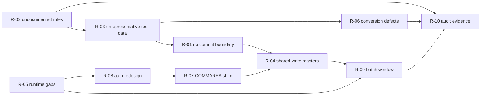

# CardDemo COBOL-to-Java Migration — Risk Register

Scope: the AWS CardDemo estate as it exists on this branch — 44 COBOL programs, 30 copybooks in
`app/cpy/` plus sub-application libraries, 46 JCL members (38 in `app/jcl/`, 8 in the three
sub-application trees), 2 PROCs, 17 BMS mapsets, and the sample datasets in `app/data/`
(`APPLICATION_INVENTORY.md` §1, §3; counts re-verified by directory listing).

Inputs: `APPLICATION_INVENTORY.md`, `DATA_DICTIONARY.md`, `DEPENDENCY_MAP.md`, `HOTSPOT_REPORT.md`
(this branch), plus `MODERNIZATION_BLUEPRINT.md` (per-area strategy) and `DOMAIN_DECOMPOSITION.md`
(bounded contexts and rated seams), both supplied as attachments and not yet in the repository.
Every risk below names the program, copybook, dataset or job that makes it real. Statements about
production volumes, SLAs, team composition and business intent are **not** in the repository and are
labelled as assumptions wherever they are used.

New measurements made for this register (not present in the four artifacts) are the dataset
quantification in §3.3 and the scheduler/CSD coverage checks in §3.4 and §3.9. Two corrections to
the prior artifacts are recorded in §7.

---

## 1. Scoring method

### 1.1 Ratings

**Likelihood** — the probability the risk materialises at least once during the migration, given the
evidence in this repository and no mitigation beyond what the code already does.

| Rating | Meaning | Test used |
| :----- | :------ | :-------- |
| High | The defect or gap is already present in the code, or the mechanism is unavoidable on the current migration path | An artefact in the repository already exhibits the failure precondition |
| Medium | Requires a plausible combination of a design choice and an operational event | Precondition exists but needs a triggering decision or load condition |
| Low | Requires an unlikely combination, or is already substantially controlled | Repository shows an existing control that usually holds |

**Impact** — the worst credible consequence if it materialises and is caught late (during parallel
run or after cutover, not in unit test).

| Rating | Meaning | Test used |
| :----- | :------ | :-------- |
| High | Wrong money, unrecoverable data state, failed audit, or a cutover that must be reversed | Touches balance-bearing masters, regulated output, or the go/no-go decision |
| Medium | Significant rework or schedule loss, but no wrong financial outcome reaches a customer | Rework measured in multiple Devin sessions, or a blocked phase |
| Low | Contained rework inside one area | One area, one session or less |

### 1.2 Combination and ranking

Likelihood and Impact are scored High = 3, Medium = 2, Low = 1. **Exposure = Likelihood x Impact**
(1–9), banded as Critical (9), Severe (6), Moderate (3–4), Low (1–2). Ties are broken in this order:

1. **Blast radius on shared masters.** Risks that can corrupt `ACCTDATA`, `TRANSACT` or `TCATBALF`
   rank above risks that cannot (`DOMAIN_DECOMPOSITION.md` §3, shared-write classification).
2. **Decision-binding earliness.** Risks that must be resolved before any rewrite begins outrank
   equally-scored risks that can be resolved later (`MODERNIZATION_BLUEPRINT.md` §7).
3. **Detectability.** A risk with no automatic detector ranks above one a reconciliation job catches.

### 1.3 Assumptions behind the scoring

These are inferences, not observations. Each is labelled and its effect on the ranking is stated.

| ID | Assumption | Why it is needed | Effect if false |
| :- | :--------- | :--------------- | :-------------- |
| A1 | The programme has no dedicated COBOL/CICS/IMS maintainers on staff and acquires mainframe knowledge by reading this repository | Nothing in the repository describes the team; the last source version stamps are 2022 and 2025 (`app/cpy/CVACT01Y.cpy:19`, `app/cpy/CVEXPORT.cpy:102`) | If experienced maintainers exist, R-02 drops from High to Medium likelihood and R-05 loses about half its impact |
| A2 | Risk appetite is moderate: a wrong customer balance is unacceptable, a schedule slip is tolerable | Needed to rank data-integrity risks above schedule risks | If appetite is "cutover date fixed", R-09 rises above R-06 |
| A3 | The target is a cloud-hosted Java stack with a relational store, i.e. off the mainframe | `samples/m2/` ships a Micro Focus / AWS M2 package and a UniKix package, and a PostgreSQL XA module (`MODERNIZATION_BLUEPRINT.md` §4.2); `README.md` names no product | If the mainframe is retained, R-05 and R-09 collapse to Low |
| A4 | Production volumes are orders of magnitude larger than the shipped fixtures (50 accounts, 300 daily transactions — §3.3) | No volume data exists in the repository | If production really is this small, R-09 impact drops to Low |
| A5 | The three optional sub-applications (Db2 transaction types, IMS/Db2/MQ authorizations, VSAM/MQ services) are in scope | `README.md:224`–`:240` marks them optional | If out of scope, R-05 drops one band and R-10's card-data exposure shrinks |
| A6 | Financial posting and statements are subject to external audit | Statements are produced in two formats and converted to PDF (`app/jcl/CREASTMT.JCL`, `app/jcl/TXT2PDF1.JCL`); nothing states the regulatory regime | If unregulated, R-10 drops to the watch list |

Budget is unknown; all effort figures are in **Devin-session units** (one session is roughly 1–2
human-weeks of work) and exclude external waits, which are listed separately per risk.

### 1.4 Cutover phases used in the mitigation columns

| Phase | Name | Content |
| :---- | :--- | :------ |
| P0 | Decide and extract | Resolve the 14 open questions in `MODERNIZATION_BLUEPRINT.md` §7; obtain production extracts |
| P1 | Foundation | Encoding codec, reference data externalization, explicit error/commit contract, parity harness |
| P2 | Bridge | Replatform the base application onto the shipped runtime artifacts to remove hosting as a variable |
| P3 | Extract contexts | Per-context rewrite behind facades, with parallel run against the bridge |
| P4 | Cutover | Batch-window switch, reconciliation gates, online traffic move |
| P5 | Decommission | Retire COBOL, BMS, GDG generations and the shim layer |

---

## 2. Risk summary table

| Rank | ID | Risk | Category | Likelihood | Impact | Exposure | Owner role | Phase most affected |
| ---: | :- | :--- | :------- | :--------- | :----- | :------- | :--------- | :------------------ |
| 1 | R-01 | Batch posting has no transactional boundary — three masters updated in place, abend as the only error path | Data integrity | High | High | 9 Critical | Batch/data platform lead | P3 |
| 2 | R-02 | Business rules exist only as tribal knowledge, stubs and unwired programs | Requirements | High | High | 9 Critical | Domain SME lead | P0 |
| 3 | R-03 | Shipped test data does not exercise the rules it is supposed to validate | Test assurance | High | High | 9 Critical | QA/test lead | P1 |
| 4 | R-04 | Shared-write masters coupled across four bounded contexts, isolated only by the scheduler | Architecture | High | High | 9 Critical | Data lead | P3 |
| 5 | R-05 | Mainframe runtime services with no shipped equivalent (IMS DL/I, MQ, Db2 plan, LE, internal reader, CEMT) | Environment | High | High | 9 Critical | Platform lead | P2 |
| 6 | R-06 | EBCDIC, zoned/packed decimal and collation conversion defects | Data conversion | Medium | High | 6 Severe | Data lead | P1 |
| 7 | R-07 | COMMAREA dynamic-dispatch navigation makes partial online migration invasive | Architecture | High | Medium | 6 Severe | Online/UX lead | P3 |
| 8 | R-08 | Clear-text `USRSEC` credential model forces an auth redesign mid-migration | Security | High | Medium | 6 Severe | Security lead | P1 |
| 9 | R-09 | Batch window breaks once the pipeline spans mainframe and cloud | Operations | Medium | High | 6 Severe | Scheduling/operations lead | P4 |
| 10 | R-10 | Audit and regulatory evidence for changed financial posting cannot be produced | Compliance | Medium | High | 6 Severe | Compliance lead | P4 |

---

## 3. Detailed risks

### 3.1 R-01 — Batch posting has no transactional boundary

**Category** Data integrity — **Likelihood** High — **Impact** High — **Exposure** 9 (Critical) —
**Owner** batch/data platform lead — **Phase** P3, prerequisites in P1

**Description.** `CBTRN02C` reads a daily transaction, then updates three separate stores in place:
it writes or rewrites the transaction-category balance, rewrites the account master, and writes the
transaction master. There is no commit scope around the three updates and no compensation logic. The
only failure path is an immediate abend. If the program fails between the balance update and the
account rewrite, the two masters disagree and nothing in the estate detects it — the effective commit
boundary is "the job ended with a good return code", which is a property of the *job*, not of the
record being posted. A rewritten pipeline that reproduces this structure inherits an
unrecoverable-by-design failure mode; a rewrite that adds a real transaction boundary is, strictly, a
behaviour change that has to be justified to whoever signs off parity.

**Evidence.**

| Fact | Citation |
| :--- | :------- |
| Category balance written on first occurrence and rewritten thereafter | `app/cbl/CBTRN02C.cbl:510`, `:528` |
| Account master balance updated and rewritten in the same paragraph | `app/cbl/CBTRN02C.cbl:547`, `:554` |
| Failure path is `CALL 'CEE3ABD'`, i.e. process termination, not error handling | `app/cbl/CBTRN02C.cbl:711`; the same pattern in 11 batch programs (`MODERNIZATION_BLUEPRINT.md` §4.6) |
| A rewrite failure sets a reject reason code but the record has already been posted to two other stores | `app/cbl/CBTRN02C.cbl:554`–`:559` |
| All three masters are in one job step with `DISP=SHR` — no step-level backout either | `app/jcl/POSTTRAN.jcl:23`, `:28`, `:39` |
| Contrast: the online path *does* have a boundary — `COACTUPC` checks for concurrent change, then rewrites account and customer, and issues `SYNCPOINT ROLLBACK` if the second rewrite fails | `app/cbl/COACTUPC.cbl:3946`, `:4066`, `:4086`, `:4100` |
| Contrast: the IMS batch program uses real checkpoints | `app/app-authorization-ims-db2-mq/cbl/CBPAUP0C.cbl:355` |
| Blueprint records this as the single most consequential undecided design question | `MODERNIZATION_BLUEPRINT.md` §7 item 14 |

**Likelihood reasoning — High.** The precondition is unconditional: every posted transaction takes
this path today, and any mid-run failure produces a partially-applied record. The migration adds a
new failure source (network calls between components) that the source never had.

**Impact reasoning — High.** The affected fields are customer balances (`ACCT-CURR-BAL`,
`app/cpy/CVACT01Y.cpy:7`) and category balances (`TRAN-CAT-BAL`, `app/cpy/CVTRA01Y.cpy:9`). A
silent divergence between the account master and the category balances is exactly the class of defect
that is discovered by a customer or an auditor rather than by a test.

**Mitigation strategy.**

- **P0** — Get an explicit answer to "what is the commit unit for posting: the file, the run, or the
  transaction?" (`MODERNIZATION_BLUEPRINT.md` §7 item 14). This is a business decision, not a design one.
- **P1** — Define the error-handling contract that replaces `CEE3ABD` before any posting code is
  written: per-record commit, structured failure record, and idempotent re-run keyed by
  `DALYTRAN-ID` (`app/cpy/CVTRA06Y.cpy:5`). Budget 1 session, shared with R-05's LE work.
- **P1** — Build a three-way reconciliation job (sum of category balances per account versus account
  balance versus sum of posted transactions) and run it against the *legacy* pipeline first, so the
  baseline mismatch count is known before migration changes anything. 1 session.
- **P3** — Implement posting with one transaction per daily record and the reconciliation job as the
  acceptance gate; never as a batch-wide commit.
- **P4** — Gate cutover on zero unexplained reconciliation mismatches across a full parallel-run cycle.

**Contingency.** Keep the replatformed COBOL posting job (P2 bridge) runnable for at least one full
monthly cycle after cutover, so a re-post from the immutable daily input is possible. If divergence
is found post-cutover, freeze posting, rebuild category balances from the transaction master
(`TRANSACT` is the only append-mostly store and is independently backed up daily by `TRANBKP`,
`app/jcl/TRANBKP.jcl:33`), then re-derive account balances and publish a correction file.

**Early warning indicators.**

- Reconciliation job: count of accounts where account balance does not equal the sum of that
  account's category balances. Baseline it in P1; alert on any increase.
- Count of posting runs ending in abend or non-zero completion, per run, trended per week.
- Count of records present in the transaction master but absent from the category balances for the
  same run id (should be zero).
- Number of re-runs that required manual dataset restoration — any occurrence is a red flag.
- Reject count reported at end of run (`app/cbl/CBTRN02C.cbl:228`) diverging from the record count
  written to the reject dataset.

### 3.2 R-02 — Business rules exist only as tribal knowledge, stubs and unwired programs

**Category** Requirements — **Likelihood** High — **Impact** High — **Exposure** 9 (Critical) —
**Owner** domain SME lead — **Phase** P0

**Description.** Several rules that a rewrite must reproduce are not fully present in the repository:
one validation program is never executed, one computation is an empty stub, the validation routine
carries a comment inviting more rules, the reject policy has no consumer, the run date is a literal,
and the sign convention that decides whether a transaction increases the credit or debit side of a
cycle is asserted by code without documentation. A rewrite therefore has no authoritative
specification, and "port it exactly" is not available as a fallback because in some places there is
nothing to port.

**Evidence.**

| Gap | What the code shows | Citation |
| :-- | :------------------ | :------- |
| Validation stage not wired | `POSTTRAN` runs `CBTRN02C`; no JCL or scheduler member runs the 415-LOC `CBTRN01C` | `app/jcl/POSTTRAN.jcl:23`; `DEPENDENCY_MAP.md` §8; `HOTSPOT_REPORT.md` §7 |
| Validation is explicitly incomplete | `1500-VALIDATE-TRAN` performs two lookups then carries the comment `ADD MORE VALIDATIONS HERE` | `app/cbl/CBTRN02C.cbl:370`, `:377` |
| Fee computation is an empty stub that is nevertheless invoked | `PERFORM 1400-COMPUTE-FEES` calls a paragraph whose body is the comment `To be implemented` | `app/cbl/CBACT04C.cbl:216`, `:518`, `:519` |
| Over-limit rule uses cycle credit minus cycle debit plus amount, not the current balance | `COMPUTE WS-TEMP-BAL` then `IF ACCT-CREDIT-LIMIT >= WS-TEMP-BAL` | `app/cbl/CBTRN02C.cbl:403`–`:410` |
| Sign convention undocumented | a non-negative daily amount is added to `ACCT-CURR-CYC-CREDIT` and a negative one to `ACCT-CURR-CYC-DEBIT`, with no comment explaining which is a purchase | `app/cbl/CBTRN02C.cbl:547`–`:551` |
| Reject policy lives outside the code | rejects are written to `DALYREJS(+1)` and nothing in the repository reads that GDG | `app/cbl/CBTRN02C.cbl:451`; `app/jcl/POSTTRAN.jcl:34`, `:38`; `DEPENDENCY_MAP.md` §5.4 |
| Interest run date is a literal | `PARM='2022071800'` received as `EXTERNAL-PARMS` | `app/jcl/INTCALC.jcl:22`; `app/cbl/CBACT04C.cbl:180` |
| Interest formula carries an unexplained divisor and no rounding mode | `COMPUTE WS-MONTHLY-INT = ( TRAN-CAT-BAL * DIS-INT-RATE) / 1200` into `PIC S9(09)V99` with no `ROUNDED` | `app/cbl/CBACT04C.cbl:464`, `:465`, `:168` |
| Rate fallback is a magic group name | when the account's group lookup fails, the literal `'DEFAULT'` is used | `app/cbl/CBACT04C.cbl:419`, `:437` |
| A required subroutine exists only in assembler | `CALL 'COBDATFT'` resolves to an assembler CSECT, not to COBOL | `app/cbl/CBACT01C.cbl:231`; `app/asm/COBDATFT.asm:17` |
| Latent JCL defect that a translation will surface | two distinct steps are both named `STEP05R` | `app/jcl/TRANREPT.jcl:23`, `:37` |
| Dead or missing output | `CBIMPORT` selects a `CARDOUT` file that no JCL defines | `app/cbl/CBIMPORT.cbl:63`; `DEPENDENCY_MAP.md` §5.2 |

**Likelihood reasoning — High.** These are not hypothetical: the stub, the unwired program, the
literal date and the orphan reject dataset are all present right now. Any rewrite of area 6 hits all
of them in its first week.

**Impact reasoning — High.** Two of the gaps are in money arithmetic (interest divisor and rounding,
fee stub) and one is in the acceptance rule for a transaction (over-limit). Guessing them produces a
system that passes a naive parity test — because the parity baseline has the same gaps — and is
wrong against the business rule.

**Mitigation strategy.**

- **P0** — Run a decision workshop against the 14 open questions in `MODERNIZATION_BLUEPRINT.md` §7,
  which already enumerates these with their evidence. Record each answer as a testable rule.
  Estimated 1 session of Devin work plus an **external wait** for business sign-off.
- **P0** — Decide `CBTRN01C`: reinstate as a pipeline stage or delete. It is 415 LOC of unrunnable
  rules; leaving it undecided makes the validation gap permanent.
- **P1** — Encode every recovered rule as an executable test *before* any rewrite, including the
  interest divisor and rounding mode, the over-limit expression and the sign convention.
- **P1** — Externalize the run date and the `'DEFAULT'` group name into configuration in the bridge,
  so the literal cannot be silently reproduced.
- **P3** — Implement `1400-COMPUTE-FEES` as an explicit, documented rule or an explicit no-op; do not
  carry an empty paragraph forward.

**Contingency.** If a rule cannot be recovered, freeze it: implement the observed COBOL behaviour
byte-for-byte, mark the code with the open question id, and put a monitored alert on the affected
field so the first production divergence is caught in hours rather than at month end. For the
assembler `COBDATFT`, if its behaviour cannot be re-specified then `CBACT01C` cannot serve as a
parity baseline and account reporting must be validated against extracts instead.

**Early warning indicators.**

- Count of open questions from `MODERNIZATION_BLUEPRINT.md` §7 still unanswered at the start of P3
  (target zero; any non-zero is a stop condition for area 6).
- Number of rules implemented from code reading alone with no business confirmation, tracked as a
  named list rather than a count.
- Number of `TODO`, `to be implemented` or "add more validations" markers carried into target code
  (target zero; currently at least two in COBOL).
- Parity-test defects whose root cause is classified "rule ambiguity" rather than "coding error" —
  if this exceeds a quarter of defects, the specification is the problem, not the code.
- Any literal date, group name or rate appearing in target configuration without an owner recorded.

### 3.3 R-03 — Shipped test data does not exercise the rules it is supposed to validate

**Category** Test assurance — **Likelihood** High — **Impact** High — **Exposure** 9 (Critical) —
**Owner** QA/test lead — **Phase** P1

**Description.** The repository ships parallel ASCII and EBCDIC sample datasets, and the blueprint's
recommended de-risking approach is golden-master parity testing on real extracts
(`MODERNIZATION_BLUEPRINT.md` §3.6, §4.2). The shipped fixtures cannot serve that purpose: they are
tiny, uniform, and — measured field by field — they do not exercise the validation tables, the
alternative branches, or the negative-value paths that the migration is most likely to break. A
parity harness built on them will be green while the rewrite is wrong.

**Evidence — measured directly from `app/data/EBCDIC/` by decoding each dataset at its copybook
record length.** Record lengths from `app/cpy/CVACT01Y.cpy:2`, `app/cpy/CVCUS01Y.cpy:2`,
`app/cpy/CVTRA06Y.cpy:2`, `app/cpy/CVTRA01Y.cpy:2`, `app/cpy/CVACT03Y.cpy:2`, `app/cpy/CVTRA02Y.cpy:2`,
`app/cpy/CVTRA03Y.cpy:2`, `app/cpy/CVTRA04Y.cpy:2`, `app/cpy/CVACT02Y.cpy:2`, `app/cpy/CVEXPORT.cpy:5`
and the file table at `README.md:133`.

| Dataset | Records | What the values cover, and what they do not |
| :------ | ------: | :----------------------------------------- |
| `AWS.M2.CARDDEMO.ACCTDATA.PS` | 50 | Every account has status `Y`, a blank `ACCT-GROUP-ID`, zero cycle credit and zero cycle debit, and a positive balance (sign nibble x'C' in all 50). No closed account, no negative balance, no group-specific interest rate, and the over-limit expression at `app/cbl/CBTRN02C.cbl:403` is always evaluated with both cycle fields zero |
| `AWS.M2.CARDDEMO.CUSTDATA.PS` | 50 | 36 distinct state codes; 5 records carry codes absent from `VALID-US-STATE-CODE`; 45 of the 100 phone numbers carry area codes absent from `VALID-PHONE-AREA-CODE`; only 2 of the 240 state-plus-ZIP2 combinations in `VALID-US-STATE-ZIP-CD2-COMBO` appear at all |
| `AWS.M2.CARDDEMO.DALYTRAN.PS` | 300 | 2 of the 7 defined transaction types (`01` 250 records, `03` 50) and 1 of the 18 defined categories (`0001`); 50 negative amounts (sign nibble x'D'); range -998.33 to 999.77; two source values only |
| `AWS.M2.CARDDEMO.TCATBALF.PS` | 50 | Every key is type `01` category `0001` — one of 18 possible combinations |
| `AWS.M2.CARDDEMO.DISCGRP.PS` | 51 | 3 group ids (`A000000000`, `DEFAULT`, `ZEROAPR`) x 17 type/category combinations. No account references any of them, so only the `'DEFAULT'` fallback path at `app/cbl/CBACT04C.cbl:437` is reachable |
| `AWS.M2.CARDDEMO.TRANTYPE.PS` and `AWS.M2.CARDDEMO.TRANCATG.PS` | 7 and 18 | Full reference sets, of which the transaction fixture exercises 2 and 1 respectively |
| `AWS.M2.CARDDEMO.CARDDATA.PS` | 50 | All cards active (`Y`) — no expired or blocked card path |
| `AWS.M2.CARDDEMO.CARDXREF.PS` | 50 | One card per account per customer; no multi-card account, so the alternate-index browse has no duplicate-key case |
| `AWS.M2.CARDDEMO.USRSEC.PS` | 10 | 5 admin and 5 regular users, all with the password `PASSWORD` (see R-08) |
| `AWS.M2.CARDDEMO.EXPORT.DATA.PS` | 500 | 5 record-type letters observed (`T` 300, then `A`, `C`, `D`, `X` at 50 each), which is the only fixture that exercises the `REDEFINES` variants of `app/cpy/CVEXPORT.cpy` at all |

The validation tables these fixtures are supposed to exercise are large and are compiled into the
program: `app/cpy/CSLKPCDY.cpy` is 1318 lines holding 490 phone area codes (`:24`, `:29`), a second
410-entry general-purpose list (`:521`), 56 state codes (`:1012`, `:1013`) and 240 state-plus-ZIP2
combinations (`:1071`, `:1073`). Only `COACTUPC` uses them, at `app/cbl/COACTUPC.cbl:602`, `:2495`
and `:2542` — so the one program with 3368 LOC and 175 conditions (`HOTSPOT_REPORT.md` §5, §7) is
also the one whose validation surface is least covered by shipped data.

Two further specifics matter for the codec work in R-06: no master file uses packed decimal at all —
`COMP` and `COMP-3` appear only in `app/cpy/CVEXPORT.cpy` (`:16`, `:41`, `:50`, `:52`, `:57`, `:71`,
`:87`) — so `EXPORT.DATA` is the *only* fixture that can test packed-decimal handling; and the
500-byte export record only adds up (1 + 26 + 4 + 4 + 5 + 460) if `PIC 9(9) COMP` occupies four
bytes, which is a compiler-option dependency rather than a property of the layout.

**Likelihood reasoning — High.** This is measured, not predicted: the coverage gaps above exist in
the shipped files today. The only question is whether production extracts arrive in time to replace
them, and that is an external wait outside the team's control.

**Impact reasoning — High.** Test data is the control that all the other data-integrity mitigations
depend on. If the fixtures cannot distinguish a correct rewrite from an incorrect one, R-01, R-02 and
R-06 all lose their detector simultaneously.

**Mitigation strategy.**

- **P0** — Request production extracts for the daily transaction input, the account master and the
  customer master, each with the matching prior-run outputs (this is the blueprint's stated external
  wait for area 6). Treat as an **external wait**, not effort; start it on day one.
- **P1** — Build a fixture generator that fills the measured gaps rather than hand-editing files:
  closed accounts, negative balances, non-zero cycle credit and debit, every transaction type and
  category, group ids that actually resolve in `DISCGRP`, multi-card accounts, and at least one
  record per state-plus-ZIP2 combination in `CSLKPCDY`. Budget 2 sessions.
- **P1** — Add a coverage report to CI that asserts, per validation table, the percentage of entries
  exercised by the test corpus, and fails when it drops.
- **P1** — Keep `app/data/ASCII/` and `app/data/EBCDIC/` as a round-trip pair for codec tests
  (`MODERNIZATION_BLUEPRINT.md` §4.2) but never as functional coverage.
- **P3** — Require both a synthetic run and a real-extract run to pass before any area is cut over.

**Contingency.** If production extracts cannot be obtained (privacy, retention or provisioning),
switch area 6 from rewrite to the replatform bridge as the long-term answer — the blueprint's own
sensitivity analysis says the rewrite's main advantage evaporates without extracts
(`MODERNIZATION_BLUEPRINT.md` §3.6) — and fund a masked-extract pipeline as a separate workstream
before revisiting.

**Early warning indicators.**

- Validation-table coverage percentage per table, on a dashboard: currently 0.8% for
  state-plus-ZIP2, about 10% for area codes, 11% for transaction types, 5.6% for categories.
- Count of branch paths in `CBTRN02C` and `CBACT04C` never taken by any test run (over-limit reject,
  expired-account reject, non-`DEFAULT` interest group are all currently zero).
- Days elapsed since the production-extract request with no delivery date.
- Number of parity tests passing on fixtures but failing on the first real extract — any occurrence
  invalidates the harness.
- Percentage of packed-decimal fields covered by a test other than the `EXPORT.DATA` fixture.

### 3.4 R-04 — Shared-write masters coupled across four bounded contexts

**Category** Architecture — **Likelihood** High — **Impact** High — **Exposure** 9 (Critical) —
**Owner** data lead — **Phase** P3

**Description.** `DOMAIN_DECOMPOSITION.md` classifies `ACCTDATA`, `TRANSACT`, `TCATBALF` and
`CARDXREF` as shared-write or universally shared-read, and rates the corresponding extraction seams
S1, S2 and S4 as hard (`DOMAIN_DECOMPOSITION.md` §3, §5). The reason the current design works is
temporal: the scheduler closes the files to CICS, runs batch, then reopens them. Once a context is
extracted to its own store while others still write VSAM, that temporal isolation is gone and there
is no lock, no version and no owner to replace it.

**Evidence.**

| Fact | Citation |
| :--- | :------- |
| `ACCTDATA` is rewritten by four programs in three runtime modes: daily batch, monthly batch and two online paths | `app/cbl/CBTRN02C.cbl:554`; `app/cbl/CBACT04C.cbl:356`; `app/cbl/COACTUPC.cbl:4066`; `app/cbl/COBIL00C.cbl:379`; `DOMAIN_DECOMPOSITION.md` §5 seam S2 |
| `TRANSACT` is written by batch posting, by online transaction entry and by online bill payment, and periodically rebuilt wholesale | `app/cbl/CBTRN02C.cbl:510`; `app/cbl/COBIL00C.cbl:512`; `DOMAIN_DECOMPOSITION.md` §5 seam S4 |
| `TCATBALF` is written by posting and read by interest, and is used by no online program (verified: no `CO*` program references it) | `app/cbl/CBTRN02C.cbl:528`; `app/cbl/CBACT04C.cbl:236` |
| `CARDXREF` is the estate's only three-way identity resolution point and is read by almost everything, through both a KSDS and an alternate-index path | `app/jcl/INTCALC.jcl:29`, `:31`; `app/jcl/XREFFILE.jcl:90`, `:100`; `DATA_DICTIONARY.md` §10 item 1 |
| Isolation is the scheduler closing files in the CICS region, not a lock | `app/jcl/CLOSEFIL.jcl:26`–`:30`; `app/jcl/OPENFIL.jcl:26`–`:30`; `DOMAIN_DECOMPOSITION.md` §4 |
| The close/open bracket covers 5 of the 8 CICS-defined files — `CARDDAT`, `CUSTDAT` and `CARDAIX` are left open during batch | `app/jcl/CLOSEFIL.jcl:26`–`:30` versus `app/csd/CARDDEMO.CSD:1`, `:13`, `:25`, `:37`, `:50`, `:63`, `:76`, `:88` |
| Online updates already assume optimistic concurrency — `COACTUPC` re-reads and compares before rewriting | `app/cbl/COACTUPC.cbl:3946` |
| Bill payment touches account and transaction masters plus the xref path in one online transaction | `app/cbl/COBIL00C.cbl:345`, `:379`, `:443`, `:512` |

**Likelihood reasoning — High.** Every incremental extraction path in the blueprint crosses at least
one of these datasets, and the scheduler-based isolation cannot be preserved in a hybrid deployment:
the target store is not something `CEMT SET FILE CLOSED` can quiesce.

**Impact reasoning — High.** The failure mode is a lost update on a balance-bearing record, which is
both invisible and financially material. It also blocks sequencing: three areas cannot be cut over
independently if they all rewrite the same record.

**Mitigation strategy.**

- **P1** — Assign a single writing owner per dataset before extraction begins, following the
  extraction order in `DOMAIN_DECOMPOSITION.md` §6. Any second writer becomes a client of the owner,
  not a co-writer.
- **P1** — Add an optimistic-concurrency token to the account and category-balance records in the
  target model; the online path already implements the semantics by hand
  (`app/cbl/COACTUPC.cbl:3946`), so this is codifying existing behaviour, not inventing it.
- **P3** — Extract `CARDXREF` first as a read-only, replicated join table (seam S1); it is read
  everywhere and written almost nowhere, so it is the cheapest way to reduce cross-context reads.
- **P3** — During dual-run, make the legacy VSAM copy authoritative and the target store a follower,
  with a per-record reconciliation, until the writer owner flips.
- **P4** — Flip writer ownership one dataset per cutover event; never two in the same window.

**Contingency.** If divergence appears during dual-run, stop the target writer, re-seed the target
store from the VSAM master (all four are small, fixed-length and fully specified, so re-seeding is
mechanical), and re-run the affected window from the immutable daily input. If divergence persists,
fall back to routing all writes through the replatformed COBOL programs on the bridge until the
ownership model is corrected.

**Early warning indicators.**

- Per-dataset writer count in the target architecture — any dataset with more than one writer is a
  defect, not a design choice.
- Dual-run divergence: number of records differing between VSAM master and target store, per dataset,
  per run; and time-to-detect for each divergence.
- Count of optimistic-concurrency conflicts rejected per hour in the online path (a rise means batch
  and online are now overlapping).
- Any batch run that starts while the corresponding files are still open to the online region.
- Length of the close/open window, trended — a growing window means the serialization is becoming
  the constraint.

### 3.5 R-05 — Mainframe runtime services with no shipped equivalent

**Category** Environment — **Likelihood** High — **Impact** High — **Exposure** 9 (Critical) —
**Owner** platform lead — **Phase** P2

**Description.** The estate depends on a set of z/OS and middleware services that are not application
code and therefore cannot be "migrated" — they must be replaced by target platform capabilities, each
with its own semantics: CICS pseudo-conversational sessions and BMS 3270 maps, IMS DL/I with PSBs and
checkpoints, IBM MQ, a Db2 plan, Language Environment services, GDG generation semantics, VSAM
alternate indexes and paths, the internal reader, an operator-modify command channel, and the utility
programs the batch pipeline is built from. `samples/m2/` ships two replatform packages that cover
part of this, and — decisively — cover none of the highest-technology-risk areas
(`MODERNIZATION_BLUEPRINT.md` §4.2).

**Evidence.**

| Dependency | Where it is used | Citation |
| :--------- | :--------------- | :------- |
| CICS pseudo-conversational re-entry state | `CDEMO-PGM-CONTEXT` distinguishes entry from re-entry | `app/cpy/COCOM01Y.cpy:29` |
| BMS 3270 presentation | 17 mapsets plus symbolic maps, defined to CICS | `app/bms/` (17 members), `app/cpy-bms/`, `app/csd/CARDDEMO.CSD` |
| CICS file control | 8 file definitions including two alternate indexes | `app/csd/CARDDEMO.CSD:1`, `:13`, `:63`; 18 transaction definitions in the same member |
| IMS DL/I, call interface | `CALL 'CBLTDLI'` in the authorization loader and unloaders | `app/app-authorization-ims-db2-mq/cbl/PAUDBLOD.CBL:244`; `app/app-authorization-ims-db2-mq/cbl/PAUDBUNL.CBL:213`; `app/app-authorization-ims-db2-mq/cbl/DBUNLDGS.CBL:222` |
| IMS DL/I, command interface plus checkpoint/restart | `EXEC DLI GN` / `GNP` / `DLET` / `CHKP` | `app/app-authorization-ims-db2-mq/cbl/CBPAUP0C.cbl:223`, `:255`, `:310`, `:355` |
| IMS PSBs and DBDs | 4 PSB and 4 DBD members | `app/app-authorization-ims-db2-mq/ims/PSBPAUTB.psb`, `app/app-authorization-ims-db2-mq/ims/DBPAUTP0.dbd` |
| IBM MQ | 40 MQ API calls across three programs, with syncpoint and no-syncpoint get/put options | `app/app-vsam-mq/cbl/COACCT01.cbl:347`, `:475`; `app/app-vsam-mq/cbl/CODATE01.cbl:296`; `app/app-authorization-ims-db2-mq/cbl/COPAUA0C.cbl:389` |
| Db2 plan and utilities | `RUN PROGRAM(COBTUPDT) PLAN(CARDDEMO)` under `IKJEFT01`; unload via `PLAN(DSNTIAUL)` | `app/app-transaction-type-db2/jcl/MNTTRDB2.jcl:30`; `app/app-transaction-type-db2/jcl/TRANEXTR.jcl:89` |
| Language Environment date service | one `CEEDAYS` call site, the leaf of all date validation | `app/cbl/CSUTLDTC.cbl:116` |
| Language Environment abend service | `CEE3ABD` in 11 batch programs (verified count) | `app/cbl/CBTRN02C.cbl:711`; `app/cbl/CBACT04C.cbl:632` |
| Assembler subroutines | `COBDATFT` and `MVSWAIT` | `app/asm/COBDATFT.asm:17`; `app/cbl/COBSWAIT.cbl:38` |
| Internal reader from an online program | `CORPT00C` submits report JCL through a transient data queue | `app/cbl/CORPT00C.cbl:462`, `:517` |
| Operator-modify channel as an application mechanism | `CLOSEFIL` and `OPENFIL` drive `CEMT SET FILE` through `PGM=SDSF` | `app/jcl/CLOSEFIL.jcl:22`, `:26`–`:30` |
| GDG generation semantics | relative generations carry state between jobs | `app/jcl/POSTTRAN.jcl:38`; `app/jcl/INTCALC.jcl:41`; `app/jcl/TRANBKP.jcl:33` |
| VSAM alternate indexes and paths | `BLDINDEX` plus `DEFINE PATH` in three loader jobs | `app/jcl/TRANIDX.jcl:42`, `:52`; `app/jcl/CARDFILE.jcl:100`, `:110`; `app/jcl/XREFFILE.jcl:90`, `:100` |
| Utilities as pipeline stages | `IDCAMS` in 24 members, `SORT` in 5, `IEBGENER` in 5, `IKJEFT01` in 3 | verified by search across `app/`; `README.md:300` |
| What the shipped packages do and do not cover | UniKix package supplies FCT/PCT/PPT, SIT, VSAM catalog and 7 GDG bases for the base application, and contains no Db2, IMS or MQ resources and no TCT | `MODERNIZATION_BLUEPRINT.md` §4.2 |

**Likelihood reasoning — High.** These dependencies are unconditional: they are exercised by the
estate's normal operation. The shipped replatform artifacts prove that base-application hosting is
solvable, which is exactly why the residual risk concentrates in the parts they do not cover.

**Impact reasoning — High.** The uncovered parts (IMS DL/I with checkpoints, MQ, Db2 plan) are the
authorization path — the only place in the estate with real transactional semantics — and provisioning
them is an external dependency with lead time, not a coding task.

**Mitigation strategy.**

- **P0** — Produce a service-by-service replacement decision list from the table above, each with an
  owner and a target capability. Anything left "to be decided" at the end of P0 is a P2 blocker.
- **P0** — Start MQ, IMS-equivalent and target-database provisioning immediately: these are
  **external waits** (blueprint area 9 lists MQ and IMS provisioning plus PSB/plan equivalents).
- **P2** — Deploy the shipped UniKix package to get the base application hosted, with alternate
  indexes and GDG bases intact, so that hosting stops being a variable while the rewrite proceeds.
  Blueprint budget: 2 sessions for the area 6 bridge.
- **P1** — Substitute `CEEDAYS` behind a date interface (one call site) and replace the 11 `CEE3ABD`
  sites with the explicit error contract from R-01. Retire `MVSWAIT`/`COBSWAIT` (13 LOC) by using
  scheduler dependencies instead of wait steps.
- **P3** — Replace `CORPT00C`'s internal-reader submission with an asynchronous job-request API, and
  replace the `CEMT`-based close/open bracket with the concurrency model from R-04 rather than
  reproducing a quiesce command.
- **P5** — Retire BMS mapsets rather than converting them.

**Contingency.** If IMS or MQ equivalents cannot be provisioned in time, keep the authorization
sub-application on the mainframe or on the replatform bridge and integrate through a published
interface — the estate already isolates it behind a single `EXEC CICS LINK`
(`app/app-authorization-ims-db2-mq/cbl/COPAUS1C.cbl:248`), which is the natural boundary. If the
internal-reader replacement is not ready, keep report submission manual for one release.

**Early warning indicators.**

- Number of runtime dependencies in the table above with no named replacement and no owner.
- Days waiting on MQ, IMS-equivalent and target-database provisioning, versus the date P2 needs them.
- Count of `CEE3ABD` call sites still present in target code (target zero; 11 today).
- Number of batch steps still invoking a z/OS utility (`IDCAMS`, `SORT`, `IEBGENER`, `IKJEFT01`) after
  each phase, trended down from 24 / 5 / 5 / 3.
- Any use of a 3270 emulator in a target-state test scenario after P3 — it means the presentation
  retirement has slipped.

### 3.6 R-06 — EBCDIC, zoned/packed decimal and collation conversion defects

**Category** Data conversion — **Likelihood** Medium — **Impact** High — **Exposure** 6 (Severe) —
**Owner** data lead — **Phase** P1

**Description.** Three distinct conversion hazards sit on the same path. First, representation: the
estate stores money as fixed-point zoned decimal in the masters and mixes zoned, packed and binary in
the export record, so sign nibbles, implied decimal points and binary field widths all have to be
interpreted exactly. Second, arithmetic: the interest computation divides by a constant with no
rounding mode into a two-decimal field, so the target must reproduce COBOL truncation rather than
apply a language default. Third, ordering: report and combine steps sort character keys in EBCDIC
collating sequence, which differs from ASCII/Unicode ordering, so a faithful data conversion can
still produce a differently-ordered output.

**Evidence.**

| Fact | Citation |
| :--- | :------- |
| Alphanumeric is EBCDIC, unqualified numeric is zoned decimal, `COMP-3` is packed, `COMP` is binary | `DATA_DICTIONARY.md` §1 |
| Money is uniformly two-decimal fixed point with no floating point anywhere | `DATA_DICTIONARY.md` §10 item 4 |
| Signed zoned money fields in the account master | `app/cpy/CVACT01Y.cpy:7`–`:9`, `:13`, `:14` |
| Signed zoned amount in the daily transaction record | `app/cpy/CVTRA06Y.cpy:10` |
| Sign nibbles observed in the shipped data: x'C' for positive in all account balances, x'D' for negative in 50 of 300 daily amounts | measured from `app/data/EBCDIC/AWS.M2.CARDDEMO.ACCTDATA.PS` and `app/data/EBCDIC/AWS.M2.CARDDEMO.DALYTRAN.PS` |
| One record mixes binary, packed and zoned representations of the same kinds of value | `app/cpy/CVEXPORT.cpy:16`, `:41`, `:50`, `:51`, `:52`, `:57`, `:71`, `:87`, `:95`, `:96` |
| Interest arithmetic truncates: divide by 1200 into `PIC S9(09)V99` with no `ROUNDED` | `app/cbl/CBACT04C.cbl:465`, `:168` |
| Rate source is itself a signed two-decimal zoned field | `app/cpy/CVTRA02Y.cpy:9` |
| Sorting is a pipeline stage, on character keys | `app/jcl/TRANREPT.jcl:37` (`PGM=SORT`); `SORT` used in 5 JCL members |
| Binary transfer is required for the EBCDIC fixture set, i.e. the repository already treats encoding as load-bearing | `README.md:126`–`:129` per `MODERNIZATION_BLUEPRINT.md` §4.2 |
| The ASCII/EBCDIC pair in `app/data/` gives a ready-made round-trip fixture | `app/data/ASCII/`, `app/data/EBCDIC/` |

**Likelihood reasoning — Medium.** A single well-tested codec removes most of this, and the
blueprint already recommends exactly that (`MODERNIZATION_BLUEPRINT.md` §4.2), which is why this is
not High. What keeps it above Low is the arithmetic and collation part: those are not codec bugs, they
are semantics that a Java developer reproduces incorrectly by default (binary floating point, natural
`String` ordering, half-up rounding).

**Impact reasoning — High.** A rounding or sign defect in interest or posting is wrong money on every
account, every cycle, and it is the kind of error that passes review because the code "looks right".
A collation difference changes statement and report ordering, which is visible to auditors.

**Mitigation strategy.**

- **P1** — Build one codec, used everywhere, covering zoned decimal (including all sign nibble
  variants), packed decimal and binary, tested against the 500-record `EXPORT.DATA` fixture and the
  ASCII/EBCDIC round-trip pair. Blueprint area 10 budget: 3 sessions.
- **P1** — Mandate fixed-scale decimal arithmetic in every rewritten area, with the rounding mode
  stated explicitly per computation; add a lint rule that fails the build on binary floating-point
  types in money paths.
- **P1** — Reproduce the interest computation as a property test against the legacy program over
  generated balances and rates, not just the 50 shipped accounts.
- **P1** — Decide and document the target collation for every sorted output, and pin it with a test
  that includes keys where EBCDIC and ASCII orderings differ (digits versus letters, and lowercase).
- **P3** — Re-verify the codec against real extracts as soon as they arrive (see R-03).

**Contingency.** If a conversion defect reaches parallel run, the daily input is immutable and
re-runnable, so the correct response is to fix the codec and re-derive rather than to patch
downstream data. Retain every raw extract and every run's output for the whole parallel-run period so
re-derivation is always possible. For collation, if the target cannot reproduce EBCDIC ordering
cheaply, get explicit sign-off on the new ordering rather than hand-rolling a comparator.

**Early warning indicators.**

- Codec test pass rate per representation, plus explicit sign-nibble coverage (x'C', x'D', x'F' and
  unsigned) — anything under 100% blocks P3.
- Count of money-path computations without an explicit rounding mode (target zero).
- Round-trip byte-identity failures between `app/data/ASCII/` and `app/data/EBCDIC/` fixtures.
- Number of records whose amount differs from the legacy value by exactly 0.01 during parallel run —
  the signature of a rounding-mode mismatch, and the single most diagnostic metric here.
- Number of report or statement lines whose ordering differs from the legacy output.

### 3.7 R-07 — COMMAREA dynamic-dispatch navigation makes partial online migration invasive

**Category** Architecture — **Likelihood** High — **Impact** Medium — **Exposure** 6 (Severe) —
**Owner** online/UX lead — **Phase** P3

**Description.** Online navigation is not encoded in call statements; it is data. A program moves the
name of the next program into a field of a shared communication area and transfers control. The call
graph therefore only exists at runtime, and every screen is simultaneously a router, a session store
and a business component. Migrating any subset of screens means something must continue to produce
and consume that structure, so the shim is unavoidable and its correctness is invisible to static
analysis.

**Evidence.**

| Fact | Citation |
| :--- | :------- |
| The communication area carries routing and session identity together | `app/cpy/COCOM01Y.cpy:19`, `:22`, `:24` |
| Re-entry state lives in the same structure | `app/cpy/COCOM01Y.cpy:29` |
| 57 statements across 20 programs move a target program name into that field (verified by search) | `DEPENDENCY_MAP.md` §2, §3 |
| There is exactly one `EXEC CICS LINK` between application programs in the whole estate | `app/app-authorization-ims-db2-mq/cbl/COPAUS1C.cbl:248` |
| The largest program in the estate is a re-entry state machine plus field edits, not business logic | `app/cbl/COACTUPC.cbl` (4236 lines in file, 3368 LOC and 175 conditions per `HOTSPOT_REPORT.md` §5) |
| The menu program has the highest call-graph degree in the estate | `HOTSPOT_REPORT.md` §6 (`COMEN01C`, degree 24) |
| Blueprint's cross-cutting decision: do not carry the target-program field into the target under any name | `MODERNIZATION_BLUEPRINT.md` §4.1 |
| Seam S8 (COMMAREA navigation) is rated hard | `DOMAIN_DECOMPOSITION.md` §5 |

**Likelihood reasoning — High.** Any online migration that is not big-bang hits this on its first
screen, and a big-bang online migration is itself the larger risk.

**Impact reasoning — Medium.** It costs sessions and produces awkward code, but it does not corrupt
money: mistakes here show up as broken navigation or lost context, which are visible immediately in
testing rather than silently wrong in a balance.

**Mitigation strategy.**

- **P1** — Split the structure into three target concepts up front: an authenticated session token,
  an explicit route, and per-operation request/response payloads (`MODERNIZATION_BLUEPRINT.md` §4.1).
- **P3** — Rewrite the navigation shell first, then screens, so the shim is written once, in the
  shell, rather than per screen. Blueprint area 1 budget: 3 sessions.
- **P3** — Build the compatibility shim that materialises a communication area for the COBOL screens
  that still expect one, and instrument it: every field the shim writes should be attributable to a
  target concept.
- **P3** — Recover the runtime call graph by resolving the 57 literal moves into an explicit route
  table, and treat that table as a test fixture for the target router.
- **P5** — Delete the shim as an explicit, tracked deliverable; a shim with no removal date becomes
  permanent architecture.

**Contingency.** If the shim proves unstable, invert the direction: keep the COBOL shell as the
router during transition and let it transfer control to a bridge program that calls the target
service, so the routing model changes once, at the end, instead of per screen.

**Early warning indicators.**

- Number of COBOL programs still moving a name into the target-program field (target zero by P5;
  57 sites today).
- Number of fields still carried in the compatibility shim, trended down each release.
- Defects per release classified as "lost or wrong session context".
- Shim age in releases with no reduction in fields carried — the signature of a permanent shim.
- Number of routes discovered at runtime that are absent from the explicit route table.

### 3.8 R-08 — Clear-text credential model forces an auth redesign mid-migration

**Category** Security — **Likelihood** High — **Impact** Medium — **Exposure** 6 (Severe) —
**Owner** security lead — **Phase** P1

**Description.** Authentication compares a user-entered 8-character password against a clear-text
field read from a VSAM file. There is no hash, no salt, no lockout and no password lifecycle. A
target platform cannot reproduce this — and should not — so the migration must design and land a new
authentication model, migrate or reset every credential, and reconcile the fact that the repository's
own documentation names an external security product while the code reads its own file.

**Evidence.**

| Fact | Citation |
| :--- | :------- |
| The password is a plain 8-byte field in the user record | `app/cpy/CSUSR01Y.cpy:21` |
| Sign-on reads the user record from a VSAM file through CICS file control | `app/cbl/COSGN00C.cbl:211` |
| The comparison is a direct clear-text equality test | `app/cbl/COSGN00C.cbl:223` |
| The user file is a CICS-defined dataset in the same close/open bracket as the business masters | `app/csd/CARDDEMO.CSD:88`; `app/jcl/CLOSEFIL.jcl:30` |
| Authorization is a single character in the same record, driving admin versus user menus | `app/cpy/CSUSR01Y.cpy:22`; `README.md:203`–`:204` |
| Documentation names an external security product, the code does not use it | `README.md:47` versus `app/cbl/COSGN00C.cbl:211`; recorded as an open question in `MODERNIZATION_BLUEPRINT.md` §7 item 13 |
| The shipped fixture is 10 users, all with the same password (see R-03) | `app/data/EBCDIC/AWS.M2.CARDDEMO.USRSEC.PS` |
| Seam SEC/S-context extraction rated in the decomposition, with user administration as its own area | `DOMAIN_DECOMPOSITION.md` §4; `MODERNIZATION_BLUEPRINT.md` §3.2 |

**Likelihood reasoning — High.** The gap is unconditional and the decision cannot be deferred: the
first migrated screen needs an identity, so the new model must exist before any online cutover.

**Impact reasoning — Medium.** It is a bounded piece of work (blueprint areas 1 and 2: 3 + 2 sessions)
with a well-understood target pattern. What raises it above Low is that it is on the critical path for
every online area and it carries an **external wait** for identity-provider selection and security
review, plus credential-reset approval.

**Mitigation strategy.**

- **P0** — Resolve whether the external directory or this file is the production authority for users
  (`MODERNIZATION_BLUEPRINT.md` §7 item 13). The answer changes area 2 from a user store to an
  administrative UI.
- **P1** — Select the identity provider and land authentication in the shell rewrite, before screens.
  Treat provider selection and security review as external waits started in P0.
- **P1** — Decide credential handling explicitly: forced reset (recommended, since the stored values
  are unusable as hashes) versus migration. Plan the user communication as a dependency, not an
  afterthought.
- **P1** — Keep the admin/user distinction as a role claim, so menu authorization does not have to be
  re-derived per screen.
- **P3** — Bridge period: the shim presents an authenticated session to COBOL screens without
  re-reading the user file; do not let both models be authoritative at once.

**Contingency.** If the identity provider is not ready when the first online area is, ship the
rewritten screens behind the legacy sign-on via the shim, with the clear-text file still authoritative
but network-isolated, and treat that as a time-boxed exception with a recorded expiry. Do not
replicate the clear-text field into the target store as an interim measure.

**Early warning indicators.**

- Existence of a signed identity-provider decision by the end of P0 — a binary gate.
- Number of target components able to read a clear-text credential field (must be zero from P1).
- Count of users needing credential reset versus users reset, tracked to completion before cutover.
- Any target-store schema containing a password column that is not a salted hash.
- Failed sign-on rate during parallel run diverging from the legacy baseline — indicates the shim is
  mishandling identity rather than users forgetting passwords.

### 3.9 R-09 — Batch window breaks once the pipeline spans mainframe and cloud

**Category** Operations — **Likelihood** Medium — **Impact** High — **Exposure** 6 (Severe) —
**Owner** scheduling/operations lead — **Phase** P4

**Description.** The batch pipeline is a chain of jobs that pass state through relative GDG
generations, bracketed by closing the files to the online region. During a partial migration each
boundary crossing becomes a network hop plus a data movement, the online outage window grows, and the
ordering contract — which is expressed as scheduler conditions, not in the JCL — has to be
reproduced in a second scheduler while the first one is still live. The repository's own two
scheduler definitions do not agree on what the pipeline is, so there is no single authoritative
ordering to copy.

**Evidence.**

| Fact | Citation |
| :--- | :------- |
| Online files are closed for the duration of batch and reopened afterwards | `app/jcl/CLOSEFIL.jcl:22`, `:26`–`:30`; `app/jcl/OPENFIL.jcl:26`–`:30` |
| State passes between jobs as relative generations, with no run identifier | `app/jcl/POSTTRAN.jcl:38`; `app/jcl/INTCALC.jcl:41`; `app/jcl/TRANBKP.jcl:33` |
| Two different jobs create generations of the same GDG base, which is harmless only under relative naming | `app/jcl/TRANREPT.jcl:33`, `:39` versus `app/jcl/TRANBKP.jcl:33` |
| Ordering lives in the schedulers as named conditions | `app/scheduler/CardDemo.controlm:9`, `:15`, `:21`, `:70`, `:76`, `:82`; `app/scheduler/CardDemo.ca7:70`, `:97` |
| The two shipped scheduler definitions describe different pipelines: the Control-M file contains no `POSTTRAN` job at all, and the CA 7 file contains no `INTCALC` or `COMBTRAN` (verified by search) | `app/scheduler/CardDemo.controlm`; `app/scheduler/CardDemo.ca7` |
| Neither matches the documented run order, which lists 21 jobs including `POSTTRAN`, `INTCALC`, `TRANBKP`, `COMBTRAN` and `CREASTMT` in sequence | `README.md:224`–`:240`; `APPLICATION_INVENTORY.md` §4 README-versus-JCL comparison |
| Waiting is implemented as a job that sleeps for a parameter-supplied time | `app/jcl/WAITSTEP.jcl:22`; `app/cbl/COBSWAIT.cbl:38` |
| One online program submits a batch job, so the boundary is already crossed in the other direction | `app/cbl/CORPT00C.cbl:462`, `:517` |
| Generation ordering constraint: the combine job reads the backup generation, so the backup must run between posting and combine | `MODERNIZATION_BLUEPRINT.md` §3.6, §4.4 |

**Likelihood reasoning — Medium.** Under assumption A4 (production volumes far larger than the 300
shipped daily transactions) added latency matters, but the pipeline is short and the shipped
replatform package already catalogues the clusters and GDG bases, so a competent bridge deployment
avoids most of the exposure. The scheduler disagreement, however, is observed fact, not assumption.

**Impact reasoning — High.** A missed batch window means the online day starts late or starts with
stale balances; a mis-ordered re-run silently consumes the wrong generation, which is the failure mode
§4.4 of the blueprint calls out explicitly.

**Mitigation strategy.**

- **P0** — Reconcile the three descriptions of the pipeline (documented order, Control-M, CA 7) into
  one authoritative dependency graph, and get operations to confirm which is live. 1 session plus an
  **external wait** for operations confirmation.
- **P1** — Replace relative generations with explicit run-dated, immutable artefacts keyed by run id,
  and make every consumer name the run it wants. This removes the "wrong generation on re-run" class
  entirely (`MODERNIZATION_BLUEPRINT.md` §4.4).
- **P2** — Measure the baseline window on the bridge before any rewrite lands, so window growth is
  attributable.
- **P4** — Cut over one chain per window with a documented rollback point, and replace wait-steps with
  real scheduler dependencies so the window is not padded by sleeps.
- **P4** — Keep the close/open bracket only as long as VSAM is authoritative; retire it with the
  writer-ownership flip in R-04 rather than reproducing a quiesce command in the target.

**Contingency.** If the window is exceeded, the immediate lever is to run the still-replatformed
chain on the bridge for that cycle (both are catalogued in the shipped package), and the structural
lever is to split posting by account-key range, since posting is per-record and the masters are keyed.
Publish a stale-data notice for the online day rather than starting with a partially posted master.

**Early warning indicators.**

- Batch elapsed time per chain per run, against the window, trended — with the bridge baseline as
  the reference line.
- Duration of the online close/open outage, per run.
- Count of jobs whose predecessor is expressed only as a wait-step rather than a dependency.
- Number of re-runs that consumed an unexpected generation, and number of runs where the same GDG
  base received generations from two different jobs.
- Difference between the authoritative dependency graph and the live scheduler definitions,
  as a count of jobs present in one and not the other (currently non-zero in both directions).

### 3.10 R-10 — Audit and regulatory evidence for changed financial posting cannot be produced

**Category** Compliance — **Likelihood** Medium — **Impact** High — **Exposure** 6 (Severe) —
**Owner** compliance lead — **Phase** P4

**Description.** Under assumption A6, changing how interest is computed and how transactions are
posted requires evidence: what the old system did, what the new one does, why any difference is
correct, and who approved it. The estate provides weak raw material for that evidence. Rejected
transactions are written to a generation nothing reads, so there is no reject audit trail with an
owner. There is no per-record processing history beyond the transaction master itself. Statement
output exists in two formats plus a PDF conversion, so "the statement" is three artefacts. And the
data in scope includes full card numbers in several files, which makes both the extracts needed for
parity testing (R-03) and the reject dataset a data-protection question rather than a purely technical
one.

**Evidence.**

| Fact | Citation |
| :--- | :------- |
| Rejected transactions go to a GDG generation with no consumer and no documented retention | `app/cbl/CBTRN02C.cbl:451`; `app/jcl/POSTTRAN.jcl:34`, `:38`; `MODERNIZATION_BLUEPRINT.md` §7 item 2 |
| The reject record carries the full 350-byte transaction plus a reason code and description | `app/cbl/CBTRN02C.cbl:176`–`:182`, `:83`–`:84` |
| Reject reason codes are numeric literals in code with no external catalogue | `app/cbl/CBTRN02C.cbl:385`, `:397`, `:410`, `:417`, `:556` |
| Interest posting writes system-generated transactions into the same master as customer activity | `app/cbl/CBACT04C.cbl:490`, `:500` |
| The only run-level audit output is displayed counts, not a durable record | `app/cbl/CBTRN02C.cbl:228`, `:229` |
| Statements are produced as text and HTML, then converted to PDF in a separate job | `app/jcl/CREASTMT.JCL`; `app/jcl/TXT2PDF1.JCL`; `MODERNIZATION_BLUEPRINT.md` §3.7 |
| Full 16-character card numbers are present in the transaction, card and cross-reference layouts, and in the shipped fixtures | `app/cpy/CVTRA06Y.cpy:15`; `app/cpy/CVACT02Y.cpy:6`; `app/cpy/CVACT03Y.cpy:5`; `app/data/EBCDIC/AWS.M2.CARDDEMO.CARDXREF.PS` |
| Government-issued id and SSN are stored in the customer record | `app/cpy/CVCUS01Y.cpy:17`, `:18` |
| Whether statements are a regulated artefact is explicitly undecided | `MODERNIZATION_BLUEPRINT.md` §7 item 12 |

**Likelihood reasoning — Medium.** Whether this materialises depends on the regulatory regime, which
the repository does not state (A6). What is not assumption is that the raw material for an audit trail
is missing today, so if evidence is demanded, it has to be built rather than extracted.

**Impact reasoning — High.** An audit finding can block cutover after the technical work is complete,
which is the most expensive place to be blocked. Card and identity data in extracts can also make the
parity-testing approach itself non-compliant, which would invalidate the R-03 mitigation.

**Mitigation strategy.**

- **P0** — Establish the regulatory regime and the retention/ownership policy for rejects
  (`MODERNIZATION_BLUEPRINT.md` §7 items 2 and 12), and get a ruling on whether extracts must be
  masked before any is requested. This is an **external wait** that gates R-03.
- **P1** — Give rejects a durable destination with an owner, a reason-code catalogue and a retention
  rule, and treat the numeric literals as the initial catalogue content.
- **P1** — Add an immutable per-run processing record: run id, input artefact identity, record counts
  in and out, rejects by reason, and totals. This is the evidence artefact the current pipeline does
  not produce.
- **P1** — Mask card numbers, SSN and government id in every non-production extract, and prove it
  with a scan in CI.
- **P4** — Produce a signed reconciliation pack per parallel-run cycle: legacy versus target totals
  by account and by category, with every difference explained. This doubles as the R-01 gate.

**Contingency.** If evidence is demanded that the pipeline cannot produce retroactively, reconstruct
it from retained raw inputs and outputs — which is only possible if every extract and every run output
has been retained from P1 onward, so treat retention as the contingency's precondition. If statements
turn out to be regulated and byte-identical reproduction is required, keep the replatformed COBOL
renderer authoritative until a rendering-parity harness passes (blueprint: 1–2 extra sessions).

**Early warning indicators.**

- Existence of a written retention and ownership policy for the reject dataset — a binary gate for P3.
- Count of reject reason codes without a catalogue entry (currently all of them).
- Count of parallel-run cycles with a complete, signed reconciliation pack versus cycles run.
- Number of non-production datasets containing unmasked card numbers, SSN or government id
  (target zero).
- Number of runs whose input artefact cannot be identified from the run record alone — the signature
  of relative-generation state (R-09) undermining auditability.

---

## 4. Risk interactions

Read the matrix as "row risk makes column risk worse". Only compounding pairs are listed.

| Amplifier | Amplified | Mechanism |
| :-------- | :-------- | :-------- |
| R-02 undocumented rules | R-03 test data | With no specification, tests are written from the code, so the fixtures inherit the code's blind spots and cannot detect a misunderstood rule |
| R-03 test data | R-01 no commit boundary | The reconciliation gate that is supposed to catch partial posting is calibrated on 50 uniform accounts with zero cycle activity, so it has never seen a real mismatch |
| R-03 test data | R-06 conversion | Packed decimal appears in one fixture only, and negative amounts in one file only, so codec defects survive to parallel run |
| R-01 no commit boundary | R-04 shared masters | A partially applied posting leaves two shared masters disagreeing, and the second writer has no way to detect that the first one failed |
| R-04 shared masters | R-09 batch window | Preserving temporal isolation during a hybrid deployment forces longer quiesce windows, because the target store cannot be closed by an operator command |
| R-05 runtime gaps | R-09 batch window | Every replaced runtime service (internal reader, wait-step, operator quiesce) becomes a network hop inside the window |
| R-05 runtime gaps | R-08 auth redesign | The identity mechanism is a runtime service too, and the file-based model has no equivalent, so auth lands on the same critical path as the platform work |
| R-06 conversion | R-10 audit evidence | Rounding or collation differences look like errors to an auditor unless the difference was predicted, documented and approved in advance |
| R-07 COMMAREA shim | R-04 shared masters | While the shim is live, both the COBOL screens and the target services write the same masters, so the shim's lifetime is the exposure window for lost updates |
| R-09 GDG state | R-10 audit evidence | Relative generations carry no run identity, so "which input produced this output" is not answerable from the artefacts alone |
| R-02 undocumented rules | R-10 audit evidence | A rule that cannot be stated cannot be evidenced as unchanged |
| R-08 auth redesign | R-07 COMMAREA shim | Session identity is carried in the same structure as routing, so the auth model and the navigation model have to be replaced together |

The graph has one dominant path: **R-02 to R-03 to R-01 to R-04**. Undocumented rules produce weak
tests, weak tests hide a missing commit boundary, and a missing commit boundary corrupts shared
masters. Every mitigation in P0 and P1 exists to break that chain before P3 begins.

---

## 5. Risks explicitly accepted

| ID | Risk | Why it is accepted |
| :- | :--- | :----------------- |
| A-01 | Losing exact 3270 screen geometry and attribute behaviour when the 17 BMS mapsets are retired rather than converted | Field-level fidelity of a green screen has no business value in a browser target, and the blueprint recommends retirement (`MODERNIZATION_BLUEPRINT.md` §4.5). Functional coverage per screen is tested; pixel and attribute equivalence is not |
| A-02 | Losing the `MVSWAIT` wait-step mechanism | `COBSWAIT` is 13 LOC whose only purpose is to sleep (`app/cbl/COBSWAIT.cbl:38`; `app/jcl/WAITSTEP.jcl:22`). Real scheduler dependencies strictly dominate it; no mitigation needed beyond deleting it |
| A-03 | Lilian-format date values not being reproduced | `CEEDAYS` has one call site (`app/cbl/CSUTLDTC.cbl:116`) and dates are otherwise character strings (`DATA_DICTIONARY.md` §10 item 6). Unless a consumer of the Lilian integers is found, reproducing them is cost with no consumer |
| A-04 | Statement HTML markup differing from the hand-built COBOL output | Byte-identical HTML has no consumer; reports carry no money movement (`MODERNIZATION_BLUEPRINT.md` §3.7). Accepted only while item 12 of §7 says statements are unregulated — if that flips, this moves into R-10 |
| A-05 | The duplicate account fixture `AWS.M2.CARDDEMO.ACCDATA.PS`, byte-identical to `AWS.M2.CARDDEMO.ACCTDATA.PS` and referenced by no JCL | Verified identical; it is fixture clutter, not a data path. Delete it during migration; no register entry needed |
| A-06 | Reference-data staleness in `app/cpy/CSLKPCDY.cpy` (area codes and ZIP ranges change over time) | Compiled-in reference data is already stale by construction and the migration externalizes it (`MODERNIZATION_BLUEPRINT.md` §7 item 6). Accepting drift during migration is cheaper than versioning a table that is about to become a service |
| A-07 | The single application `EXEC CICS LINK` remaining a synchronous call in the target | One call site, already isolated, and its target `COPAUS2C` is present in this repository (`app/app-authorization-ims-db2-mq/cbl/COPAUS1C.cbl:35`, `:248`). Making it asynchronous adds a failure mode for no measured gain |
| A-08 | One-off load utilities (`IDCAMS`, `IEBGENER`) not being reproduced in the target | The loader jobs exist to seed VSAM from sequential fixtures (`README.md:160`–`:166`); the target seeds its store differently. Only pipeline-stage utilities (`SORT`) need semantic replacement |

---

## 6. Watch list — risks 11 and beyond

| ID | Risk | Anchor |
| :-- | :--- | :----- |
| R-11 | Skills and staffing on both sides — nobody fluent in CICS/IMS/JCL *and* the target stack. **Labelled as an assumption (A1)**: the repository contains no team information, so this is inference from the estate's age and shape, not observation | assumption A1; `HOTSPOT_REPORT.md` §5 for what has to be understood |
| R-12 | `COBIL00C` performs a multi-file online update (read, rewrite, browse, write) with no explicit syncpoint of its own, so bill payment has the R-01 problem in the online path | `app/cbl/COBIL00C.cbl:345`, `:379`, `:443`, `:512` |
| R-13 | `TRANSACT` is periodically rebuilt wholesale by a sort-and-reload, so any target replica must handle full-file replacement, not just deltas | `DOMAIN_DECOMPOSITION.md` §5 seam S4; `app/jcl/COMBTRAN.jcl` |
| R-14 | Alternate-index ordering and duplicate-key behaviour is what online list screens present, and no test captures it today | `app/jcl/TRANIDX.jcl:42`; `MODERNIZATION_BLUEPRINT.md` §4.3 |
| R-15 | Whether Db2 or VSAM is authoritative for transaction reference data is undecided, which changes area 8 from a 3-session rewrite to a 1-session retirement | `MODERNIZATION_BLUEPRINT.md` §7 item 4; `app/app-transaction-type-db2/jcl/TRANEXTR.jcl:89` |
| R-16 | Ownership of the 1318-line compiled reference table is unassigned, so externalizing it may have no receiving owner | `app/cpy/CSLKPCDY.cpy:24`, `:1012`, `:1071`; `MODERNIZATION_BLUEPRINT.md` §7 item 6 |
| R-17 | `CBIMPORT` selects an output file no JCL defines — port it and you port an ambiguity | `app/cbl/CBIMPORT.cbl:63` |
| R-18 | External partners may consume the 500-byte export layout, making it a published contract requiring byte-exact fidelity | `app/cpy/CVEXPORT.cpy:5`; `MODERNIZATION_BLUEPRINT.md` §7 item 11 |
| R-19 | The IMS authorization batch program is the only place with checkpoint/restart semantics; replacing IMS also replaces the estate's only working restart model | `app/app-authorization-ims-db2-mq/cbl/CBPAUP0C.cbl:355` |
| R-20 | MQ get and put use both syncpoint and no-syncpoint options in the same estate, so message-loss semantics differ per program and must be preserved deliberately | `app/app-vsam-mq/cbl/COACCT01.cbl:347`, `:475`; `app/app-authorization-ims-db2-mq/cbl/COPAUA0C.cbl:389` |
| R-21 | Duplicate step names survive on z/OS but not an unambiguous scheduler translation; a replatform carries the defect forward silently | `app/jcl/TRANREPT.jcl:23`, `:37` |
| R-22 | Three of the eight CICS-defined files stay open to the online region during batch, so the "batch and online never overlap" premise is narrower than it appears | `app/jcl/CLOSEFIL.jcl:26`–`:30` versus `app/csd/CARDDEMO.CSD:25`, `:50`, `:13` |
| R-23 | The interest job's category-balance input is never reset after interest is applied, so re-running it applies interest twice with no guard | `app/cbl/CBACT04C.cbl:196`, `:352`; no reset of `TRAN-CAT-BAL` in `app/cbl/CBACT04C.cbl` |

---

## 7. Corrections to the prior artifacts

Recorded because both were used as evidence above and the corrected facts change a conclusion.

| Prior statement | Correction | Citation |
| :-------------- | :--------- | :------- |
| The task brief states `'COBDATFT'` "does not exist in the repository" | It exists as an assembler CSECT; what is missing is a COBOL implementation, which is why it is a re-specification problem rather than a missing-file problem | `app/asm/COBDATFT.asm:17`; `app/cbl/CBACT01C.cbl:231`; consistent with `MODERNIZATION_BLUEPRINT.md` §1.2 |
| `MODERNIZATION_BLUEPRINT.md` §7 item 7 describes the sole application `EXEC CICS LINK` as targeting "a program not in this repository" | The target program name is `'COPAUS2C'`, and `app/app-authorization-ims-db2-mq/cbl/COPAUS2C.cbl` is present. The open question is the *fraud-scoring* behaviour it stands in for, not the existence of the program | `app/app-authorization-ims-db2-mq/cbl/COPAUS1C.cbl:35`, `:248` |

Two line references in the attached blueprint also point at neighbouring lines rather than the exact
statement (`SYSTRAN(+1)` is at `app/jcl/INTCALC.jcl:41`, and `TRANREPT` writes the transaction backup
generation at `app/jcl/TRANREPT.jcl:33` and `:39`, on two separate DD statements). The underlying facts
are correct; the citations above are the verified ones.
